# 1. Gebruik van R

R is een softwareprogramme voor datamanipulatie, berekening en het grafisch voorstellen van data. Het heeft onder meer: 

1. Een effectieve gegevensbeheer- en opslagfaciliteit
2. Een reeks operatoren voor berekeningen op arrays, in het bijzonder matrices
3. Een grote verzameling van instrumenten voor data-analyse
4. Grafische faciliteiten voor data-analyse en weergave
5. een goed ontwikkelde, eenvoudige en effectieve programmeertaal

Hulpfaciliteit: 

```
> help (functie)
```

of

```
> ?functie
```

## 1.1 Commando's opslaan en output uitvoeren

Commandos op extern bestand: 
```
> source ("commands.R")
```

Uitvoer van console naar bestand wegschrijven
```
> sink ("bestand.lis")
```

## 1.2 R omgeving en workspace

Entiteiten die R creëert staan bekend als objecten zoals variabelen of arrays va cijfers. Tijdens een R sessie worden deze opgeslagen op naam.

Alle objecten tonen:
```
> objects()
```

Objecten verwijderen:
```
> rm(x, y)
```

## 1.3 Toewijzing

De meest directe manier om een lijst met nummers op te slaan is via het c-commando, dit staat voor combine. Een andere term voor een lijst nummers is een **vector**
```
> variabele <- c(10.4, 5.6, 3.1)
```

Een nummer gebruiken:
```
> x[2]
```

## 1.4 Een csv file lezen

Gegevensbestanden lezen gebeurt via het read.csv() commando.

Weergeven van gedefinieerde kolommen: 
```
> names(computers)
```

Alles vermelden dat gebruikt wordt om variabele te beschrijven:
```
> attributes(computer)
```

## 1.5 Data types

We kijken naar enkele manieren waarop R gegevens kan opslaan en organiseren. Dit is echter een inleiding dus beschouwen we maar een kleine subset van de verschillende datatypes die door R worden herkend

### Numbers

De meest eenvoudige manier om een nummer op te slaan is om een variabele van een enkel getal te nemen:
```
> a <- 3
```

Hiermee kunt u allerlei basisoperaties doen en opslaan:
```
> b <- sqrt (a*a+3)
> b
 [1] 3.464102
```

Lijst met nummers initialiseren via **numeric**
```
> a <- numeric(10)
> a
 [1] 0 0 0 0 0 0 0 0 0 0
> typeof(a)
 [1] double
```

### Strings

Een tekenreeks wordt gespecifieert door gebruik te maken van aanhalingstekens. Zowel enkelvoudig als dubbele werken.
```
> a <- "hello"
> a
 [1] "hello"
> b <- c("hello", "there")
> b
 [1] "hello" "there"
>b[1]
 [1] "hello"
```

### Factors

Vaak bevat een experiment proeven voor verschillende niveaus van een verklarende variabele. Bijvoorbeeld een nominale variabele die gecodeerd wordt met een integer. De verschillende niveaus worden ook factoren genoemd

Je geeft aan dat een variabele een factor is met behulp van het **factor command**

### Data Frames

Data kan woren opgeslagen aan de hand van dataframes. Dit is een manier om verschillende vectoren van verschillende types te nemen en ze op te slaan in dezelfde variabele. Dataframe kan verschillende vectoren bevatten en elke lijst kan een vector zijn van factoren, strings of nummers.

```
> a <- c(1,2,3,4)
> b <- c(2,4,6,8)
> levels <- factor(c("A", "B", "A", "B"))
> bubba <- data.frame(first=a, second=b, f=levels)
> bubba
  first second f
1     1      2 A
2     2      4 B
3     3      6 A
4     4      8 B
> summary(bubba)
     first          second    f    
 Min.   :1.00   Min.   :2.0   A:2  
 1st Qu.:1.75   1st Qu.:3.5   B:2  
 Median :2.50   Median :5.0        
 Mean   :2.50   Mean   :5.0        
 3rd Qu.:3.25   3rd Qu.:6.5        
 Max.   :4.00   Max.   :8.0        
> bubba$first
[1] 1 2 3 4
> bubba$second
[1] 2 4 6 8
> bubba$f
[1] A B A B
Levels: A B
```

### Logische variabelen

Er zijn twee vooraf gedefinieerde variabelen: **TRUE** en **FALSE**

### Tables

Een andere manier om informatie op te slaan is in een tabel. We kijken alleen naar het maken en definiëren van een tabel.

```
> a <- factor(c("A", "A", "B", "A", "B", "B", "C", "A", "C"))
> results <- table(a)
> results
a
A B C
4 3 2
> attributes(results)
$dim
[1] 3

$dimnames
$dimnames$a
[1] "A" "B" "C"


$class
[1] "table"

> summary(results)
Number of cases in table: 9
Number of factors: 1
```

Als je rijen wil toevoegen, voeg dan nog en vector toe als argument van de tableopdracht.

```
> a <- c("Sometimes", "Sometimes", "Never", "Always", "Always", "Sometimes", "Sometimes", "Never")
> b <- c("Maybe", "Maybe", "Yes", "Maybe", "Maybe", "No", "Yes", "No")
> results <- table(a,b)
> results
           b
a           Maybe No Yes
  Always        2  0   0
  Never         0  1   1
  Sometimes     2  1   1
```

### Matrix

Een matrix is een verzameling van gegevens die zijn aangebracht in een tweedimensionale rechthoekige indeling.

```
> A = matrix(
+   c(2,4,3,1,5,7),
+   nrow=2,
+   ncol=3,
+   byrow=TRUE)

> A
     [,1] [,2] [,3]
[1,]    2    4    3
[2,]    1    5    7

> A[2,3]
[1] 7

> A[2, ]
[1] 1 5 7

> A[ ,c(1,3)]
     [,1] [,2]
[1,]    2    3
[2,]    1    7
```

# 2. Het onderzoeksproces

## 2.1 De wetenschappelijke methode

Verschillende methodes om kennis te vergaren: 

* Wetenschappelijke methode
* Niet-wetenschappelijke methode

### Niet-wetenschappelijk:

* Autoritair: Iemand geldt als autoritair en wordt als betrouwbaar bestempeld, alles wat die zegt wordt gezien als waarheid
* Deductief: Gegeven een set va, veronderstellingen gaat men op een welbepaalde manier conclusies trekken. Afhankelijk van de waarheid van de veronderstellingen.

### Wetenschappelijk:

Een kenmerk van de wetenschappelijke methode is **empirische validering** gebaseerd op ervaring en directe observatie. Dus een uitspraak is geldig indien het overeen komt met wat geobserveerd wordt.

Aan de hand van empirisch onderzoek kunnen we verschillende doelen behalen:

1. Exploratie: bestaat iets of gebeurt er iets
2. Beschrijving: wat zijn de eigenschappen van deze gebeurtenis
3. Voorspelling: is een bepaalde gebeurtenis gerelateerd aan een andere en kan ik deze zo voorspellen
4. Controle: kan ik een gebeurtenis volledig voorspellen aan de hand van andere zaken

### Onderzoeksdoelstellingen

Er zijn 2 grote onderzoekdoelen die we willen behalen: 

* **Generalisatie**: we gaan vaak maar een onderzoek doen op een bepaalde, beperkte groep van de totale groep, als de conclusies voor de subgroep ook gelden voor de totale groep, hebben we een correcte generalisatie gevonden.
* **Specialisatie**: toepassen van algemene kennis op een specifiek domein of probleem.

2 Soorten generalisatie: 

* Over 1 enkel fenomeen
* Over verbanden tussen fenomenen

Waarom zijn verbanden zo belangrijk?

1. Volledig verstaan van een fenomeen
2. Verbanden kunne zorgen voor een voorspelling
3. Casuale verbanden: een van de fenomenen heeft dat andere fenomeen tot gevolg

### Fundamenteel vs Toegepast onderzoek

#### Fundamenteel onderzoek

* Om oplossingsmethoden te ontwikkelen
* Minder rekening gehouden met prakische toepassingen
* Om kennis in vakgebied uit te breiden

#### Toegepast onderzoek

* Begint bij een concreet probleem
* Probleem moet opgelost worden
* Meestal in bedrijfscontext

## 2.2 Basisconcepten in onderzoek

### Meetniveaus

In statistiek werken we met variabelen en waarden

* Variabele: algemene eigenschap van een object waardoor we objecten van elkaar kunnen onderscheiden _bv. lengte_
* Waarde: specifieke eigenschap, invulling voor die variabele _bv. 1m98_

Er worden 4 meetniveaus gebruikt, het niveau bepaalt welke methodes bruikbaar zijn

* **Nominaal meetniveau**: Slechts keuze uit bepaald aantal categorieën, waarbij geen volgorde aanwezig is tussen de antwoorden _bv. man of vrouw_
* **Ordinaal meetniveau**: Een variabele die is ingedeeld in categorieën, waar er echter wel een logische volgorde is tussen de categorieën _bv. goud zilver brons_
* **Intervalniveau**: variabelen die niet n categorieën voorkomen, en waarbij berekeningen kunnen worden uitgevoerd, maar zonder absoluut nulpunt _bv. teperatuur: temperatuur kan 0 zijn maar dit wil niet zeggen dat er geen temperatuur is_
* **Rationiveau**: intervalniveau met nulpunt, je kunt hierdoor verhoudingen berekenen tussen verschillende waarden op de schaal, als een waarde 0 is dan staat dat voor afwezigheid _bv. leeftijd of inkomen_

### Onderzoeksproces

Kan worden opgedeeld in 6 grote fasen: 

1. Formuleren van de probleemstelling -> _Wat is de onderzoeksvraag_
2. Exacte informatiebehoefte definiëren -> _Welke vragen stellen?_
3. Uitvoeren van het onderzoek -> _Enquêtes, simulaties, ..._
4. Verwerken van de gegevens -> _Statische software_
5. Analyseren van de gegevens -> _Uitvoeren statische methodes_
6. Conclusies schrijven -> _Schrijven onderzoeksverslag_

**Oorzakelijk verband**: Een variabele veroorzaakt een oorzakelijk verband wanneer een verandering in die variabele op een betrouwbare manier een geassocieerde verandering van een andere variabele tot gevolg heeft , op voorwaarde dat alle andere potentiële oorzaken geëlimineerd zijn

# 3. Analyse op 1 variabele

## 3.1 Beschrijvende statistiek

Met beschrijvende statistiek bedoelen we een verzameling van technieken om data te synthetisch voor te stellen en samen te vatten.

## 3.2 Gemiddelde

Het gemiddelde van een set waarden is de som van al deze waarden gedeeld door het aantal waarden. Gemiddelde is gevoelig aan outliers.

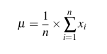

Waarbij: 

* xi de waarden zijn
* n het aantal waarden is

## 3.3 Mediaan

Indien we alle cijfers sorteren van klein naar groot, is de mediaan het middelste cijfer, of het 2e middelste cijfer als het aantal even is. Mediaan is niet gevoelig voor outliers.

## 3.4 Modus

Het cijfer dat het meeste voorkomt in een set cijfers

* Heeft geen zin als alle cijfers evenveel voorkomen
* Bimodaal: twee modi
* Multimodaal: meerdere modi

## 3.5 Range / Bereik

Het bereik in een set van getallen is de absolute waarde van het verschil tussen het laagste en het grootste getal

## 3.6 Kwartielen & kwartielafstand

De kwartielen zijn de waarden die een gesorteerde lijst van nummers in 4 gelijke delen deelt. Elk deel vormt dus een kwart van de dataset

Dus:

* Het eerste kwartiel Q1 is de getalwaarde die de laagste 25% van de reeks afscheidt
* Het tweede kwartiel Q2 is de getalwaarde die de laagste 50% van de reeks afscheidt
* Het derde kwartiel Q3 is de getalwaarde die de laagste 75% van de reeks afscheidt

De **kwartielafstand** is het verschil tussen Q3 en Q1

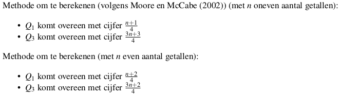


## 3.7 Variantie en standaardafwijking

De variantie is het gemiddelde van de kwadraten van de verschillen tussen de waarde van de dataset en het gemiddelde

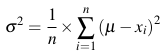

De standaardafwijking wordt dan gedefinieerd als de vierkantswortel van de variantie

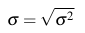

Dit geeft ons dus zicht op wat normaal en abnormaal is. Kleine SA wil zeggen dat waarden dicht bij centrummaat liggen en grote SA wil zeggen dat de waarden verspreid liggen.

## 3.8 Centrummaat en Spreidingsmaat toepassen

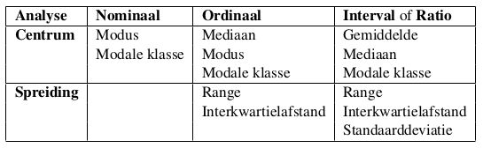

## 3.9 Grafieken

### Boxplot

De boxplot wordt gevormd door een rechthoek begrensd door de kwartielwaarden, ook de mediaan wordt er in getekend. De stelen bevatten de rest van de waarnemingen op uitschieters op extremen na.

* **Uitschieter**: waarde die meer dan 1,5 keer de interkwartielafstand boven/onder het derde/eerste kwartiel ligt. Aangeduid met cirkeltje.
* **Extremum**: waarde die meer dan 3 keet de interkwartielafstand boven/onder het derde/eerste kwartiel ligt. Aangeduid met sterretje.


## 3.10 R

Zodra u een vector in het geheugen hebt, zijn de meeste basisbewerkingen beschikbaar. Indien je een operatie uitvoert op meerdere vectoren, is het vaak nodig dat de vectoren allemaal hetzelfde aantal elementen hebben.

```
> a <- c(1,2,3,4)
> a
[1] 1 2 3 4
> a + 5
[1] 6 7 8 9
> a - 10
[1] -9 -8 -7 -6
> a * 4
[1]  4  8 12 16
> a / 5
[1] 0.2 0.4 0.6 0.8

> b <- a - 10
> b
[1] -9 -8 -7 -6

> sqrt(a)
[1] 1.000000 1.414214 1.732051 2.000000
> exp(a)
[1]  2.718282  7.389056 20.085537 54.598150
> log(a)
[1] 0.0000000 0.6931472 1.0986123 1.3862944
> exp(log(a))
[1] 1 2 3 4

> c <- (a + sqrt(a))/(exp(2)+1)
> c
[1] 0.2384058 0.4069842 0.5640743 0.7152175

> a + b
[1] -8 -6 -4 -2
> a * b
[1]  -9 -16 -21 -24
> a / b
[1] -0.1111111 -0.2500000 -0.4285714 -0.6666667
> (a+3)/(sqrt(1-b)*2-1)
[1] 0.7512364 1.0000000 1.2884234 1.6311303
```

De volgende commando's kunnen worden gebruikt om het gemiddelde, de kwartielen, het minimum, het maximum, de variantie en de standaardafwijking van een reekst getallen te verkrijgen.

```
> attach(computers)
> mean(price)
[1] 2219.577
> median(price)
[1] 2144
> quantile(price)
  0%  25%  50%  75% 100%
 949 1794 2144 2595 5399
> min(price)
[1] 949
> max(price)
[1] 5399
> var(price)
[1] 337333.2
> sd(price)
[1] 580.804

> summary(computers)
     price          speed
 Min.   : 949   Min.   : 25.00
 1st Qu.:1794   1st Qu.: 33.00
 Median :2144   Median : 50.00
 Mean   :2220   Mean   : 52.01
 3rd Qu.:2595   3rd Qu.: 66.00
 Max.   :5399   Max.   :100.00
       hd              ram
 Min.   :  80.0   Min.   : 2.000
 1st Qu.: 214.0   1st Qu.: 4.000
 Median : 340.0   Median : 8.000
 Mean   : 416.6   Mean   : 8.287
 3rd Qu.: 528.0   3rd Qu.: 8.000
 Max.   :2100.0   Max.   :32.000
     screen           cd
 Min.   :14.00   Length:6259
 1st Qu.:14.00   Class :character
 Median :14.00   Mode  :character
 Mean   :14.61
 3rd Qu.:15.00
 Max.   :17.00
    multi             premium
 Length:6259        Length:6259
 Class :character   Class :character
 Mode  :character   Mode  :character


      ads            trend
 Min.   : 39.0   Min.   : 1.00
 1st Qu.:162.5   1st Qu.:10.00
 Median :246.0   Median :16.00
 Mean   :221.3   Mean   :15.93
 3rd Qu.:275.0   3rd Qu.:21.50
 Max.   :339.0   Max.   :35.00
 ``` 

# 4. Steekproefonderzoek

## 4.1 Populatie en Steekproeven

**Populatie**: De verzameling van alle objecten of personen waar men in geïnteresseerd is en onderzoek naar wil doen.

**Steekproef**: Wanneer met een subgroep uit een populatie gaat onderzoeken.

Redenen waarom een steekproef gedaan wordt: 

* Populatie is te groot
* Kostbare metingen
* Wanneer snelheid belangrijk is
* Gemakkelijker

Stappen om een steekproef op te zetten: 

1. **Definitie populatie**: Wie is deel van de populatie, belangrijke elementen zijn bv sociale, demografische of fysieke kenmerken.
2. **Bepalen van steekproefkader**: Een populatie heeft verschillende segmenten en het is meestal onmogelijk een populatie als geheel te onderzoeken. Daarom beperken we ons tot homogene subpopulaties. Deze noemt de operationele populatie.
3. **Budget en tijd**: Het aantal te onderzoeken objecten of personen zal ook afhankelijk zijn van budget en tijd.

## 4.2 Kiezen van steekproefmethode

Soms is de populatie die men wenst te bespreken erg verschillend op een aantal belangrijke kenmerken. Daartoe wordt de populatie als geheel in een aantal elkaar niet-overlappende en homogene strata of klassen ingedeeld.

Een **gestratificeerde** steekproef is proportioneel als het aandeel van de subpopulatie in de steekproef gelijk is aan de het aandeel van de subpopulatie in de populatie als geheel.

Nadat gestratificeerd is, moet bepaald worden op welke wijze binnen ieder stratum het aantal benodigde objecten of correspondenten gekozen moeten worden. Aselect of niet-aselect.

### 4.2.1 Fouten bij steekproeven

#### Toevallige steekproeffouten

Wanneer er puur door het toeval een verschil is in een waarde voor de populatie en de steekproef.

#### Systematische steekproeffouten

Een procedure in de steekproef die een fout oplevert die een systematische oorzaak heeft en dus niet te wijten is aan toevallige effecten.

#### Toevallige niet-steekproeffouten

Hieronder vallen bijvoorbeeld verkeerde aangekruiste antwoorden

####Systematische niet-steekproeffouten

Wanneer bijvoorbeeld respondenten met een sterke band met het onderzoek eerder geneigd zijn een vragenlijst in te vullen, ga je positieve antwoorden krijgen. Deze zijn niet representatief.

### 4.2.2 Aanpassing formule standaardderivatie

We noemen het gemiddelde van de steekproef het steekproefgemiddelde. Als we de standaardafwijking willen bepalen moeten we niet meer delen door n maar door (n-1)

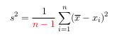

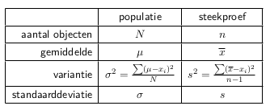

## 4.3 Kansverdeling van een steekproef

### 4.3.1 Stochastisch experiment

Een random of stochastisch experiment heeft volgende elementen nodig:

* Universum of uitkomstenruimte
* Gebeurtenis
* Kansruimte

#### Universum of uitkomstenruimte

Verzameling van alle mogelijke uitkomsten van dit experiment.

* Moet volledig zijn
* Elke uitkomst moet overeenkomen met juist 1 element

#### Gebeurtenis

Deelverzameling van de uitkomstenruimte. Enkelvoudige gebeurtenis is singleton, een samengestelde gebeurtenis heeft cardinaliteit groter dan 1.


Opmerkingen

* Door inductie leidt men af dat de unie van n gebeurtenissen eveneens een gebeurtenis is
* Idem voor doorsnee van gebeurtenissen
* Voor sommige toepassingen is het nodig om ook oneindige unies en doorsnedes te beschouwen

#### Kansruimte

Het toekennen van kansen aan gebeurtenissen dient aan de volgende regels te voldoen

1. Kansen zijn steeds positief: P(A) ≥ 0 voor elke A
2. De uitkomstenruimte heeft kans 1: P(Ω) = 1
3. Wanneer A en B disjuncte gebeurtenissen zijn dan is P(A ∪ B) = P(A) + P(B)

Wanneer een functie aan bovenstaande eigenschappen voldoet dan noemt men het drietal (Ω, P(Ω), P) een kansruimte.

### 4.3.2 Kansverdeling 

#### Discrete kansverdeling

Hetgeen we meten kan een beperkt aantal waarden aannemen (bv gooien dobbelsteen)

* Kansen zijn allemaal groter of gelijk aan 0
* De kans op een getal is gelijk aan de bijbehorende oppervlakte van de staaf
* De totale oppervlakte van alle staven is 1

#### Continue kansverdeling

Hetgeen wat we meten kan niet alleen een beperkt aantal waarden aannemen, maar ook alle ertussen liggende waarden bijvoorbeeld gewicht van een persoon. De kansverdeling bestaat hier niet uit staafjes maar uit een vloeiende kromme.

## 4.4 De normale verdeling

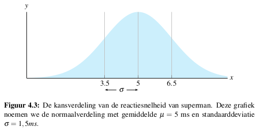

De normale verdeling kent volgende eigenschappen

* Klokvormig
* Symmetrisch
* Gemiddelde, mediaan en modus zijn gelijk
* Totales oppervlakte is 1
* In gebied σ onder μ en σ boven μ ligt ongeveer 68% van de waarnemingen
* In het gebied 2σ boven en onder μ ligt ongeveer 95% van alle waarnemingen

### 4.4.1 De standaardnormale verdeling

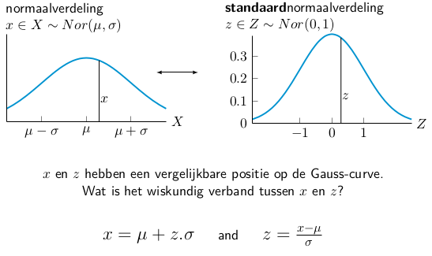

Indien de toevalsveranderlijke X ∼ N(μ, σ ) verdeeld is dan is de toevalsvariabele Z = (X−μ)/σ normaal verdeeld: Z ∼ N(0, 1). Dit noemen we de standaardnormale verdeling.


In het algemeen kan men dus bij een waarneming x de zogenaamde z-score bepalen als volgt:

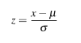

Deze score geeft dus aan hoe extreem een waarneming is of anders gezegd, hoeveel standaardderivatie is de waarneming x van het gemiddelde μ verwijderd. Voor deze z-scores heeft men tabellen opgesteld met de kansen dat een waarde kleiner dan z getrokken wordt uit Z, de zgn linkerstaartkans P(z > Z). 

We komen dat tot de volgende methode voor het berekenen van kansen met de normale verdeling: 

1. Bepaal de kansvariabele met de bijhorende normale verdeling
2. Bereken de z-score bij de bijhorende x-waarde
3. Schets de plaats van de gevraagde kans
4. Herleid de gevraagde kans met behulp van de schets tot een linkerstaartkans en gebruik de z-tabel van de standaardnormale verdeling om deze te bepalen. Gebruik indien nodig de symmetrieregel en de regel van 100% kans.

Voorbeeld voor het berekenen van een kans: 

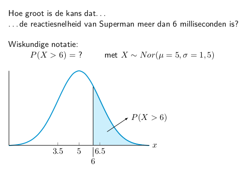
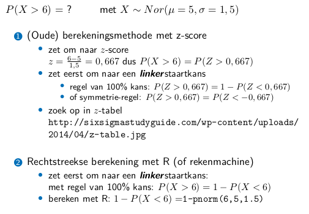

### 4.4.2 Testen op normaliteit

Er zijn verschillende methoden die kunnen gebruikt worden om na te gaan of een steekproef uit een normale verdeling komt.

1. Construeer een histogram en bekijk de vorm. Als de gegevens een normale verdeling hebben zal het histogram een klokcurve vormen.
2. Bereken de intervallen x ± s, x ± 2s, x ± 3s en bepaal het percentage meetwaarden dat binnen elk van deze intervallen valt. Als de gegevens ongeveer normaal verdeeld zijn, zullen percentages ongeveer gelijk zijn aan respectievelijk 68%, 95% en 99,7%.
3. Construeer een QQ-plot voor de gegevens. Als de gegevens ongeveer normaal verdeeld zijn zullen de punten ongeveer op een rechte lijn liggen.
4. Bekijk de kurtosis (welving of platheid): duidt aan hoe scherp de piek van de verdeling is
	* Een normale verdeling heeft en kurtosis = 0
	* Een vlakke distributie heeft negatieve kurtosis
	* Een piekvormige distributie heeft positieve kurtosis
5. Bereken de Skewness (scheefheid): duidt symmetrie aan
	* Symmetrische distributie heeft skewness = 0
	* Normale verdeling heeft dus ook 0
	* Lange linkerstaart = negatief
	* Als absolute waarde van skewness > 1 : geen symmetrische distributie

**QQ-plot of normaliteitsplot**: Spreidingsdiagram met de gesorteerde gegevenswaarden op de ene as en de bijhorende verwachte z-waarden van een standaardnormale verdeling op de andere as.

```
> m <- 1000
> s <- 50
> n <- 50
> observations <- rnorm ( n , m, s )
> qqnorm(observations)
> x <- seq ( -3 , +3 , length = n )
> lines ( x , m+ s * x , col = 'red' )
```

## 4.5 Centrale limietstelling

Als een steekproefomvang voldoende groot is, dan kan de kansverdeling van het steekproefgemiddelde benaderd worden met een normale verdeling. Dit geldt ongeacht de vorm van de kansverdeling van de onderliggende populatie.

Een lineaire combinatie van onafhankelijke, gelijk verdeelde stochasten is steeds normaal verdeeld.

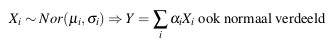

Bijgevolg zal ook het steekproefgemiddelde van een steekproef uit een populatie met een willekeurige verdeling, nagenoeg normaal verdeeld zijn voor een voldoende grote n.

Beschouw een aselecte steekproef van n waarnemingen die uit een populatie met een willekeurige distributie met verwachtingswaarde μ en standaardafwijking σ. Als n groot genoeg is zal de kansverdeling van x een normale verdeling benaderen met:

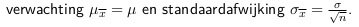

Hoe groter de steekproef is, des te beter zal de kansverdeling overeenkomen met een normaalverdeling.

### 4.5.1 Toepassing van centrale limietstelling

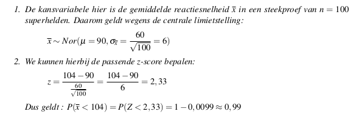

### 4.5.2 Schatten van een parameter

Indien we nu een steekproef onderzoeken, willen we uit de berekening op de steekproef een aantal conclusies trekken met betrekking tot de populatie. Als we een schatting geven voor een onbekende parameter, noemen we dat een puntschatter.

**Een puntschatter** voor een populatieparameter is een regel of een formule die ons zegt hoe we uit de steekproef een getal poeten berekenen om de populatie parameter te schatten. Dit is dus een steekproefgrootheid.

### 4.5.3 Betrouwbaarheidsinterval populatiegemiddelde bij grote steekproef

In het geval van het schatten van een gemiddelde van een populatie uit een steekproef hebben we totaal geen idee over hoe correct deze schatting is. Daarvoor geen we opzoek naar een interval waarvan we met een bepaalde zekerheid bv 95% kunnen zeggen dat het de te testen karakteristiek bevat.

**Een betrouwbaarheidsinterval** is een regel of een formule die ons zegt hoe we uit de steekproef een interval moeten berekenen dat de waarde van de parameter met een bepaalde hoge waarschijnlijkheid bevat.

Een goede schatting voor populatiegemiddelde zou steekproefgemiddelde zijn. Deze schatting is echter niet de werkelijke waarde van de populatie. Daarom wordt vaak rondom x een interval geconstrueerd dat de waarden bevat die aannemelijk zijn voor μ. Hiervoor kunnen we gebruik maken van de centrale limietstelling: het gemiddelde in een te trekken steekproef van omvang n is normaal verdeeld met karakteristieken µ en σ/√n. Als we het gemiddelde standardiseren krijgen we:

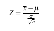

Deze uitdrukking hangt af van µ maar we weten wel dat  deze standaarnormaal verdeeld is. We kunnen daarom getallen -z en z vinden, onafhankelijk van µ, waartussen Z met een gekozen kans 1-α ligt. deze kans wordt de betrouwbaarheidsniveau genoemd. we nemen hier dat 1-α=0.95

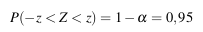

Hieruit halen we dat α=0.05. Door het toepassen van de symmetrieregel weten we dus dat we de volgende term moeten berekenen:

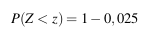

Kijken we in de Z-tabel vinden we voor de rechterstaartkans 0.025 de z-score van 1.96

Dus vinden we: 

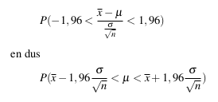

Hier gaan we er van uit dat we de standaardderivatie van de populatie kennen, wat meestal niet zo is. Indien de steekproef gorrt genoeg is kunnen we de steekproefstandaardderivatie nemen als schatter.

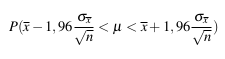

### 4.5.4 Betrouwbaarheidsinterval populatiegemiddelde bij kleine steekproef

Bij kleine steekproeven kunnen we niet veronderstellen dat de kansverdeling van x bij benadering normaal verdeeld is. CLS garandeerd allen normaliteit bij grote steekproeven (n>30). De vorm van de verdeling van de steekproefgemiddelde hangt nu af van de vorm van verdeling van de populatie. Standaardafwijking kan een slechte benadering zijn voor σ.

Als oplossing kunnen we een nieuwe grootheid bepalen. in plaats van 

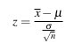

construeren we

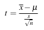

Deze heeft een kansverdeling die beschreven wordt door een Student-t verdeling. Deze lijkt zeer goed op een normale verdeling, maar de precieze vorm hangt af van de steekproefomvang n. We zeggen dat de t-verdeling (n-1) vrijheidsgraden heeft (afgekort df).

* (n-1) werd ook gebruikt om s² te berekenen 
* als n -> ∞ krijgenn we de standaardnormale verdeling

Om betrouwbaarheidsinterval voor het gemiddelde te bepalen op basis van een kleine steekproef bepalen we:

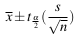

waarbij t(α/2) gebaseerd is op (n-1) vrijheidsgraden0 We veronderstellen wel dat we een aselecte steekproef genomen hebben uit een populatie die bij benadering normaal verdeeld is.


### 4.5.5 Betrouwbaarheidsinterval voor populatiefractie bij grote steekproef

Indien je een variabele wil meten als een fractie, bijvoorbeeld % mensen die ja geantworrd heeft op bepaalde vraag,willen we in feite de kans p op succes in een bernouilli experiment schatten, waarbij p de kans is dat een willekeurige geselecteerde respondent een succes is. we kunnen p dan schatten door bijvoorbeeld:

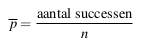

om de betrouwbaarheid van schatter p te bepalen moeten we zijn kansverdeling kennen. Via centrale limietstelling: n elementen, succes=1 faling=0 -> kans op 1 is p en kans op 0 is 1-p. Het gemiddelde p heeft dan bij benadering een normale verdeling of dus:


Aangezien p een steekproefgemiddelde is van het aantal successen, stelt dit ons in staat een betrouwbaarheidsinterval te berekenen analoog als die voor de intervalschatting van µ voor grote steekproeven.

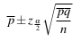
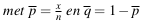

## 4.6 R

De prefixen zijn als volgt: 

* **d** geeft de hoogte van de respectievelijke kansdichthiedsfunctie
* **p** geeft de cumulatieve kansdichtheidsfunctie
* **q** geeft de omgekeerde cumulatieve dichtheidsfunctie
* **r** geeft een willekeurige waarde

### dnorm

gegeven een waarde geeft het de hoogte van de kansverdeling op elk punt terug. Als u alleen punten zonder gemiddelde en standaardafwijking ingeeft wordt gemiddelde van 0 en standaardafwijking van 1 beschouwd

```
> dnorm(0)
[1] 0.3989423
> dnorm(0)*sqrt(2*pi)
[1] 1
> dnorm(0, mean=4)
[1] 0.0001338302
> dnorm(0,mean=4, sd=10)
[1] 0.03682701
> v <- c(0,1,2)
> dnorm(v)
[1] 0.39894228 0.24197072
[3] 0.05399097
> x <- seq(-20,20,by=.1)
> y <- dnorm(x)
> plot(x,y)
> y <- dnorm(x, mean=2.5, sd=0.1)
> plot(x,y)
```

### pnorm

Dit is de cumulatieve kansdichtheidsfunctie, of anders gezegd de linkerstaartkans

### qnorm

Dit is de inverse van pnorm. Het idee er achter is dat je een kans α geeft, en geeft het geheel getal weer waarvan de cumulatieve distributie overeenkomt met de waarschijnlijkheid van α

```
> qnorm(0.5)
[1] 0
> qnorm(0.5, mean=1)
[1] 1
> qnorm(0.5, mean=1, sd=2)
[1] 1
> qnorm(0.5, mean=2, sd=2)
[1] 2
> qnorm(0.5, mean=2, sd=4)
[1] 2
> qnorm(0.25, mean=2, sd=2)
[1] 0.6510205
> qnorm(0.333)
[1] -0.4316442
> qnorm(0.333, sd=3)
[1] -1.294933
> qnorm(0.75, mean=5, sd=2)
[1] 6.34898
> v = c(0.1, 0.3, 0.75)
> qnorm(v)
[1] -1.2815516 -0.5244005  0.6744898
> x <- seq(0, 1, by=.05)
> y <- qnorm(x)
> plot(x,y)
> y <- qnorm(x, mean=3, sd=2)
> plot(x,y)
```

### rnorm

Kan willekeurige getallen genereren waarvan de distributie normaal is. Het argument dat je ingeeft is het aantal willekeurige getallendat u wilt, met optionele argumenten om de gemiddelde en standaardafwijking op te geven

```
> rnorm(4)
[1] -0.0531426 -1.2896160  0.1294976 -1.3827267
> rnorm(4, mean=3)
[1] 2.415890 2.886442 3.972199 3.393040
> rnorm(4, mean=3, sd=3)
[1] 1.816145 2.913165 2.692808 2.792216
> y <- rnorm(200)
> hist(y)
> y <- rnorm(200, mean=2)
> hist(y)
> y <- rnorm(200, mean=2, sd=4)
> hist(y)
> qqnorm(y)
> qqline(y)
```

# 5. Toetsingsprocedures

We kunnen de informatie van het vorige hoofdstuk ook gebruiken voor bepaalde hypothesen over een populatie te toetsen. Een hypothese is een veronderstelling waarvan nog moet worden bewezen dat deze correct is. Het doel van een toetsingsprocedure is het testen van een hypothese omtrent de waarheden van 1 of meer populatieparameters. 

Een **statische hypothese** is een uitspraak over de numerieke waarde van een populatieparameter.

## 5.1 Elementen van een hypothesetoets

1. **Nullhypthese** H0: Deze hypothese proberen we te ontkrachten door een redenering in het ongerijmde. We gaan deze hypothese accepteren, tenzij de observaties uit de steekproef overtuigend wijzen op het tegendeel.
2. **Alternatieve hypothese** H1: Dit is meestal de hypothese die de onderzoeker wil bewijzen. Deze hypothese zal echter alleen worden geaccepteerd als de observaties uit de steekproef overtuigend wijzen op de juistheid hiervan.
3. **Teststatistiek**: De veranderlijke die berekend wordt uit de steekproef.
4. Aanvaardings- en kritiek gebied:
	* **Aanvaardingsgebied**: Het gebied van waarden die de nullhypothese ondersteunt
	* **Verwerpingsgebied**: Gebied dat waarden bevat die de nullhypothese verwerpen. Ook kritiek gebied genoemd.

Een alternatief voor de laatste stap is het berekenen van de overschrijdingskans.

## 5.2 Toetsingsprocedure voor de z-toets

In de eerste toetsingsprocedure die we uitwerken, gaan we een uitspraak over het populatiegemiddelde µ verifiëren. Deze is algemeen bekend als de z-toets.

1. De vermoedens over de populatie worden vastgelegd in 2 hypothesen H0 en H1. Voor de z-toets is de nullhypothese dat het populatiegemiddelde µ een bepaalde waarde heeft, en de alternatievehypothese dat µ groter is.
2. Het significantieniveau α en de steekproefomvang n worden vastgelegd. Je kan α in principe zelf kiezen (bv 0,05). Hoe dichter het significantieniveau bij 0 ligt, hoe minder twijfel er is over het resultaat van de toets. Maar langs de andere kant wordt het ook moeilijker om de nullhypothese te verwerpen.
3. De waarde van de toetsingsgrootheid in de steekproef wordt berekend. De uitkomst is bepalend voor de beslissing of we de nullhypothese H0 kunnen verwerpen of niet.
4. Het kritieke gebied bepalen, of meer bepaald de grens tussen het aanvaardings- en het verwerpingsgebied. we zoeken de grenswaarde g zodat: 

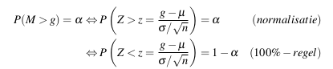

De z-waarde hangt af van het gekozen significantieniveau en kan worden opgezocht in een z-tabel of berekend worden met de R-functie qnorm(1-alpha). Daaruit kunnen we dan g afleiden: 

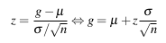

Alle waarden links van g vormen het aanvaardingsgebied. Waarden rechts, die dus ver van het H0 veronderstelde populatiegemiddelde liggen, zijn het verwerpingsgebied.

**Voorbeeld**

Algemeen wordt aangenomen dat superhelden gemiddeld 3,3 mensen per dag redden. De onderzoekers krijgen echter gevoel dat dat niet zo is: ze hebben de indruk dat een superheld gemiddeld meer dan 3,3 mensen per dag redt.

Ze gaan dit onderzoeken en voeren een steekproef uit bij n=30 superhelden. In deze steekproef is het gemiddelde x = 3,483. De standaardafwijking in de populatie is gekend en is σ = 0, 55.

1. We veronderstellen dat het aantal mensen dat een superheld redt normaal verdeeld is en formuleren twee hypothesen omtrent de parameter µ.
	* H0 = de nulhypothese (te weerleggen): µ = 3,3
	* H1 = alternatieve hypothese (aan te tonen) : µ > 3,3 

2. Vastleggen significantieniveau α en steekproefomvang n. We willen significantieniveau van 5% kiezen dus α = 0.05 en n = 30

3. De waarde van de toetsingsgrootheid in de steekproef bepalen. We nemen het steekproefgemiddelde x = 3,483. Volgens centrale limietstelling geldt dat:  
M ~ Nor( µ = 3,3 ; σ = 0,1 )

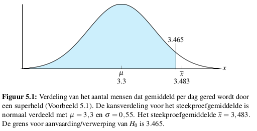

4. Kritieke grenswaarde berekenen. De z-waarde voor een significantieniveau van 0,05 is 1.645²

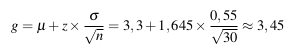

Het steekproefgemiddelde x = 3,483 ligt nog verder van µ = 3,3 dan de grenswaarde g = 3,45. De kans is heel klein dat zo een steekproef getrokken wordt uit een populatie met dit gemiddelde. Slechts in 34 op 1000. Met andere woorden, de steekproefwaarde ligt in het verwerpingsgebied. We kunnen dus H0 verwerpen en besluiten dat superhelden inderdaad meer dan 3,3 mensen per dag redden.

## 5.3 Kritieke gebied

De formule voor de berekening van de grenswaarde is gebaseerd op de centrale limietstelling, meer bepaald betrouwbaarheidsintervallen.

De kritieke grenswaarde vormt een betrouwbaarheidsinterval rond µ met een gekozen zekerheidsniveau. Als we bijvoorbeeld stellen dat α = 0,05, weten we vanuit de centrale limietstelling dat we kunnen verwachten dat als we herhaaldelijk voldoende steekproeven uit deze populatie nemen, in 95% van de gevallen het steekproefgemiddelde binnen dit betrouwbaarheidsgeval zal liggen.

Als we de redenering omkeren, en een steekproef genomen hebben waar het gemiddelde niet binnen dit betrouwbaarheidsinterval ligt, dan is de kans heel klein dat deze uit een populatie getrokken is met het veronderstelde gemiddelde µ. In dat geval kunnen we de nulhypothese dus verwerpen.

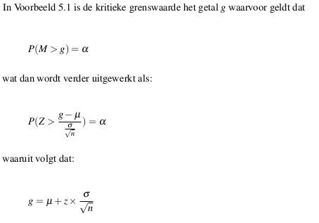

## 5.4 Overschrijdingskans
i
Een karakteristiek die gebruikt wordtom weer te geven hoe sterk de geobserveerde waarde afwijkt van H0, is de overschrijdingskans. Dit vormt een alternatieve manier om te bepalen of de nullhypothese al dan niet verworpen kan worden.

**Overschrijdingskans** is de kans, indien de nullhypothese waar is, om een waarde te verkrijgen van de toetsingsgrootheid die minstens even extreem is als de geobserveerde waarde.

**Statische significantie** In een statische hypothesetoets heeft men een statisch significant resultaat behaald wanneer de geobserveerde overschrijdingskans p van de teststatistiek lager is dan het significantieniveau α. De p-waarde wordt onder het gekozen significantieniveau beschouwd als te extreem om de veronderstelling dat de nullhypothese waar is aan te houden.

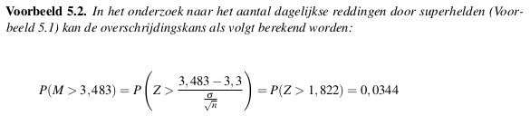

Als de overschrijdingskans of de p-waarde kleiner is dan de onbetrouwbaarheidsdrempel dan moet H0 verworpen worden, is de p-waarde groter of gelijk aan α dan mag je H0 niet verwerpen.

## 5.5 Eenzijdig of tweezijdig toetsen

In het voorbeeld ligt het kritieke gedeelte om H0 te verwerpen aan de rechterzijde van de curve dus is deze toets rechtszijdig.

Wat moeten we in de vergelijking veranderen voor correcte kritieke waarde voor linkszijdige z-toets?

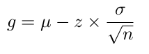

Soms kan het ook dat er **tweezijdig** moet getoetst worden. De alternatieve hypothese wordt dan geformuleerd als zijnde het populatiegemiddelde verschillend is van de opgegeven waarde. Er moeten dan 2 kritieke grenswaarden berekend worden.

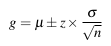

Als we opnieuw significantieniveau α = 0,05 nemen, zoeken we dus de z-waarde waarvoor geldt dat:

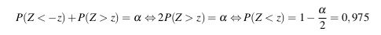

De overeenkomstige z-waarde is dan ongeveer 1.96 (door qnorm(.975))

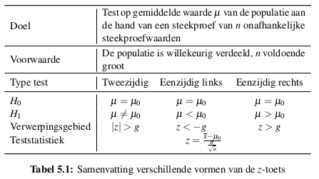

## 5.6 De z-toets in R

```
> n <- 30
> sm <- 3.483
> s <- 0.55
> a <- 0.05
> m0 <- 3.3
```

### Methode 1: Overschrijdingskans

Wat is de kans dat je in een steekproef het gegeven steekproefgemiddelde ziet?

```
> p <- 1 - pnorm (sm, m0, s/sqrt(n))
> p
[1] 0.03419546
```

Als p kleiner is dan a: H0 verwerpen

### Methode 2: Kritieke grensgebied

Onder welke waarde kan je H0 niet verwerpen?

```
> g <- m0 + qnorm(1-a) * s / sqrt(n)
> g
[1] 3.465169
```

als sm kleiner is dan g: H0 niet verwerpen.

### Plot van deze casus

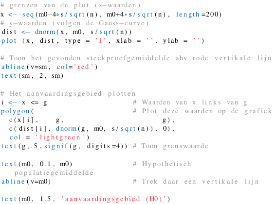

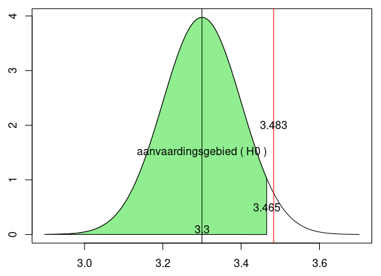

## 5.8 De t-toets

Bij de z-toets gaan we uit van een aantal veronderstellingen waar we rekening mee moeten houden.

* De steekproef moet voldoende groot zijn
* De variantie van de toetsingsgrootheid moet normaal verdeeld zijn
* we veronderstellen dat de standaardafwijking van de populatie bekend is

Soms zijn deze veronderstellingen niet geldig en mogen we de z-toets niet gebruiken. We kunnen wel gebruik maken van de student-t verdeling.

Aangepaste formule van kritieke grenswaarde:

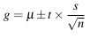

Voor het bepalen van de t-waarde hebben we het aantal vrijheidsgraden nodig, n-1. Om de standaardafwijking te schatten gebruiken we de steekproefstandaardsafwijking s.

Voorbeeld: vorig voorbeeld maar met n=25

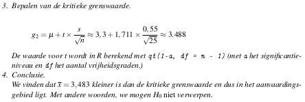

### Oplossing via t.test

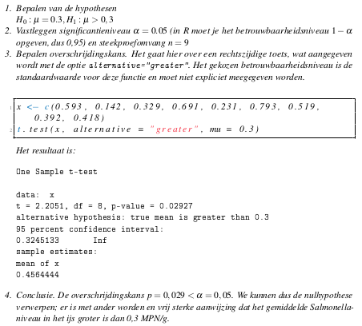

## 5.9 De t-toets voor twee steekproeven

De t-toets kan ook gebruikt worden om 2 steekproeven met elkaar te vergelijken.Je kan er mee nagaan of het steekproefgemiddelde van beide steekproeven significant verschillend is.

Men maakt onderscheid tussen 2 gevallen:

* Beide steekproeven zijn onafhankelijk
* Steekproeven zijn afhankelijk

Voorbeeld: Nagaan of nieuwe medicijn als bijwerking een verminderde reactiesnelheid heeft

* Controlegroep: 91, 87, 99, 77, 88, 91 (x=88,83)
* Interventiegroep: 101, 110, 103, 93, 99, 104 (x=101,67)

We noteren µ₁ voor het gemiddelde van de niet behandelde populatie en µ₂ voor het populatiegemiddelde van de behandelde patienten. De hypothesen worden genoteerd als:

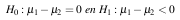

Als teststatistiek gebruiken we x - y.

Het gaat dus over een linkszijdige test, weergegeven door de optie alternative="less". Als nullhypothese verwachten we dat het verschil 0 is, aangeduid met optie mu=0

```
> controle <- c(91, 87, 99, 77, 88, 91)
> interventie <- c( 101, 110, 103, 93, 99, 104)
> t.test(controle, interventie, alternative="less", mu=0)

	Welch Two Sample t-test

data:  controle and interventie
t = -3.4456, df = 9.4797, p-value =
0.003391
alternative hypothesis: true difference in means is less than 0
95 percent confidence interval:
      -Inf -6.044949
sample estimates:
mean of x mean of y
 88.83333 101.66667
```

## 5.10 Fouten in hypothesetoetsen

Wanneer we H₀onterecgt verwerpen spreken we van fout type 1, wanneer we H₀ onterecht aanvaarden spreken we van fout type 2

Het significantieniveau bepaalt wanneer een nulhypothese precies verworpen kan worden. Dit is dus gelijk aan de kans op het maken van een fout type 1.

We willen de kans op type 1 zo klein mogelijk houden maar dat is ten koste van de kans op type 2, aangeduid met β die hierdoor groter wordt.


# 6. Analyse op 2 variabelen

Wanneer we een verband beschrijven tussen variabelen onderscheiden we:

* De afhankelijke variabele, waarover we een voorspelling willen doen
* De Onafhankelijke variabele, op basis van dewelke we de voorspelling doen

Welke soort van grafieken we kunnen gebruiken hangt af van het meetniveau

* Interval of ratio
	* Staafdiagram van de gemiddelden
	* Boxplot per groep
* Ordinaal of nominaal
	* Kruistabel
	* Geclusterd staafdiagram
	* Rependiagram

Bij de vraag of er samenhang is tussen twee variabelen kunnen we de volgende grafieken gebruiken

* Nominaal x Nominaal
	* Kruistabel met Cramér's V
* Ordinaal x Ordinaal
	* Geclusterd staafdiagram
	* Rependiagram
* Ratio x Ratio
	* Spreidingsdiagram
	* Regressie en correlatie met correlatiecoefficient

## 6.1 Kruistabellen en Cramér's V

**Kruistabel**: Hierin worden frequenties van de 2 variabelen samengevat

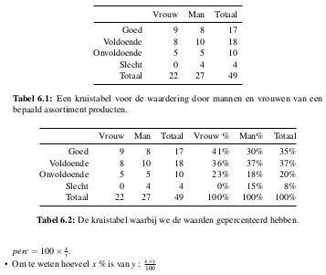

Hoe bepalen we de samenhang tussen tussen de verschillende variabelen? Bepalen aan de hand van Cramér's. Maar eerst de x² waarden.

## 6.2 X²-test voor associatie

Wordt gebruikt om te bepalen of er een significant vervand bestaat tussen 2 variabelen. Berekening: 

1. Stel kruistabel op samen met marginale totalen

2. Stel voor elke cel een schatter op voor de theoretische kans om in die cel te geraken

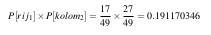

Hieruit kan theoretische waarde e dan alsvolgt berekend worden

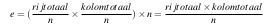

Voor cel 1,2 is dat dus 9,36

3. Dan berekenen we het verschil tussen geobserveerde a en verwachte frequentie e

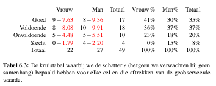

4. Berekenen van maat van afwijking

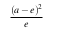

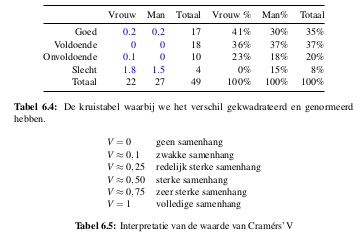

5. Optellen

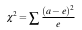

Hiermee kunnen we de waarde van Cremér's V berekenen

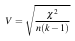

met k = kleinste waarde van het aantal kolommen of het aantal rijen van de tabel

### Uitwerking in R


## 6.3 Regressie

Bij regressie gaan we proberen een consistente en systematische koppeling tussen de variabelen te vinden

* **Monotoon**: Verband waarbij de onderzoeker de algemene richting van samenhang kan aanduiden.Hetzij stijgend hetzij dalend.
* **Niet-monotoon**: aanwezigheid van variabele wordt gerelateerd aan aanwezigheid van andere maar de richting kan niet aangeduid worden.

Bij lineaire regressie gaan we ons beperken tot lineair verband waarbij kennis van de onafhankelijke variabele kennis over de afhankelijke geeft.

Karakteristieken: 

1. Aanwezigheid: is er wel een verband?
2. Richting: dalend of stijgend?
3. Sterkte: sterk, gematigd of niet-bestaand

### Uitwerking

Gezochte lijn: y = β₀ + β₁x
Afwijking gegeven door: e = y - β₀ + β₁x

Som van kwadraten van afwijking moet minimaal zijn. Hierdoor kunnen we de punten bepalen: 


### Uitwerking in R


## 6.4 Correlatie

### 6.4.1 Pearsons product-momentcorrelatiecoefficient

We kunnen twee statistieken bepalen die de sterkte van een lineair verband uitdrukken.

Correlatiecoefficient R is een maat voor de sterkte van de lineaire samenhang tussen X en Y. De waarde kan variëren van -1 tot 1.

* Waarde van +1 duidt positief lineair verband aan
* Waarde van -1 duidt negatief lineair verband aan
* Waarde van 0 wil zeggen dat er totaal geen lineaire samenhang is

Hoe dichter bij -1 of 1 hoe beter de kwaliteit van het lineaire model

### 6.4.2 Determinatiecoëfficiënt

Determinatiecoëfficiënt R² is het kwadraat van de correlatiecoëfficiënt en verklaart het percentage van de variantie van de waargenomen waarden tov de regressierechte.

#### Bepaling van R en R²


Als we de kwadranten volgens gemiddelde verdelen kunnen we volgende situaties bekijken


Maat om verband tussen 2 variabelen te meten


We kunnen de maat onafhankelijk maken van de grootte van de steekproef door te delen door de steekproefgrootte n. Dit noemen we co-variantie.


Correlatiecoëfficiënt = Relatieve co-variantie. Het is onafhankelijk van het aantal waarnemingen en de orde van grootte van de getalswaarden.


#### R² interpretatie


# 7. De X² toets

## 7.1 X² toets voor verdelingen

Eenvoudigste voor toetsen van hypothesen wanneer alle variabelen nominaal zijn. De test kan gebruikt worden om na te gaan in welke mate de steekproef overeenstemt met een null hypothese over de verdeling van de variabele.

### 7.1.1 Voorbeeld

We willen kijken of de steekproef representatief is. Als dat zo is dan is de frequentie in een steekproef even groot als die in een populatie

expected e: 


We merken op: 

* Indien de verschillen klein zijn => verdeling komt voldoende overeen
* Indien de verschillen groot => verdeling niet representatief

We bepalen nu een kritieke grenswaarde g die een X² verdeling heeft. Hierbij speelt het aantal vrijheidsgraden (df) een rol. Er geldt: 

df = k - 1

Met k het aantal categorieën

Als X² kleiner is dan g mogen we besluiten dat de steekproef representatief is.

### 7.1.2 Toetsingsprocedure

1. **Bepalen hypothese**: Als nullhypothese formuleren we dat de verdeling in de steekproef gelijk is aan die in de populatie.

* H₀: Steekproef is representatief
* H₁: Steekproef is niet representatief

2. **Bepalen α en n**: α = 0,05

3. **Toetsingsgrootheid en waarde er van in steekproef**


4. **Bereken en teken kritiek gebied**

### 7.1.3 Voorwaarden

1. Voor alle categorieën moet gelden dat de vewachte waarde e groter is dan 1
2. In ten hoogste 20% van de categoriën mag de verwachte waarde e kleiner dan 5 zijn

# 8. Tijdreeksen

Soms is het nodig om data op te volgen die voortdurend veranderd.

## 8.1 Tijdreeksen en voorspellingen

Een tijdreeks is een opeenvolging van observaties van een willekeurige variabele in functie van tijd. 
