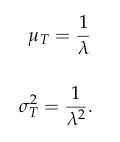
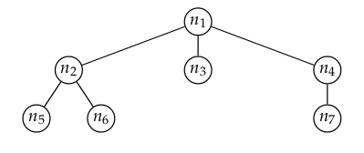

# 1. Gebeurtenissen en hun kansen

## 1.1 Inleiding

Kansrekening houdt zich bezig met studie van gebeurtenissen of toevalsverschijnselen. Dit zijn verschijnselen waarvan de individuele uitkomsten onzeker zijn, maar waar bij een groot aantal herhalingen een regelmatige verdeling van relatieve frequenties ontstaat.

De kans komt overeen met de relatieve frequentie op lange termijn

Onderdelen: 

1. Opstellen lijst mogelijke uitkomsten
2. Bepalen van de kans van elke uitkomst

## 1.2 Universum of uitkomstenruimte

Het universum of uitkomstenruimte is de verzameling van alle mogelijke uitkomsten van dit experiment en wordt genoteerd met Ω. Elke uitkomst moet overeenkomen met juist één element.

Het moet dus mogelijk zijn om eenduidig aan te geven welk element van Ω zich heeft voorgedaan.

## 1.3 Gebeurtenissen

Een gebeurtenis is een deelverzameling van de uitkomstenruimte. Een enkelvoudige of elementaire gebeurtenis is een singleton, een samengestelde heeft cardinaliteit groter dan 1.

Gebeurtenissen die geen gemeenschappelijke uitkomsten hebben noemt men disjunct. Deze kunnen dus nooit samen voorkomen.

Unie of doorsnee van gebeurtenissen zijn eveneens gebeurtenissen.

## 1.4 Kansen en kansruimte

Kans of waarschijnlijkheid drukt uit hoe waarschijnlijk het is dat deze gebeurtenis voorkomt. We noteren deze kans als P(A)

Het toekennen van kansen aan gebeurtenissen dient aan volgende regels te voldoen:

1. Kansen zijn steeds positief
2. Uitkomstenruimte heeft kans 1
3. Wanneer A en B disjuncte gebeurtenissen zijn dan is P(A ∪ B) = P(A) + P(B)

Wanneer de functie P aan volgende eigenschappen voldoet is dit een kansruimte.

Eigenschappen:

1. Voor elke gebeurtenis A geldt dat P(Ā) = 1 - P(A)
2. De onmogelijke gebeurtenis heeft kans 0: P(∅) = 0
3. Als A ⊆ B, dan is P(A) ≤ P(B); i.h.b geldt P(A) = P(B) - P(B \ A)
4. De uitgebreide somregel is: P(A ∪ B) = P(A) + P(B) - P(A ∩ B)

### 1.4.1 Eindig universum

Als de uitkomstenverzameling eindig is dan moet de som van de kansen van alle elementaire gebeurtenissen gelijk zijn aan 1.

Wanneer de elementaire gebeurtenissen allemaal even waarschijnlijk zijn dan bekomt men de formule van Laplace:

## 1.5 Voorwaardelijke kansen en (on)afhankelijkheid van gebeurtenissen

Uitdrukkingen zijn vaak van de vorm

> Als B voorkomt, dan is de waarscheinlijkheid dat A voorkomt gelijk aan p.

Kans op A gegeven B: 

Wanneer de waarschijnlijkheid niet veranderd kunnen we zeggen dat A en B onafhankelijk zijn. Gebeurtenissen zijn onafhankelijk als:

P(A ∩ B) = P(A)P(B)

Als A en B onafhankelijk zjn dan geldt 

P(A) = P(A|B)

#### Kettingregel

Wanneer A₁ tem An gebeurtenissen zijn waarvoor

P(A₁ ∩ A₂ ∩ ... ∩ An-1) > 0

Dan geldt

### 1.5.2 Regel van Bayes

Gegeven een gebeurtenis A met n elkaar uitsluitende oorzaken Bi geldt voor elke j dat:

# 2. Kans- of toevalsvariabelen

## 2.1 Inleiding

Het kan gebeuren dat we bij toevalsverschijnselen niet geintereseerd zijn in de kansen van verschillende uitkomsten, maar aan de verschillende gebeurtenissen getalwaarden te hechten.

Een kansvariabele X is een afbeelding van Ω naar R. Deze afbeelding associeert met elke mogelijke uitkomst van een kansexperiment een reëel getal. Men maakt ook een onderscheid tussen discrete en continue kansvariabelen.

## 2.2 Discrete kansvariabelen

Een kansvariabele X is discreet wanneer X slechts een eindig of aftelbaar oneindig aantal waarden aanneemt.

De kansfunctie van de discrete toevalsveranderlijke X:

Een kansfunctie f voor een discrete toevalsveranderlijke voldoet aan de volgende eigenschappen:

Men definieert ook de comulatieve kansfunctie, de Kansverdelingsfunctie. Deze wordt gedefinieerd als:

## 2.3 Continue kansvariabelen

Er zijn oneindig veel mogelijkheden en elk heeft evenveel kans. Het is eerder zinvol om na te gaan wat de kans is van een bepaald interval. De fundamentele grootheid is dan dus ook de kansverdelingsfunctie

De kansverdelingsfunctie Fx van toevalsveranderlijke X is een functie van R naar het interval [0,1] gegeven door:

Een toevalsveranderlijke X is continu als er een functie fx van R naar R⁺ bestaat zodanig dat 

De functie fx wordt de kansdichtheid genoemd

#### De functie fx voldoet aan de volgende eigenschappen

1. De functie fx is nergens negatief: fx(x) >= 0

2. Als men fx integreert over R dan bekomt men als uitkomst 1

3. De kans dat X behoort tot een interval [a,b] wordt uitgedrukt mbh de volgende integraal

#### Zowel voor discrete als continue kansvariabelen geldt: 

1. F is gedefinieerd in heel R: dom(F) = R

2. F is niet dalend

3. De X-as is een horizontale asymptoot op min oneindig:

4. De rechte met vergelijking y=1 is een horizontale asymptoot op plus oneindig

## 2.4 Verwachtingswaarde en variantie

### 2.4.1 Discrete kansvariabele

Veronderstel dat een toevalsveranderlijke X geassocieerd werd met de uitkomstenruimte Ω van een bepaald experiment, met elke w ∈ Ω werd een reeel getal X(w) geassocieerd. Bij herhalingen van het experiment komen we een lijst van reele getallen X(w) uit. we willen hiervan het **gemiddelde** berekenen: 

De **Verwachtingswaarde** van een discrete toevalsveranderlijke X wordt genoteerd als µx of E(X), en is een gewogen gemiddelde van de waarden xi die X kan aannemen met de respectievelijke kansen als gewichten. In formulevorm: 

De verwachtingswaarde geeft aan rond welke waarde de kansvariabele ligt. Het is een centraliteitsmaat.

De **Variantie** is de gewogen gemiddelde kwadratische afwijking tov zijn verwachtingswaarde:

De **Standaardafwijking** is de spreidingsmaat waarvan de eenheid hetzelfde is als die van de verwachtingswaarde:

### 2.4.2 Continue kansvariabele

Op analoge manier als bij de discrete kansvariabelen heeft men de volgende definities.

De **Verwachtingswaarde** en **Variantie** worden gedefinieerd als:

### 2.4.3 Eigenschappen van verwachtingswaarde en variantie

**Law of the unconscious statistican**: Als X een discrete kansvariabele is en g een functie van R naar R dan geldt:

De **verwachtingswaarde** en **variantie** voldoen aan de volgende eigenschappen:

1. Als X constant is, dan is E(X)=k

2. Als a ∈ R een constante is dan geldt: E(X+a) = E(X) + a waaruit volgt dat: E(X-µx) = 0

3. Als a ∈ R een constante is dan geldt: E(aX) = a E(X)

4. Er geldt steeds dat:

5. De variantie wijzigt niet als we de toevalsveranderlijke verschuiven:

6. Vermenigvuldigen met een constante wijzigt de variantie op een kwadratische manier

# 3. Kansverdelingen

## 3.2 Discrete kansverdelingen

### 3.2.1 Bernoulliverdeling

Experimenten met slechts 2 mogelijke uitkomsten.

We noemen de ene uiykomst succes en stellen ze voor door 1 en de andere misslukking en stellen deze voor door 0

**Verwachtingswaarden** en **variantie** Als X een toevalsveranderlijke is die een bernoulliverdeling volgt met kans op succes p, dan geldt:

i
### 3.2.2 Binomiale verdeling: aantal successen

Geldt als n onafhankelijke uitvoeringen van eenzelfde bernoulli experiment. De toevalsveranderlijke X die telt hoeveel successen er voorkomen wanneer men n onafhankelijke bernoulli experimenten uitvoert volgt de binomiale verdeling. Deze wordt gekenmekt door 2 parameters: n en p. We noteren:

Veronderstel dat X ~ B(n,p), dan wordt de kansfunctie van X gegeven door

De **kansfunctie** wordt gegeven door:

met C = n!/k!(n-k)!

**Verwachtingswaarde** en **variantie** als X ~ B(n,p)

### 3.2.3 Geometrische verdeling: wachten op eerste succes

Als X geometrisch verdeeld is met parameter p dan wordt de kansfunctie fx gegeven door: 

**Verwachtingswaarde** en **variantie** als X geometrisch verdeeld is met parameter p

Men kan hiermee ook bepalen hoeveel trekkingen met teruglegging men moet uitvoeren om uit een populatie van n verschillende elementen er juist r verschillende te bepalen

### 3.2.4 Poisson verdeling: zeldzame gebeurtenissen

Zeer groot aantal n onafhankelijke uitvoeringen van eenzelfde bernoulli experiment. De kans op succes p is zeer klein en het gemiddeld aantal successen n*p is ongeveer constant. Deze wordt genoteerd met de lambda 

Als X Poisson-verdeeld is met parameter λ, dqn wordt zijn kansfunctie gegeven door:

**Verwachtingswaarde** en **variantie** als X Poisoon-verdeeld is met parameter λ

Het eenheidsinterval kan vervangen worden door een willekeurig tijdsinterval [0,t]

## 3.3 Continue kansverdelingen

### 3.3.1 Uniforme verdeling:

Boven een bepaalde ondergrens a en bovengrens b is de kansdichtheid constant. Alle waarden tussen a en b hebben dus evenveel kans om voor te komen.

Als X een continue uniforme verdeling volgt met grenzen a en b dan wordt de kansdichtheid van X gegeven door:

**Verwachtingswaarde** en **variantie** als X een continue uniforme verdeling volgt met grenzen a en b:

### 3.2.2 Exponentiele verdeling

Veronderstel dat we te maken hebben met een poisson proces met parameter λ. We kunnen ons dan afvragen wat de verdeling is van de tijd T die nodig is voor het eerste success. T heeft een exponentiele verdeling.

De kansdichtheid en kansverdelingsfunctie van een exponentieel verdeelde veranderlijke T met parameter λ wordt gegeven door:

**verwachtingswaarde** en **variantie** als T een toevalsveranderlijke is die exponentieel verdeeld is met parameter λ

# 4. Bomen

## 4.1 Terminologie mbt bomen

Een boom is een abstractie die situaties waar informatie geordend is volgens hierarchische structuur modelleert.

Een **gewortelde boom** T is een verzameling van **toppen** die aan de volgende eigenschappen voldoet.

1. Er is 1 speciale top t die de wortel van de boom wordt genoemd
2. De andere toppen zijn verdeeld in m >= 0 disjuncte verzamelingen T₁ ... Tm die op hun beurt weer elk een gewortelde boom zijn 

Bomen T₁ tem Tm zijn deelbomen van T. De wortels t₁ tem tm van deelbomen T₁ tem Tm worden de kinderen van de wortel t genoemd. Het aantal deelbomen van een top wordt de graad van de top genoemd. Een blad is een top met graad 0. De graad van een boom wordt gezien als het maximum van de graden van zijn toppen.

De diepte van een top n mbt een boom T wordt alsvolgt gedefinieerd: de diepte van de wortel van T is nul terwijl de diepte van elke andere top 1 meer is dan de diepte van zijn ouder.

## 4.2 Datastructuren voor bomen

### 4.2.1 Array-van-kinderen voorstelling

Rechtstreekse implementatie van de vader-kind structuur

Als n = aantal toppen en k = graad dan zijn er n*k referenties waarvan er slechts n-1 verschillend van null zijn. 

Het nadeel hiervan is dus dat het geheugen inefficient gebruikt wordt.

### 4.2.2 Eerste-kind-volgende-broer voorstelling

In plaats van referenties naar alle kinderen houden we enkel een referentie bij voor het eerste kind en de volgende broer. Dit gaat efficienter om met het geheugen maar navigeren in de boom is moeilijker

## 4.3 Recursie op bomen

### 4.3.1 Alle toppen van een boom bezoeken

Boom doorlopen in **preorde**

1. Bezoek de wortel van de boom
2. Doorloop de deelbomen van de wortel in preorde

Boom doorlopen in **postorde**

1. Doorloop de deelbomen van de wortel in postorde
2. Bezoek de wortel van de boom

Het proces eindigt als een boom slechts uit 1 top bestaat.

Afgedrukt in preorde: 

n1, n2, n5, n6, n3, n4, n7

Afgedrukt in postorde: 

n5, n6, n2, n3, n7, n4, n1

### 4.3.2 Eenvoudige berekeningen op bomen

Veronderstel dat we het aantal toppen van een boom willen berekenen maar de voorstelling van de boom dit niet rechtsreeks toe laat.

## 4.4 Binaire bomen

### 4.4.1 Definitie en eigenschappen

Een binaire boom is een verzameling toppen die 

1. Ofwel leeg is
2. Ofwel bestaat uit een wortel en 2 disjuncte verzamelingen Tl en Tr

In een binaire boom is het aantal toppen met diepte k hoogstens 2^k 

Voor een (niet-lege) binaire boom T met diepte d >= 0 geldt dat: 

### 4.4.2 Voorstelling van een binaire boom

De top van een binaire boom wordt voorgesteld door een structuur, die behalve de eigenlijke data voor die top, ook 2 referenties bijhoudt naar de linker en rechter deelboom. De boom zelf wordt voorgesteld door een referentie naar zijn wortel.

### 4.4.3 Alle toppen van een binaire boom zoeken

Binaire boom doorlopen in **preorde**

1. Bezoek de wortel van de boom
2. Als de linkerdeelboom niet leeg is, doorloop de linkerdeelboom dan recursief in preorde
3. Als de rechterdeelboom niet leeg is, doorloop de rechterdeelboom dan recursief in preorde

Binaire boom doorlopen in **postorde**

1. Als de linkerdeelboom niet leeg is, doorloop de linkerdeelboom dan recursief in postorde
2. Als de rechterdeelboom niet leeg is, doorloop de rechterdeelboom dan recursief in postorde 
3. Bezoek de wortel van de boom

Binaire boom doorlopen in **inorde**

1. Als de linkerdeelboom niet leeg is, doorloop de linkerdeelboom dan recursief in inorde
2. Bezoek de wortel van de boom
3. Als de rechterdeelboom niet leeg is, doorloop de rechterdeelboom dan recursief in inorde

## 4.5 Binaire zoekbomen

Vaak voorkomende activiteit in een computerprogramma is het bijhouden van een verzameling waarden waarbij we wensen

1. gegevens toe te voegen aan de verzameling
2. gegevens verwijderen uit de verzameling
3. te controleren of een element aanwezig is in de verzameling

Een noodzakelijke voorwaarde voor een binaire zoekboom is dat de labels een totaal geordende verzameling vormen. dit wil zeggen dat voor elk paar labels x en y geldt dat 

Deze labels worden vaak sleutels genoemd. De labels kunnen getallen of karakterreeksen zijn.

Een **binaire zoekboom** is een gelabelde binaire boom die aan een bijzondere voorwaarde, de binaire zoekboomeigenschap, voldoet.

De **binaire zoekboomeigenschap** is de volgende: voor elke top x van een binaire zoekboom geldt dat alle toppen in de linkerdeelboom van x een label hebben dat kleiner is dan het label van x, terwijl voor alle toppen in de rechterdeelboom van x geldt dat hun label groter is dan dat van x.

Wanneer we deze boom in inorde doorlopen worden de toppen in volgende volgorde doorzocht: 1, 3, 4, 6, 7, 8, 10, 13, 14

### 4.5.1 Opzoeken van een sleutel in een binaire boom

Wanneer we een sleutel x willen opzoeken kunnen we gebruik maken van de binaire zokboomeigenschap om uit te maken of x aanwezig is of niet.

Om recursief te zoeken naar een bepaalde waarde x in een binaire zoekboom T gaat men als volgt tewerk:

1. Wanneer de boom leeg is geef dan "niet gevonden" terug

2. Vergelijk x met de sleutel van de wortel
	* Wanneer x kleiner is dan dit label zoek dan recursief in de linkerdeelboom
	* Wanneer x groter is dan dit label zoek dan recursief in de rechterdeelboom
	* Geef de wortel van de boom terug (x werd gevonden)

Om het kleinste element van een binaire zoekboom te vinden ga je als volgt tewerk:

1. Wanneer de linkerdeelboom van de wortel leeg is, geef dan de wortel terug
2. In het andere geval zoek je recursief naar het kleinste element van de linkerdeelboom

### 4.5.2 Toevoegen van een sleutel aan een binaire zoekboom

Als we een een sleutel toevoegen dan moet de nieuwe zoekboom ook voldoen aan de binaire zoekeigenschap.

We kunnen het toevoegen recursief formuleren: Vergelijk x met de wortel

1. Wanneer x kleiner is dan het label van de wortel, voeg x dan toe aan de linkerdeelboom wanneer die niet leeg is. Als die leeg is vervang dan de null referentie door de referentie naar een nieuwe top met x als label
2. Wanneer x groter is dan het label van de wortel, voeg x dan toe aan de rechterdeelboom wanneer die niet leeg is. Als die leeg is vervang dan de null referentie door de referentie naar een nieuwe top met x als label
3. Doe niets, want x behoort reeds tot de boom.

### 4.5.3 Verwijderen van een sleutel uit een binaire zoekboom

Het verwijderen van sleutel x start met het opzoeken van deze sleutel in de boom. Er kunnen zich nu 3 gevallen voordoen:

1. De sleutel x bevindt zich in een blad 
2. De sleutel x bevindt zich in een top met 1 kind
3. De sleutel x bevindt zich in een top met 2 kinderen

#### De sleutel bevindt zich in een blad

Wanneer x zich in een blad bevindt, dan kunnen we eenvoudig dit blad verwijderen.

#### De sleutel bevindt zich in een top met 1 kind

Wanneer de top n die x bevat slechts 1 kind heeft, dan kunnen we n vervangen door dit ene kind

#### De sleutel bevindt zich in een top met 2 kinderen 

Wanneer de top n die x bevat 2 kinderen heeft dan kunnen we x vervangen door het kleinste element y van de rechterdeelboom. In een volgende stap kunnen we dit element y gaan verwijderen uit de rechterdeelboom

### 4.5.4 Tijdscomplexiteit van de bewerkingen

In het slechtste geval heeft een bewerking op een binaire zoekboom een uitvoeringstijd die evenredig is met de diepte van die boom

## 4.6 Binaire hopen

### 4.6.1 Prioriteitswachtrij

Bestaat uit sleutel en een waarde. De sleutel geeft de prioriteit aan. Meestal hoe kleiner de sleutel hoe groter de prioriteit.

Bij een prioriteitswachtrij kan men:

1. het element met de kleinste sleutel opzoeken
2. het element met de kleinste sleutel verwijderen
3. een nieuw element toevoegen aan wachtrij

Enkel element met kleinste sleutel kan efficient bereikt worden. Dit wil zeggen dat het flexibel is voor het toevoegen van elementen maar niet voor het verwijderen.

### 4.6.2 Implementatie als binaire hoop

Een binaire hoop is een complete binaire boom voor die aan een extra ordeningseigenschap voldoet.

Een **complete binaire boom** is een binaire boom van diepte d waarbij het aantal toppen met diepte k (d > k) maximaal is. De toppen met diepte d komen voor van links naar rechts.

De **ordeningseigenschap voor binaire hopen** zegt dat de sleutel van elke top hoogstens gelijk is aan de kleinste sleutel van zijn kinderen.

### 4.6.3 Implementatie

We kunnen een binaire hoop implementeren als een binaire boom waarbij men voor elke top bijhoudt wat zijn linker en rechterkinderen zijn.

Aangezien de binaire boom steeds compleet is kunnen we dit ook met een array doen

### 4.6.4 Opzoeken element met kleinste sleutel

Het element met de kleinste sleutel is steeds de wortel van de boom

### 4.6.5 Toevoegen van een element

We gaan als volgt tewerk:

1. Creëer een nieuw element
2. Voeg dit toe op de eerste beschikbare plaats
3. Als de ordeningseigenschap geschonden is verwissel het dan met zijn parent en herhaal.

### 4.6.6 Verwijderen element met kleinste sleutel

Het verwijderen van een element loopt alsvolgt:

1. Verwissel de wortel met het meest rechtse blad met de grootste diepte
2. Verwijder het meest rechtse blad
3. Als de ordeningseigenschap geschonden is, verwissel de wortel dan met zijn kleinste kind en heraal.

### 4.6.7 Tijdscomplexiteit van de bewerkingen

