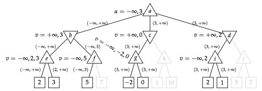
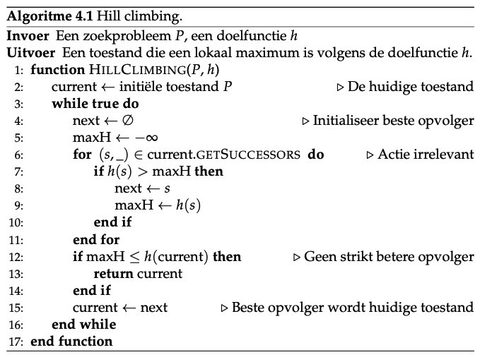
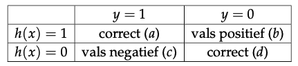

# 1 Rationale Agenten

## 1.1 Definities van artificiële Intilligentie

<table>
    <tr>
        <th>Denken</th>
        <td>"[The automation of] activities that we associate with human thinking, activities such as decision-making, problem solvig, learning ..." (Bellman, 1978)</td>
        <td>"The study of the computations that make it possible to perceive, reason and act." (Winston, 1992)</td>
    </tr>
    <tr>
        <th>Handelen</th>
        <td>"The study of ho to make computers do things at which, at the moment, people are better." (Rich and Knight, 1991)</td>
        <td>"AI ... is concerned with intelligent behavior in artifacts" (Nilsson, 1998)</td>
    </tr>
    <tr class="text-center">
        <td></td>
        <th>Mensenlijk</th>
        <th>Rationaliteit</th>
    </tr>
</table>

De eerste as gaat over “denken vs. handelen”, de tweede as beschrijft systemen alnaargelang hun “menselijkheid” of “rationaliteit”.

### Menselijk handelen 

Turing stelde een operationele definitie van intelligentie voor. Een computer slaagt in de Turing-test wanneer een menselijke ondervrager niet kan uitmaken of de geschreven antwoorden van een persoon of een computer afkomstig zijn.

**Te beheersen deelvelden:**

* Beheersen van natuurlijke taal
* Kennisrepresentatie om te kunnen opslaan wat hij weet of hoort
* Geautomatiseerd redeneren om de opgeslagen kennis te gebruiken om bvragen te beantwoorden en zelf nieuwe conclusies te kunnen afleiden
* Patronen herkennen

Deze test is niet zo interessant, de studie van de onderliggende principes van de deelvelden wel.

### Menselijk denken

Bepalen hoe mensen denken. Aan de hand van een gedetailleerd model van de werking van het menselijk brein hard- en software gebruiken om dit artificieel te implementeren.

### Rationaal denken

Gebied van logica en syllogismen, i.e. redeneerprocessen die leiden tot conclusies die ontegensprekelijk correct zijn wanneer permissen dat zijn.

**Voorbeeld**

1. Alle mannen zijn sterfelijj
2. Socrates is een man
3. Socrates is sterfelijk

**Moeilijkheden**

* Moeilijk informele kennis te vertalen naar logische notatie en regels
* Groot verschil tussen het “in principe” en het “praktisch” oplossen van datzelfde probleem.

### Rationaal handelen

Men tracht rationale agenten te bouwen en dit is de manier waarop AI nu meestal wordt opgevat. Kort gezegd tracht een ratioanle agent op zo een manier te handelen dat hij de best verwachtte uitkomst verkrijgt. Rationaal denken kan een onderdeel zijn maar niet noodzakelijk. 

Kort: Het is niet altijd nodig om de juiste redenering te volgen. Bijvoorbeeld bij Reflexen, je denkt hier ook niet eerst over na wat de voor/nadelen zijn.

## 1.2 Rationale Agenten

### Definitie 

Een agent is elke entiteit die zijn omgeving kan waarnemen aan de hand van zijn sensoren en die invloed kan uitoefenen op zijn omgeving aan de hand van zijn actuatoren.

<table>
	<tr>
		<th></th>
		<th>Mensen</th>
		<th>Robots</th>
	</tr>
	<tr>
		<th>Sensoren</th>
		<td>Zien, Ruiken, Smaken, Voelen, ...</td>
		<td>Lichtsensor, Temperatuursensor, ...</td>
	</tr>
	<tr>
		<th>Actuatoren</th>
		<td>Handen, Voeten, Stem, ..</td>
		<td>Wieltjes, Armen, Geluid, ...</td>
	</tr>
</table>

### WaarnemingsSequentie

Op elk moment krijgt de agent één enkele waarneming binnen. Na verloop van tijd verzamelt de agent (conceptueel) een WaarnemingsSequentie.

### AgentFunctie

Het is de taak van de agent om voor elke mogelijke waarnemingssequentie te reageren met de "juiste" actie. Dit noemen we de Agentfuncite, dit is dus het mappen van waarnemingen naar acties.

### PerformantieMaat

Evalueert sequenties van (omgevings)toestanden. De PerformatieMaat kan (en zal) voor elke applicatie verschillend zijn. Het opstellen hiervan is niet zo eenvoudig als het lijkt. 

PerformantieMaat moet niet gedefinieerd worden in termen van het gedrag van de agent, maar in termen van wat bereikt moet worden.

**Wat rationaal is op een bepaald moment hangt af van de volgende factoren:**

1. Performantiemaat die het succescriterium definieert
2. De ingebouwde kennis van de agent betreffende de omgeving
3. De acties die de agent kan ondernemen
4. De huidige waarnemingssequentie

### Rationale Agent

Selecteert voor elke mogelijke waarnemingssequentie de actie waarvan verwacht wordt dat deze zijn performantiemaat maximaliseert, rekening houdend met het bewijs aangebracht door de huidige waarnemingssequentie en de eventuele ingebouwde kennis van de agent.

## 1.3 Eigenschappen van Omgevingen 

Een omgeving waarin agenten handelen kunnen gecatalogiseerd worden alnaargelang hun kenmerken. Sommige omgevingen zijn gemakkelijker voor agenten, anderen een pak moeilijker.

<table>
	<tr>
		<th>Makkelijker</th>
		<th>vs</th>
		<th>Moeilijker</th>
	</tr>
	<tr>
		<td>Compleet observeerbaar</td>
		<td>vs</td>
		<td>Partieel observeerbaar</td>
	</tr>
	<tr>
		<td>Eenpersoons</td>
		<td>vs</td>
		<td>Multipersoons</td>
	</tr>
	<tr>
		<td>Deterministisch</td>
		<td>vs</td>
		<td>Stochastisch</td>
	</tr>
	<tr>
		<td>Episodisch</td>
		<td>vs</td>
		<td>Sequentieel</td>
	</tr>
	<tr>
		<td>Statisch</td>
		<td>vs</td>
		<td>Dynamisch</td>
	</tr>
	<tr>
		<td>Discreet</td>
		<td>vs</td>
		<td>Continue</td>
	</tr>
</table>

### Definities

* Compleet observeerbaar vs Partieel observeerbaar
	* Compleet: huidige waarneming toegang verschaft tot alle relevante aspecten 		om de volgende actie te ondernemen 
	* Partieel: dit is niet het geval
* Eenpersoons vs Multipersoons
	* Eenpersoons: de agent handelt alleen in de omgeving
	* Multipersoons: er zijn meerdere agenten
* Deterministisch vs Stochastisch
	* Deterministisch: de volgende toestand van de omgeving wordt bepaald door de 	huidige toestand en de actie die werd ondernomen
	* Stochastisch: dit is niet het geval
	
	

	
* Episodisch vs Sequentieel
	* Episodisch: de ervaring van de agent is opgedeeld in verschillende 	onafhankelijke episodes. De actie die wordt ondernomen in de huidige episode 	heeft geen invloed op de volgende
	* Sequentieel: de huidige actie heeft een (potentiële) invloed heeft op alle 	volgende acties
* Statisch vs Dynamisch
	* Statisch: de omgeving verandert niet terwijl de agent nadenkt over zijn 	volgende actie
	* Dynamisch: omgeving verandert wel
* Discreet vs Continue
	* Discreet: eindig aantal toestanden
	* Continue: oneindig aantal mogelijke acties

## 1.4 Structuur van Agenten

Implementatie van een agent adhv een tabel is niet haalbaar in praktijk. De invoer van een agent op elk moment is één waarneming en geen sequentie.

### Types agent op hoog niveau	

Oplopend in volgorde van compelxiteit

* Eenvoudige reflex agent
* Modelgebaseerde reflex agent
* Doelgebaseerde agent
* Utiliteitsgebaseerde agent

### Eenvoudige Reflex Agent

Heeft geen geheugen, neemt volgende actie enkel en alleen op basis van de huidige waarneming. 

Conceptueel bestaat er een lijst van conditie-actie regels die één voor één worden getest en de eerste regel waarvan het antecedent voldaan is wordt uitgevoerd.

**Voorbeeld:**

ALS auto voor mij aan het remmen is DAN rem.

### Modelgebaseerde Reflex Agent

Houdt inschatting bij van de huidige toestand. Deze inschatting is in het algemeen niet gelijk aan de werkelijke toestand. 

De agent beschikt over een model van de manier waarop de toestand wijzigt zowel onafhankelijk van de agent als door de acties van de agent. Wanneer een nieuwe waarneming binnenkomt wordt de inschatting van de huidige toestand aangepast m.b.v. het model, de waarneming en de laatst ondernomen actie. Daarna worden de conditie-actie regels losgelaten op de inschatting van de huidige toestand.

### Doelgebaeerde Agent

De inschatting (of zelfs de volledige kennis) van de huidige toestand is niet steeds voldoende om te weten wat je moet doen. 

Een doelgebaseerde agent beschikt, net zoals de modelgebaseerde agent, over een model van de wereld. Hij bedenkt echter ook hoe de wereld zal evolueren op basis van zijn acties en selecteert die acties die (hopelijk) het doel zullen bereiken.

Deze is veel flexibeler dan een modelgebaseerde reflex agent. Wanneer men een modelgebaseerde reflex agent een nieuwe bestemming wil geven dan moeten alle conditie-actie regels worden herschreven. Bij een doelgebaseerde agent moet enkel de bestemming worden gewijzigd.

### Utiliteitsgebaseerde Agent

Gebruikt een UtiliteitsFunctie die aangeeft hoe “goed” een toestand is. Deze is in essentie niets anders dan de internalisatie van de performantiemaat. Wanneer utiliteitsfunctie en performantiemaat overeenkomen dan zal een utiliteitsgebaseerde agent die zijn (verwachte) utiliteit gaat maximaliseren ook meteen zijn performantie- maat gaan maximaliseren.

Dit is veel flexibeler dan een doelgebaseerde agent.

# 2 ZoekAlgoritmes

## 2.1 Inleiding

### Zoekprobleem bestaat uit volgende elementen

1. Toestandruimte S die alle mogelijke toestanden bevat

2. Verzameling van de mogelijke acties A

3. Transitiemodel dat zegt wat het effect is van het uitvoeren ven een actie op een bepaalde toestand
	
	T: (S,A) &rarr; S: (s,a) &rarr; s1
	
	Wanneer s1 bereikt wordt door het uitvoeren van een actie a op een 	toestand s dan wordt s1 een opvolger van s genoemd
	
	Het uitvoeren van een actie op een bepaalde toestand heeft meestal een 	bepaalde KOST:
	
	c: (S,A,S) &rarr; R: (s,a,s1) &rarr; (s,a,s1)
	

	De kost kan dus afhangen van zowel s, de gekozen actie a, als van de opvolger 	s1. In deterministische omgevingen ligt de opvolger s1 	vast wanneer men s en 	a weet, maar deze definitie kan ook gebruikt worden in 	een stochastische omgeving waar s1 onzeker is.
	
4. Een initiele toestand s0 ∈ S, dit is de toestand waaruit het zoeken zal vertrekken

5. Een doeltest: een functie die voor elke toestand s aangeeft of
 het doel bereikt is of niet. Een toestand waarvoor de doeltest voldaan
 is noemen we een DOELTOESTAND.
 
### ToestandsRuimteGraaf

De toestandsruimte S kan samen met de transitie- en kostfunctie gebruikt worden om een ToestandsRuimteGraaf G op te bouwen. 

In deze graaf stellen de knopen de toestanden voor en twee knopen zijn verbonden door een (gerichte) boog wanneer de ene knoop de opvolger is van de andere door het uitvoeren van een bepaalde actie. 

De kost (of het gewicht) van een boog is dan uiteraard de kost van de bijhorende actie.

### Oplossing

Een Oplossing van Zoekprobleem bestaat uit een sequentie van acties zodanig dat startend vanuit de initiële toestand een doeltoestand wordt bereikt.

De **Kost van een oplossing** is de som van de kosten van de individuele acties.

Een **Optimale Oplossing** is een oplossing waarvoor de kost minimaal is onder alle mogelijke oplossingen.

## 2.2 Algemene Zoekalgoritmen

### 2.2.1 Boomgebaseerd Zoeken

Er wordt een lijst bijgehouden van mogelijke partiële oplossingen die nog verder uitgewerkt moeten worden. Deze lijst wordt de **Open Lijst** genoemd.

Bij de start van de uitvoering bestaat deze enkel uit het plan corresponderend met de initiële toestand. Bij elke iteratie van het algoritme wordt een plan gekozen uit deze lijst (volgens één of andere strategie). 

Wanneer de (eind)toestand van het gekozen plan voldoet aan de doeltest dan stopt het algoritme. 

Wanneer dit niet het geval is dan worden de plannen voor alle opvolgers van de (eind)toestand van het gekozen plan toegevoegd aan de open lijst (waardoor deze ook beschikbaar worden voor expansie). Wanneer de open lijst op een bepaald moment leeg is dan geeft het algoritme aan dat er geen oplossing werd gevonden.

Conceptueel bouwen we dus een **Zoekboom** op. Dezelfde toestand kan (en zal) in het algemeen meerdere malen voorkomen in een zoekboom.

#### Voorbeeld

#### Plan

Het is echter niet nodig om in elke top het volledige pad op te slaan. Zolang we weten wat het vorige plan is kunnen we, in combinatie met de laatst gekozen actie, het volledige plan opstellen.

Plan bestaat uit vier velden:

* Huidige toestand
* Laatst gekozen actie a, deze is enkel leeg voor het plan geassocieerd met de initiële toestand
* De voorganger of ouder van dit plan, een referentie naar het plan waatvan it plan is afgeleid door het toepassen van de huidige actie a
* De totale kost g van dit plan. Strikt genomen kunnen we deze kost ook 	berekenen door het volgen van de voorganger-referenties. Deze berekening 	heeft echter een uitvoeringstijd die lineair is in het aantal acties van het 	plan.

### 2.2.2 Criteria voor Zoekalgoritmen

1. Een zoekalgoritme is **compleet** wanneer het algoritme, voor elk zoekprobleem met een oplossing, effectief een oplossing vindt
2. Een zoekalgortime is **optimaal** wanneer het niet enkel een oplossing vind maar steeds een optimale oplossing teruggeeft voor elk zoekprobleem met een oplossing
3. De **tijdscomplexiteit** van een zoekalgortime bepaalt de uitvoeringstijd van het algoritme, we nemen aan dat de uitvoeringstijd evenredig is met het aantal gegenereerde toppen
4. De **ruimtecomplexiteit** van een zoekalgoritme bepaalt de hoeveelheid geheugen die het algoritme nodig heeft tijdens de uitvoering, dit wordt meestal uitgedrukt in als het maximaal aantal toestanden dat gelijktijdig moet worden bijgehouden

#### Vertakkingsfactor

Geeft het maximaal aantal opvolgers van een top in de zoekboom

Het aantal toppen in een zoekboom met vertakkingsfactor b en maximale diepte m wordt gegeven door:

### 2.2.3 Graafgebaseerd Zoeken

Het grootste probleem van boomgebaseerd zoeken is dat dit algoritme niet onthoudt waar het reeds geweest is. Dit zorgt ervoor dat we in sommige gevallen te oneindige lussen zijn, en dat we in veel andere gevallen een grote hoeveelheid werk herhaaldelijk uitvoeren.

De oplossing voor het probleem bestaat erin om te onthouden welke toestanden reeds geëxpandeerd zijn in, wat men noemt, een **gesloten lijst**. 

Merk op dat de gesloten lijst toestanden bevat terwijl de open lijst plannen bevat.

Bij **graafgebaseerd zoeken** wordt elke toestand hoogstens éénmaal geëxpandeerd. Wanneer een plan van de open lijst wordt gehaald dat een toestand bevat die reeds geëxpandeerd is, dan wordt deze niet opnieuw geëxpandeerd.

## 2.3 Blinde Zoekmethoden

Blinde zoekmethoden kunnen enkel gebruikmaken van de informatie die verschaft wordt door de definitie van het zoekprobleem. Ze beschikken niet over extra informatie die hen kan helpen bij het zoekproces.

### 2.3.1 Breedte Eerst Zoeken

Er wordt een open lijst en wachtrij gebruikt. Dit is een FIFO datastructuur. De zoekboom wordt systematisch laag per laag opgebouwd.

Het algoritme zal steeds een oplossing vinden voor elke zoekboom dat effectief een oplossing heeft. Het algoritme vindt steeds de meest ondiepe doeltop, i.e. het retourneert een oplossing met een minimaal aantal acties.

Dit is enkel optimaal wanneer alle acties dezelfde kost hebben.

#### Tijdscomplexiteit

Het aantal gegenereerde toppen is (op term b na) gelijk aan:

1 + b + b2 + ... + bd + bd+1 = O(bd+1)

De tijdscomplexiteit van breedte eerst is exponentieel in de diepte van de meest ondiepe doeltop.

#### Ruimtecomplexiteit

De ruimtecomplexiteit is eveneens gelijk aan O(bd+1)

#### Breedte Eerst

Bij graafgebaseerd breedte eerst zoeken kan men veel tijd winnen t.o.v. boomgebaseerd zoeken wanneer veel toestanden meerdere malen voorkomen in de zoekboom. Het extra geheugen dat men moet spenderen aan het bijhouden van de gesloten lijst weegt niet op tegen de tijdswinst die men kan maken. Om deze reden wordt breedte eerst zoeken meestal uitgevoerd in zijn graafgebaseerde versie.

### 2.3.2 Diepte Eerst Zoeken

Diepte eerst zoeken is in zekere zin duaal aan breedte eerst zoeken: hier gebruikt men een LIFO structuur voor het bijhouden van de open lijst. Deze stapel zorgt ervoor dat men zo snel mogelijk zo diep mogelijk in de boom afdaalt.

Diepte eerst zoeken genereert steeds een linkerdeel van de boom. Wanneer m eindig is en de enige doeltop helemaal rechts onderaan in de boom zit dan worden alle toppen van de boom gegenereerd. In het slechtste geval is de tijdscomplexiteit m.a.w. O(bm). Dit is dezelfde exponentiële (en dus slechte) tijdscomplexiteit als bij breedte eerst.

Diepte eerst kan in bepaalde gevallen toch in een oneindige lus geraken. Diepte eerst is niet optimaal. Zelfs wanneer diepte eerst een oplossing vindt is deze niet gegarandeerd een optimale oplossing.

Waar diepte eerst wel goed op scoort is op het vlak van benodigd geheugen. Wanneer een bepaalde top wordt geëxpandeerd dan behoren enkel de broers van zijn voorouders tot de open lijst. Aangezien er maximaal m niveaus zijn en er hoogstens b broers zijn is de ruimtecomplexiteit van diepte eerst van de orde O(b · m). Dit is een lineaire functie van b. Dit is dus een heel stuk beter dan de exponentiële ruimtecomplexiteit in het geval van breedte eerst.

### 2.3.3 Iteratief Verdiepen

Het is een lus rond diepte eerst zoeken waarbij het zoekproces wordt afgebroken wanneer een bepaalde diepte wordt bereikt; dit zoekproces wordt **Diepte-Gelimiteerd Zoeken** genoemd.

Het algoritme wordt recursief geïmplementeerd en bij elke recursieve oproep wordt de maximale toegelaten diepte met één verminderd. Wanneer de toegelaten diepte de waarde nul bereikt dan wordt het meegegeven plan niet verder geëxpandeerd (en gebeuren er dus ook geen recursieve oproepen meer).

Het algoritme heeft een bijzondere returnwaarde nl. “hit boundary” om aan te geven dat er geen oplossing werd gevonden binnen de opgegeven dieptelimiet maar dat tijdens het zoekproces de dieptelimiet minstens éénmaal werd bereikt. Deze returnwaarde geeft aan dat een oplossing eventueel kan gevonden worden wanneer de maximale toegelaten diepte wordt verhoogd.

Bij elke iteratie van Iteratief Verdiepen, wordt de maximaal toegelaten diepte met één verhoogd. Het algoritme stopt de eerste maal dat een oplossing wordt gevonden of wanneer het duidelijk is dat er geen oplossing is. Op die manier vermijden we het probleem van diepte eerst dat we terechtkomen in een oneindige lus. We vinden op deze manier immers steeds de meest ondiepe doeltop. Tegelijkertijd behouden we de goede eigenschappen m.b.t. de de ruimtecomplexiteit van diepte eerst.

Op het eerste zicht zou men denken dat dit proces een gigantische hoeveelheid werk te veel doet. De eerste lagen van de zoekboom worden immers meerdere malen opgebouwd. De eerste lagen van de zoekboom bevatten echter relatief weinig toppen tegenover de diepere lagen zodat de hoeveelheid werk die “te veel” wordt verricht relatief beperkt blijft.

Iteratief verdiepen is een compleet zoekalgoritme en zal steeds de oplossing met het minste aantal acties vinden. Het algoritme is in het algemeen niet optimaal maar wel in het bijzondere geval dat alle acties dezelfde kost hebben. Het algoritme heeft een exponentiële tijdscomplexiteit maar slechts een lineaire ruimtecomplexiteit.

### 2.3.4 Uniforme Kost Zoeken

Uniforme kost zoeken tracht het probleem dat breedte eerst niet noodzakelijk optimaal is wanneer acties een verschillende kost hebben op te lossen door steeds het plan te expanderen waarvoor de totale kost van dit plan minimaal is. De open lijst wordt hier m.a.w. geïmplementeerd aan de hand van een prioriteitswachtrij. Een kleinere kost betekent een grotere prioriteit.

Het idee achter uniforme kost zoeken is dus in essentie gelijk aan het algo- ritme van Dijkstra.

#### Voorbeeld

Van S naar B:

## 2.4 Geinformeerde Zoekmethoden

### 2.4.1 Heuristieken

#### Definitie

Een heuristiek h is een afbeelding van de verzameling toestanden S naar de verzameling niet-negatieve reële getallen R+.

h: S &rarr; R+ : s &rarr; h(s)

Wanneer h(s) klein is dan is s niet ver van een doeltoestand verwijderd.

#### Toelaatbaar

Een heuristiek h: S → R+ is toelaatbaar als voor elke toestand s geldt dat h(s) ≤ C∗(s) waarbij C∗ de kost van een optimale oplossing voorstelt van s naar een doeltoestand.

Wanneer de heuristiek h toelaatbaar is, dan is h(g) = 0 voor elke doeltoestand g.

#### Consistent

Een heuristiek h: S → R+ is consistent als voor elke doeltoestand g geldt dat h(g) = 0 en als bovendien voor elke toestand s en elke actie a op s met s1 = T (s, a) geldt dat

h(s) ≤ c(s, a, s1) + h(s1)

Wanneer een heuristiek consistent is, is deze ook onmiddelijk toelaatbaar.

Het is niet zo dat elke toelaatbare heuristiek ook consistent is.

### 2.4.2 Gulzig Beste Eerst

De gulzig beste eerst zoekmethode maakt gebruik van een heuristiek h. De methode kiest steeds de top met de kleinste waarde van h als de volgende top die wordt geëxpandeerd. De open lijst wordt hier dus, net als bij uniforme kost zoeken, geïmplementeerd als een prioriteitswachtrij en een kleinere waarde voor h betekent een grotere prioriteit.

Deze algoritme is echter niet optimaal en niet compleet. Het houdt geen rekening met de kost, en de tijd- en ruimte complexiteit zijn in het slechtste geval van de orde O(bm)

### 2.4.3 A* Zoekalgoritme

Het probleem van de gulzig beste eerst zoekmethode is dat er enkel rekening wordt gehouden met de waarde van de heuristiek en niet met de kost van de reeds afgelegde weg. Er wordt waardevolle informatie genegeerd.

Bij de A* zoekmethode wordt de open lijst nog steeds geïmplementeerd als een prioriteitswachtrij maar de volgende top die wordt geëxpandeerd is de top (plan) n waarvoor

f(n) = g(n) + h(n)

minimaal is.

Deze algoritme is niet noodzakelijk optimaal wanneer er een niet-toelaatbare heuristiek gebruikt wordt.

Wanneer boomgebaseerde A* gebruikmaakt van een toelaatbare of een consistente heuristiek h en wanneer alle acties een kost hebben groter of gelijk aan een zekere strikt positieve e, dan is A∗ compleet en optimaal, i.e. dan vindt het algoritme steeds een optimale oplossing wanneer die bestaat.

De tijds- en ruimtecomplexiteit zijn in het slechtste geval nog steeds exponentieel, waarbij in de meeste gevallen A* sneller een tekort heeft aan geheugen dan aan tijd.

## 2.5 Ontwerpen van Heuristieken

### 2.5.1 Gebruik van Vereenvoudigde Problemen

Door één of meerdere van deze condities (restricties) weg te laten.

Het is uiterst belangrijk dat de vereenvoudigde problemen efficiënt kunnen opgelost worden, i.e. zonder het uitvoeren van een zoekalgoritme. Het is belangrijk dat een heuristiek efficiënt berekend kan worden.

### 2.5.2 Patroon Databanken

Een aanvaardbare heuristiek kan ook gevonden worden als de kost van een optimale oplossing voor een deelprobleem.

Er kan vervolgens een databank aangelegd worden met voor elk patroon de optimale oplossingskost van het deelprobleem.

Het aanleggen van de databank kan (omdat de acties omkeerbaar zijn) vereenvoudigd worden door (graaf- gebaseerde) breedte-eerst uit te voeren startend vanaf het doelpatroon, en bij te houden wat de afstand is vanaf het doelpatroon (dat gebruikt werd als initiële toestand).

Twee heuristieken kunnen gecombineerd worden door het nemen van het maximum:

h(s) = max(h1(s), h2(s)

Het resultaat is een betere heuristiek die nog steeds aanvaardbaar is.

# 3 Zoeken met een Tegenstander

## 3.1 Inleiding

Hoe moet een agent moet handelen om zijn performantiemaat te maximaliseren wanneer er in de omgeving nog een andere (competitieve) agent aanwezig is.

De agenten spelen om de beurt. Zo’n omgeving wordt vaak een “spel” genoemd.

### Definitie

Een Twee persoons nulsomspel wordt gespeeld door twee spelers (genaamd Max en Min) en bestaat verder uit de volgende componenten:

* Verzameling van toestanden S
* Verzameling van mogelijke acties A
* Transitiemodel
* Initiële toestand
* Eindtest
* Opbrengstenfunctie U die zegt voor elke eindtoestand en voor elke speler wat de opbrengst is in deze toestand voor de gegeven speler. Omdat het spel een nulsomspel is geldt voor alle eindtoestanden s dat

	U (s, Max) + U (s, Min) = K
	
	Waarbij K een constante die hoort bij het spel, deze is niet noodzakelijk gelijk aan 0
	
## 3.2 Spelbomen en het Minimax Algoritme

De initiële toestand s0 bepaalt, samen met het transitiemodel T en de eindtest een Spelboom voor het gegeven spel. De wortel van de spelboom is de initiële toestand. De kinderen van een top zijn de opvolgers van de toestand horend bij de top onder het gegeven transitiemodel. 

De blaadjes van de boom corresponderen met de eindtoestanden van het spel. De waarden die worden geschreven bij deze blaadjes corresponderen met de opbrengstfunctie vanuit het standpunt van de speler Max.

De spelboom is vooral een theoretisch concept, want voor realistische spellen is deze veel te groot om volledig op te bouwen.

### Minimax beslissing

Eens de minimax waarde van een toestand is bepaald is het eenvoudig om de bijhorende actie voor Max te selecteren. Men kiest eenvoudigweg die actie (of één van de acties) waarvoor het maximum wordt bereikt. Die noemt men dan de Minimax Beslissing.

De minimax beslissing is de beste beslissing wanneer er wordt gespeeld tegen een tegenstander die ook optimaal speelt. Een andere beslissing dan de minimax beslissing kan (en zal) door een optimaal spelende tegenstander uitgebuit worden om ervoor te zorgen dat zijn eigen opbrengst zal stijgen (of gelijk blijven).

## 3.3 Snoeien van Spelbomen

De waarde van sommige toppen is irrelevant voor het eindresultaat.

Het niet evalueren van een tak in een spelboom (omdat die het eindresultaat toch niet kan beïnvloeden) wordt het Snoeien van die tak genoemd.

### Definitie α-β-snoeien

De parameter α houdt de waarde bij van de beste keuze (i.e. de hoogste waarde) op het huidig pad voor Max. De parameter β houdt de waarde bij van de beste keuze (i.e. de laagste waarde) op het huidig pad voor Min.

Max wijzigt de α-waarden en Min de β-waarden. Op elk moment heeft de top in de spelboom een huidige waarde v; deze waarde stijgt voor Max en daalt voor Min. Er kan gesnoeid worden als één van volgende voorwaarden voldaan is:

1. Min merkt dat de huidige waarde v kleiner (of gelijk) is aan α. Een
 rationele Max zal immers het spel nooit hier laten komen aangezien
 hij op het huidig pad reeds een betere keuze heeft.
 
2. Max merkt dat de huidige waarde v groter (of gelijk) is aan β. Een
 rationele Min zal immers het spel nooit hier laten komen aangezien
 hij op het huidig pad reeds een betere keuze heeft.
 
### Uitwerking α-β-snoeien
 
 
 
 

 
### Algoritme α-β-snoeien
 

De volgorde waarin de opvolgers bekeken en uitgewerktworden worden heeft een zeer grote invloed op de effectiviteit van het snoei-algoritme.

Benadering voor effectieve vertakkingsfactor: 

be ≈ N1/m

## 3.4 Praktische Uitwerking

In veel spelbomen komt dezelfde toestand meerdere malen voor wat leidt tot extra wek. Dit kan opgelost worden door de toestanden en hun minimax haarde bij te houden in een hashtabel.

### TranspositieTabel

Hash tabel voor spelbomen. Het bijhouden hiervan kan een grote tijdswinst betekenen. Als het aantal toestanden te groot is worden er strategieën gebruikt om te beslissen welke bijgehouden worden.

### Heuristische EvaluatieFunctie

In praktijk wordt er een limiet opgesteld op de diepte van de boom. Wanneer deze limiet wordt bereikt voordat de eindtoestand wordt bereikt, dan gebruikt men deze functie om de waarde van die toestand te benaderen.

We krijgen de volgende formule om een heuristische minimax waarde te berekenen voor maximale diepte d:

De kwaliteit van de heuristische evaluatiefunctie heeft een grote invloed op de performantie van het algoritme. Wanneer een heuristische evaluatiefunctie verkeerdelijk een hoge waarde toekent aan slechte posities, dan zal het algoritme in de richting van de slechte posities gestuurdworden.

### Eigenschappen Heuristische EvaluatieFunctie

1. Eindtoestanden moeten op dezelfde manier geordend worden als de opbrengstFunctie U

2. Moet snel berekend kunnen worden

3. Waarde voor niet-eindtoestanden moet sterk gecorreleerd zijn met de kans om effectief te winnen vanuit die toestand

een toestand wordt geëvalueerd als een gewogen lineaire combinatie van features:

EVAL(s) = θ1f1(s) + θ2f2(s) + ··· + θnfn(s)

Wanneer het niet duidelijk is wat “juiste” waarden voor de gewichten θi zijn,dan kunnen technieken voor machineel leren gebruikt worden om deze tebepalen.

# 4 Lokaal Zoeken en Genetische Algoritmen

## 4.1 Lokale Zoekmethoden

#### Lokale ZoekAlgoritmes

Deze houdt zich niet bezig met het bijhouden van oplossingspaden. Ze houden één (of beperkt aantal) huidige toestanden bij en vervangen in het algemeen deze huidige toestand door één van zijn opvolgers in de hoop zo een optimale toestand te bereiken.

#### Voordelen

1. Gebruikt beperkte, constante hoeveelheid hoofdgeheugen

2. Vinden vaak redelijk goede oplossingen in zeer grote toestandsruimten waar systematische zoekalgoritmes falen

#### OptimalisatieProblemen

Lokale zoekalgoritmes worden voornamelijk hiervoor gebruikt. Hier is er een doelfunctie die met elke toestand een waarde associeert.

h: S &rarr; R: s &rarr; h(s)

Deze doelfunctie moet geoptimaliseerd worden.

#### Globaal en Lokaal Maximum of Minimum

##### Globaal Maximum

Een toestand s is een Globaal Maximum voor een doelfunctie h als voor alle toestanden s′∈ S geldt dat:

h(s) ≥ h(s′)

##### Lokaal Maximum

Een toestand s is een Lokaal Maximum voor een doelfunctie h als voor alle toestanden s′ van s geldt dat:

h(s) ≥ h(s′)

##### Minimum 

Gelijkaardig aan Maximum

Elk maximalisatieprobleem kan echter omgezet worden in een equivalent minimalisatieprobleem (en omgekeerd) bijvoorbeeld door de negatie te nemen van de doelfunctie.

### 4.1.1 Hill Climbing

Hill climbing is het meest eenvoudige lokale zoekalgoritme.  Het algoritme start in een (random) begintoestand. In elke iteratie vervangt het deze toestand door de beste toestand onder zijn opvolgers op voorwaarde dat deze beter is. Het algoritme stopt wanneer er geen verbetering meer mogelijk is.

Hillclimbing is een gulzig algoritme omdat het bij elke iteratie steeds doet wat op dat momenthet beste lijkt, zonder stil te staan bij mogelijke verdere gevolgen van deze actie.

Hier wordt steeds de eerste “beste” opvolgergekozen wanneer er meerdere “beste” opvolgers zijn. In de meeste implementaties van hill climbing kiest men random onder deze beste opvolgers.

#### Voordelen

* Eenvoudig en snel algoritme
* kan initieel (vanuit een slechte toestand) vaak snel vooruitgang boeken
* ALs het faalt, faalt het vroeg

#### Redenen tot Falen in vinden van Globaal Maximum

1. Lokale Maxima: Er wordt een lokaal maximum bereikt

2. Plateaus: Er wordt niet verder gegaan wanneer de beste opvolger evengoed is al de huidige toestand, dit kan opgelost worden door zijwaartse stappen

#### Nadelen

* Faalt veel
* Niet compleet

Echter, door gebruik te maken van random herstarten kan het algoritme compleet worden gemaakt met waarschijnlijkheid 1.

### 4.1.2 Simulated Annealing

In elke iteratie wordt een random opvolger gegenereerd.

Wanneer deze strikt beter is dan de huidige oplossing, wordt deze aanvaard als nieuwe toestand.

Wanneer deze niet beter is dan aanvaarden we deze met een zekere waarschijlijkheid. Deze wordt beinvloed door tijdstip en de mate waarin de potentiele opvolger slechter is dan de huidige toestand.

De aanvaardingswaarschijnlijkheid daalt naarmate het algoritme vordert.

Het algoritme gebruikt een afkoelingschema om aan te geven hoe lang het algoritme nog te lopen heeft. Het is van belang dat de temperatuur traag genoeg afkoelt. Dan zal het algoritme een optimale oplossingvinden met een waarschijnlijkheid die nadert naar 1.

#### AanvaardingsWaarschijnlijkheid

Figuur toont de aanvaardingswaarschijnlijkheid voor drie verschillende waarden van ∆E

Veronderstel dat de huidige temperatuur T gelijk is aan 4.  Een potentiële opvolger met ∆E = −1 wordt aanvaard met waarschijnlijkheid

e∆E/T = e−1/4 ≈ 0.7788

### 4.1.3 Gradient Descent

#### Bespreking

We beschouwen nu de situatie waarin de toestandsruimte continu is en we nemen m.a.w. aan dat de toestanden n-dimensionale vectoren zijn. 

We nemen verder aan dat de doelfunctie h (met h: Rn → R) die we wensen te minimaliseren een wiskundig “brave” functie is zonder “sprongen” (continu) en zonder “knikken” (afleidbaar).

#### Gradient Descent

Bij en in elke iteratie wensen we de huidige toestand te verbeteren, in dit geval dus verkleinen, door een stapje te nemen in de richting waarin de functie h het sterkst daalt.

#### Gradient Berekenen

Gebruikt om richting van de sterkste stijging te vinden.

Merk op dat deze gradiënt eveneens een vector is; deze kan dus opgeteld worden bij een punt dat de huidige toestand voorstelt.  De partiële afgeleiden kunnen ofwel analytisch berekend worden of kunnen benaderd worden als

Het enige wat een implementatie van gradient descent nodig heeft is een functie g die voor elk punt x ∈ Rn een vector teruggeeft die gelijk is aan de gradiënt van h in dat punt. 

Hiernaast gebruikt het algoritme een striktpositieve stapgrootte α.  

Wanneer α klein genoeg is dan zal het algoritme convergeren naar een lokaal minimum, i.e. na een tijdje zal het huidig punt x nagenoeg ongewijzigd blijven en zal een lokaal minimum zijn. 

Wanneer de functie h slechts één lokaal minimum heeft (onmiddellijk ook globaal minimum) dan zal het algoritme dit globale minimum vinden. Wanneer h meerdere (lokale) minima heeft dan kan een herstart van het algoritme soelaas brengen.

Hetgeen gebeurt in de binnenste lus van gradient descent is de volgende wiskundige operatie:

x ← x − α∇h(x)

Het symbool α is een scalair (een reëel getal), terwijl x en ∇h(x) vectoren zijn. De bewerking 

α∇h(x)

is m.a.w. descalaire vermenigvuldiging. Het verschil is het verschil tussen vectoren.

## 4.2 Genetische Algoritmen

Algoritmen die een vast aantal huidige toestanden bijhouden.

Het doel is om een toestand s te vinden uit een verzameling S die de waarde van een doelfunctie h maximaliseert. Hier is geen notie van opvolgers vereist.

Geïnspireerd op natuurlijke selectie.

Genetische algoritmen zijn iteratief.  Bij elke iteratie wordt een nieuwe populatie berekend op basis van de voorgaande. Hiertoe wordt een selectiemechanisme toegepast dat bepaalt welke individuen hun genetisch materiaal kunnen doorgeven aan de volgende generatie a.d.h.v.recombinatie.

Nadat de kinderen bepaald werden wordt er soms nog een willekeurige mutatie toegepast. Dit proces van selectie, recombinatie en mutatiewordt herhaald totdat ofwel de gealloceerde tijd opgebruikt is of totdat een individu werd gevonden dat geacht wordt om “voldoende goed” te zijn.

### 4.2.1 Populatie en Encodering

Genetische algoritmen houden een populatie bij van een vast aantal individuen. 

Elk individu encodeert een element van de toestandsruimte s.

### 4.2.2 Fitnessfunctie en Selectiemechanisme

#### Fitnessfunctie

Bij elke iteratie van het algoritme wordt een nieuwe populatie opgebouwd die de volgende generatie wordt genoemd. Een fitness functie f bepaaltvoor elk lid van de huidige populatie hoe “goed” dit individu is. Hogere waarden duiden op betere individuen.

#### Selectiemechanisme

Een selectiemechanisme bepaalt welke individuen hun genetisch materiaal mogen doorgeven aan de volgende generatie. Het selectie mechanisme wordt meestal zodanig gekozen dat de kans op selectie van een individu stijgt naarmate  de  fitness van dat individu stijgt.

#### Roulette Wiel Selectie

Hierbij krijgt elk individu een stuk van een roulette wiel toegewezen. De grootte is evenredig met zijn fitness. Als er n individuen zijn in de huidige populatie en als de fitheid van individu i gegeven wordt door fi, dan is de kans dat i gekozen wordt voor selectie bij één enkele draai aan het wiel gelijk aan de **Fitness Ratio**

Een probleem van roulette wiel selectie kan zijn dat het fitste individu zo veel beter is dan de rest dat het te vaak wordt gekozen, terwijl het misschien globaal geziennog niet zo’n goed individu is.

#### Rang Gebaseerde Selectie

Hierbij wordt enkel rekening gehouden met de relatieve positie van de individuen wanneer ze gerangschikt worden volgens hun fitheid. De kans dat het individu met rang i geselecteerd wordt is dan

Hier kan het selectieproces niet gedomineerd worden door een aantal fitte individuen.

### 4.2.3 Recombinatie en Mutatie

Nadat er n individuen gekozen zijn wordt een nieuwe generatie gecreëerd. In het algemeen zal het genetisch materiaal van twee ouders gebruikt worden om twee nieuwe afstammelingen te creëren.  Dit noemt men **Recombinatie**.

#### Eenpunts Crossover

Meest eenvoudige vorm van recombinatie.

Hierbij wordt op een random plaats in de string een crossover punt gekozen. Het eerste kind bestaat dan uit het eerste deel van de eerste ouder en het tweede deel van de tweede ouder. Het tweede kind omgekeerd.

1001 en 0100 &rarr; 1000 en 0101

#### Geordende Crossover

Garandeert dat de kinderen nog steeds geldig zijn.

p1: 1,2|3,8,4|5,6,7
p2: 1,2|3,8,6|7,5,4

Gedeelte tussen kinderen wordt ongewijzigd overgebracht:

c1: 2,6|3,8,4|7,5,1
c2: 2,4|3,8,6|5,7,1

Om de resterende gedeeltes van c1 te bepalen maken we een lijst van alle van p2 die nog niet voorkomen in c1 startend na het tweede crossoverpunt. Deze worden  dan ingevuld in c1 eveneens startend na het tweede crossover punt:

c1: x,x|3,8,4|x,x,x
c2: x,x|3,8,6|x,x,x

#### Mutatie

Nadat kinderen gecreëerd zijn kan met een lage probabiliteit nog een random **Mutatie** optreden. Hierdoor worden er nieuwe regio’s van de zoekruimte opgezocht. De manier waarop de mutatie wordt geïmplementeerd hangt af van de encodering.

### 4.2.4 Een Eenvoudige Implementatie

Hierbij moeten nog een heel aantal keuzes worden gemaakt. Naast de drie parameters moet er beslist worden hoe de ouders worden gekozen in **Randomselection**. Merk op dat een efficiënte implementatie zal trachten om de fitness van de individuen slechts éénmaal te berekenen per iteratie. Verder moet er nog een implementatie worden voorzien voor het genereren van de twee kinderen m.b.v. de functie **Reproduce**. Tenslotte moet er nog een implementatie worden gegeven voor de functie **Mutate**.

### 4.2.5 Besluit en Toepassingen

Door de random componenten die aanwezig zijn in de implementatie van genetische  algoritmen is het niet gegarandeerd dat het eindigt met een globaal optimum.  

Het is m.a.w. niet gegarandeerd dat een het steeds de beste oplossing vindt.   Toch is het zo dat voor veel complexe optimalisatieproblemen genetisch algoritmen er in slagen om zeer goede oplossingen te bekomen op voorwaarde dat de encodering van de individuen goed gekozen is.

Het is immers meestal zo dat de recombinatie operatoren grotere stukken opeenvolgend genetisch materiaal doorgeven aan hun kinderen. Het moet dan ook zo zijn dat deze stukken interessante eigenschappen van de oplossing voorstellen.

# 5 Machinaal Leren

## 5.1 Inleiding

Het deelveld van artificiële intelligentie dat computers de mogelijkheid geeft om te leren zonder hiervoor expliciet geprogrammeerd te zijn.

## 5.2 Drie Types van Machinaal Leren

### 5.2.1 Gesuperviseerd Leren

De taak bestaat erin om op basis van een gelabelde trainingsdataset een hypothese op te bouwen waarmee, vooreen (nieuwe) invoer het label kan voorspeld worden. 

Wanneer het label een getal is, dan spreekt men van een **RegressieProbleem**. 

Wanneer het label één van een (klein) aantal voorgedefinieerde klassen is dan  spreekt men van een **ClassificatieProbleem**.

Wanneer er slechts 2 klassen zijn spreekt men van een **binair** classificatieprobleem.

Het leeralgoritme heeft als uitvoer een functie h die de **hypothese** genoemd wordt.

### 5.2.2 Ongesuperviseerd Leren

De taak bestaat erin om structuur te ontdekken in een ongelabelde dataset. De meestvoorkomende taak in ongesuperviseerd leren is **Clustering**, het ontdekken van coherente groepen. Andere taken zijn **Anomaliedetectie** en **Primaire Componentenanalyse**

### 5.2.3 Reinforcement Learning

Reinforcement learning is verschillend in die zin dat er niet wordt gewerkt met datasets. In de plaats hiervan leert de agent van een reeks van “beloningssignalen”, die negatief zijn wanneer de agent een “slechte” handeling stelt en positief wanneer de agent een goede handeling stelt. 

Eenvoudig gezegd bestaat de taak van reinforcement learning erin om te leren welke acties, i.e.  welk beleid, leiden tot de hoogste totale beloning.

## 5.3 Evaluatie van Hypothesen voor Gesuperviseerd leren

### 5.3.1 Foutmaten

Numerieke maat om gemakkelijk verschillende hypothesen te vergelijken. Kleinere numerieke waarden duiden meestal op betere hypothesen.

#### Regressieprobleem

Hiervoor neemt men als maat voor de fout vaak de **Gemiddelde Kwadratische Afwijking** tussen de voorspelde labels en de werkelijke labels over de verzameling voorbeelden. 

In formulevorm:

#### Classificatieprobleem

Hiervoor gebruikt men vaak de **FoutRatio**, dit is  het percentage voorbeelden dat het verkeerde label toegewezen krijgt.

In formulevorm:

#### Binair Classificatieprobleem

De **Precisie** zegt welk percentage van de voorbeelden die voorspeld waren als positief ook effectief positief waren:

precisie = a / (a + b)

De **Rappel** zegt welk percentage van de positieve voorbeelden ook effectief als positief werd gelabeld door de hypothese:

precisie = a / (a + c)

De **Performantie** van een hypothese kan worden uitgedrukt als één enkel getal.  De precisie en de rappel kunnen gecombineerd worden in één enkele score, de F-SCORE:

### 5.3.2 Trainings-, Validatie-, en TestData

Trainingsdata dient om de agent te trainen. Testdata is om te testen hoe goed de hypothese scoort op nieuwe data.

Een hypothese die goed scoort op trainingsdata maar slecht scoort op testdata (een hypothese die niet goed generaliseert naar nieuwe data) leidt aan overfitting. Wanneer de klassen van hypothesen waaruit gekozen kan worden niet groot genoeg is om een hypothese te vinden die goed generaliseert. Men spreekt dan van onderfitting.

Wanneer moet gekozen worden tussen meerdere modellen die de data goed verklaren dan zegt het principe Ockhams scheermes dat men het meest eenvoudige model moet kiezen. Men moet ook opletten dat het model niet te eenvoudig wordt.

Om overfitting te vermijden gebruiken sommige modellen metaparameters of moet er beslist worden wanneer een trainingsproces wordt gestopt. Bij deze beslissing gebruikt men een validatie dataset.

# 6 Gesuperviseerd Leren

## 6.1 Lineaire Regressie

### 6.1.1 Probleemstelling

Hypothesen van de vorm: hw,b (x) = w1 x1 + w2 x2 + · · · + wn xn + b = wx + b. 

Hierbij zijn w = (w1 , w2 , . . . , wn ) ∈ R1×n en b ∈ R.

Met elke hypothese h van bovenstaande vorm associëren we een kost (gebaseerd op de beschikbare voorbeelden). We zoeken die hypothese h die de kost (voor de gegeven dataset) minimaliseert. De kost is niets ander dan de gemiddelde kwadratische afwijking tussen de voorspelde labels hw,b (x(i)) en de werkelijke labels y(i).

### 6.1.2 Oplossingsmethode

We maken gebruik van gradient descent om de kostfunctie J te minimaliseren. Deze functie heeft juist één lokaal minimum.
