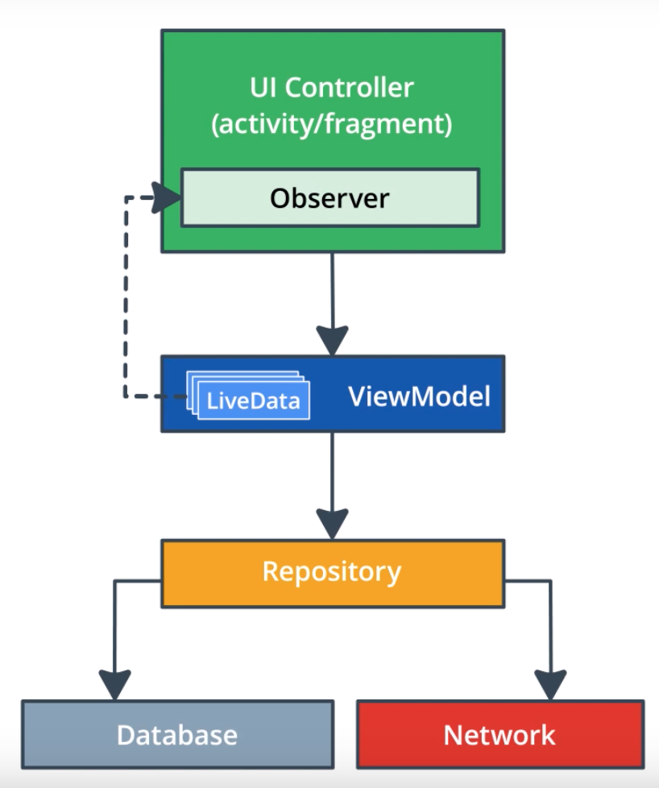
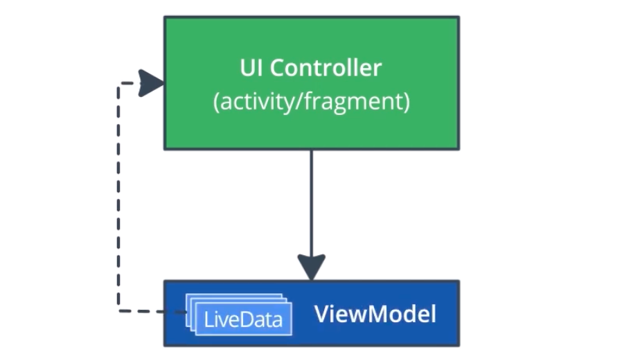
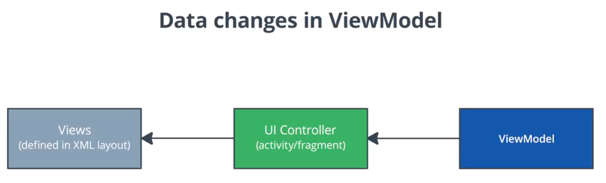
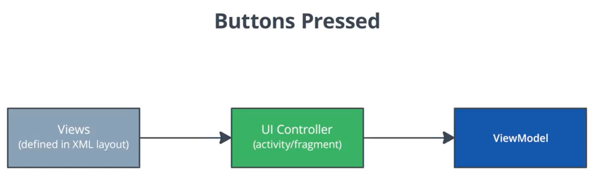
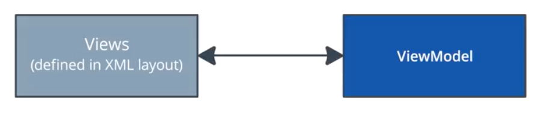

# Lesson 5: App Architecture (UI Layer)

onSaveInstance has some issues. They require extra code to store the state in the bundle, and then the logic to retrieve that state. They are meant to be kept pretty small. These are the types of problems that application architecture and the lifecycle library are meant to solve. 

Application architecture is a way of designing your apps classes and the relationship between them such that the codebase is more organized, performant in particular scenarios, and easier to work with.

## MVVM Architecture 

Model - View - ViewModel

## Separation of Concerns 

Divide your code into classes, each with separate, well-defined responsibilities.

### UI Controller Class

* Describes what activities and fragments are. 
* Responsible for any UserInterface related tasks, like displaying data and capturing OS and user events. 
* Not responsible for calculations and processing that decide what to draw. 

### ViewModel

* Will do the decision making. 
* It holds all of the data needed for the UI and prepare it for display. 
* This wil contain instances of LiveData.
* Survives configuration changes.

### LiveData

* Crucial for communicating information for the view model to the UI Controller that it should update and redraw the screen.

## Adding a ViewModel

1. Add dependency (gradle)
2. Subclass Viewmodel
3. Associate UI Controller and ViewModel

You never construct view models yourself, if you did you'd end up constructing a view model every time the fragment was created.

The lifecycle library will create the view model for you. You request it from a class called **ViewModelProvider**.

## ViewModel VS UI Controller

### UI Controller

* Only displays and gets user/OS events.
* Code needed to display the proper values on screen.
* Code which captures user events.
* Should have as little responsibility as possible.
* Instantiates and controls the views.

### ViewModel

* ViewModel holds data for UI.
* UI data that we want to survive rotations.
* Code that processes the UI data.
* Should never contain references to fragments, activities or views.

## Benefits of Architecture 

* Code is more organized, managable and debugable.
* No lifecycle problems and bugs.
* Code is modular.
* Small number of references between classes.

## LiveData

Way to communicate from ViewModel back to the UI Controller without having the ViewModel store references to any Views, Activities or Fragments.

### Observer Pattern and LiveData

LiveData is an observable data holder class that is lifecycle-aware.

* Subject: LiveData object.
* Observers: UI Controllers.
* State Change: Whenever data wrapped inside of LiveData changes.

## Lifecycle Awareness

LiveData knows about the lifecycle state of it's UI Controller observers. It will only update UI Controllers that are on screen. When UI Controller is destroyed, the livedata will clean up it's own connection to the observer. 

  

## LiveData Encapsulation

### Encapsulation

Encapsulation is the notion of restricting direct access to object's fields. This way you could expose a public set of methods that modify the private internal fields and you can controll the exact ways outside classes can and can't manipulate these internal fields.

### LiveData vs MutableLiveData

#### MutableLiveData

LiveData that can be mutated or modified.

#### LiveData

LiveData that you can read but you can not call setValue on.

## ViewModel Factory

Factory is a class that knows how to create ViewModels.

### Adding a constructor

* Create a ViewModel that takes in a constructor parameter.
* Make a ViewModel Factory for ViewModel.
* Have factory construct ViewModel with constructor Parameter.

## DataBinding

ViewModel holds a lot of the UI data so it's a great object to pass into the data binding. This automates some of the communication between the ViewModel and the Views so the UI Controller doesn't need to be involved.

### Before DataBinding:

### After DataBinding:

