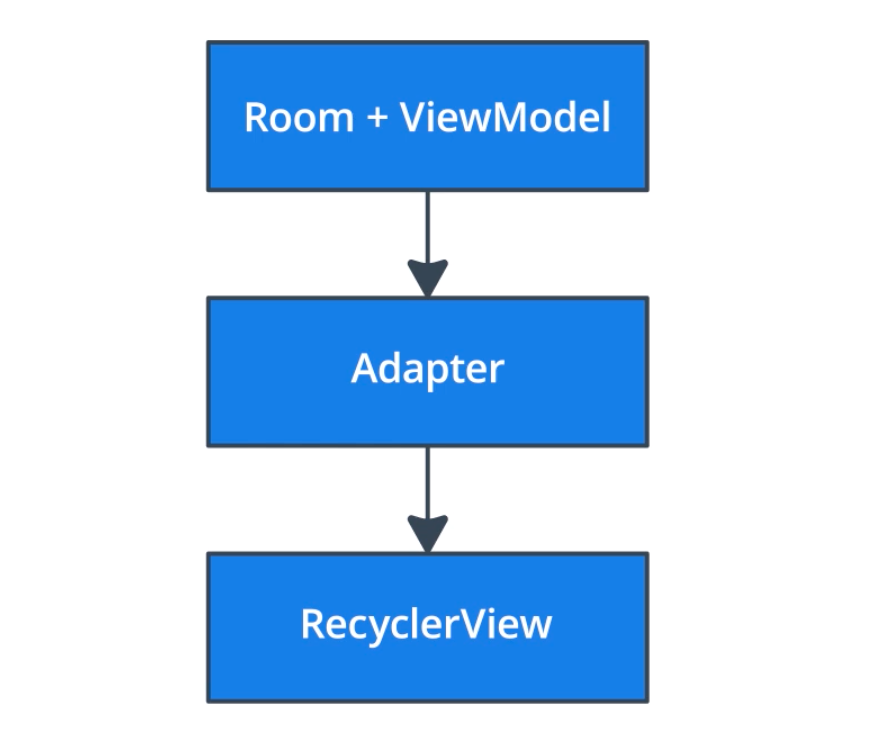
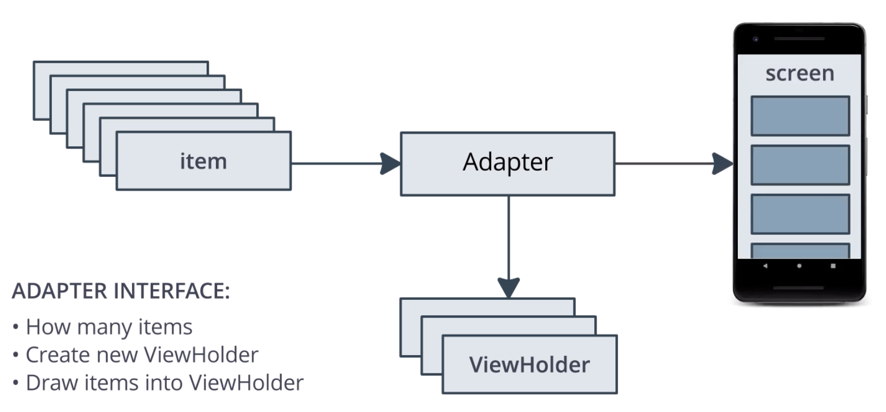

# Lesson 7: RecyclerView

## Introduction

RecyclerView is designed to be efficient even when displaying extremely large lists.
It allows you to build everything from simple lists of textviews to very complex collections of views.

## Adapter

Converts one interface to work with another.
An adapter is used to adapt data into something that can be used by RecyclerView.

### Adapter Interface

RecyclerView adapters must provide a few methods for RecyclerView to understand how to display the data on screen.

* How many items
* How to draw an item
* Way to create a new view for an item

### ViewHolder

RecyclerView doesn't interact with views, but instead it iteracts with ViewHolders. 

* Holds Views
* Stores information for RecyclerView
* RecyclerView's main interface

The Adapter will take care of providing any ViewHolders that the RecyclerView needs.

