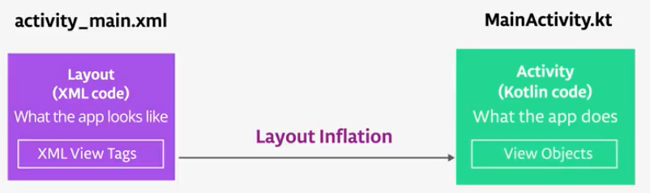

# Lesson 1: Build your First App

## Activity and Layout

### Activity

Core android class which is responsible for drawing an app user interface and recieving input events. 

When your app launches, it launches a specific activity. This is the activity that was declared in the manifest with the correct intent filter tagged.

### Layout

Activities have a associated layout file. Layout files are XML files that express what the app actually looks like. 

The activity and layout are connected by a process known as layout inflation. This process is triggered when the activity starts.

## Introduction to Gradle

### Controls: 

* What devices run your app 
* Compile to executable
* Dependency management
* App signing for google play
* Automated tests

### APK

Executable format for distributing Android applications. 

### Types of Gradle Files

* build.gradle(Project): For project wide build settings
* build.gradle(Module:app): For each module of your project

### Module

A folder with the source files and resources for a discrete piece of functionality in your app.

## Build.gradle

### Repository

Remote server where external code is downloaded from.

### Dependencies

External code, such as libraries, that a project depends on.
