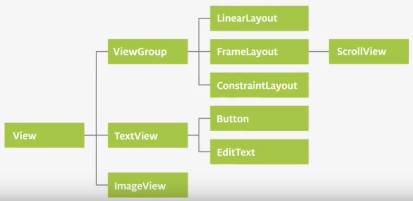

# Lesson 2: Layouts

## View Groups & View Hierarchy

All the visual elements that make up a screen are views and they are all children of the view class.

### Density Independent Pixel (dp)

* On 160 dpi screen, 1dp == 1 pixel
* On 480 dpi screen, 1dp == 3 pixels

## Data Binding

Every time we search for a view with findViewById after it has been created or re-created, android has to traverse the view hierarchy to find it at runtime. 

For a large or deep view hierarchy this can take enough time that it can slow down the app for the user.

This is why we will use Databinding

## Constraint Layout

### Constraint

A connection or alignment to another UI element, to the parent layout, or to an invisible guideline.

### Advantages

* You can make it responsive to screens and resolutions
* Usually flatter view hierarchy
* Optimized for laying out its views
* Free-form - place views anywhere, and the editor helps add constraints

