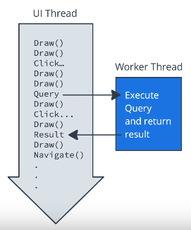

# Lesson 6: App Architecture (Persistence)

## Designing Entities

### Entity

Object or concept to store in the database. Entity class defines a table, each instance is stored as a table row.

### Query 

Request for data or information from a database table or tables, or a request to perform some action on the data.

### Room

We need data classes to define tables and annotations to specify things such as primary keys. 

## Data Access Object

Interfaces that define how to interact with the database.

Defines functions that map to SQL queries.

### Annotations

* @Insert
* @Delete
* @Update
* @Query

## Creating a Room Database

* Extend RoomDatabase
* Create Database
* Associate with DAO
* Get Reference to Database

## Multithreading and Coroutines

Long-runnig operations should run on a separate thread.

### Scheduler

Takes into account things such as priorities and makes sure all the threads get to run and finish.

### Dispatcher

Sets up threads and specifies the context.

### Threads in Android

#### Main thread 

* Handles all updates to the UI
* Calls all click handlers and other UI and lifecycle callbacks
* Also called UI thread

Unless you ecplicitly switch threads or use a class that runs on a different thread, everything is on the main thread.

### Callbacks

By using callbacks you can start long-running tasks on a background thread. When the task completes, the callback supplied as an argument is called to inform you of the result on the main thread.

#### Drawbacks

* Hard to read
* Code will run at asynchronous time in the future
* Dont't allow the use of some language features

### Coroutines

Handles long-running tasks elegantly and efficiently. They let you convert callback based code to sequential code. 

Coroutines and Callbacks do exactly the same thing: Wait until a result is available from a long-running task and continue execution. 

### Characteristics od Coroutines

* Asynchronous
* Non-blocking
* Sequential code

#### Asynchronous

The coroutine runs independently from the main execution steps of your program. 

We cannot expect the result is available until we explicitly wait for it. 

#### Non-blocking

The system is not blocking the main or UI thread.

### Suspend

Marks a function or function type available to Coroutines. 

Instead of blocking until that function returns like a normal function call, it suspends execution until the result is ready, then it resumes where it left off with te result.

While it's suspended, it unblocks the threads that it's running on. 

### Coroutines need...

* Job
* Dispatcher
* Scope

#### Job

A background job. Conceptually, a job is a callable thing with a life-cycle that culminates in its completion. 

They can be arranged in parent-child hierarchies

#### Dispatcher

Sends off coroutines to run on various threads. 

#### Scope

Combines information, including a job and dispatcher, to define the context in which the coroutine runs.

Scopes keep track of coroutines. 