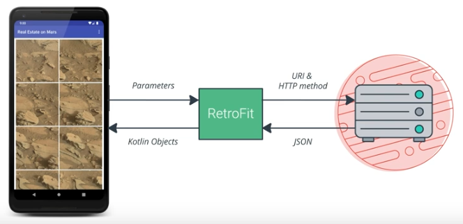

# Lesson 8: Connect to the Internet

## RESTful Services

REpresentational State Transfer.

### URI vs URL

URI specifies the data you want

A URL is a URI

### HTTP Protocol Tells the Server What to Do

* GET
* POST/PUT
* DELETE

### Server Response has Formatted Data

* XML
* JSON

### Retrofit

Creates your eyes for the web service based on the parameters we pass to it. 

## Libraries

### Thing to look for

* Only use reasonable API's/Permissions
* Supports Targetting Latest Android SDK

## Parcel and Parcelables

Parceling is a way of sharing objects between different processes by flattening an object into a stream of data called a parcel.

### Bundle

Parcelable object that contains a key/value store of parcelable objects.

