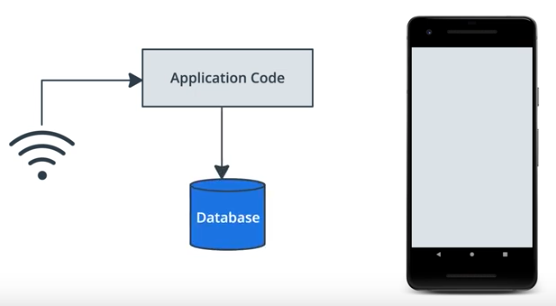
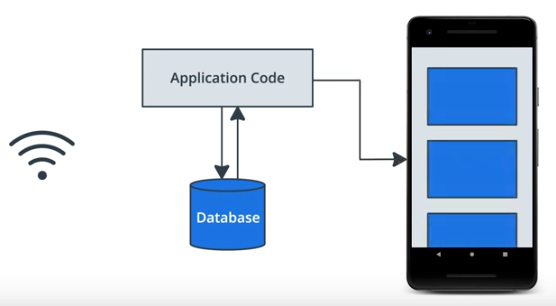
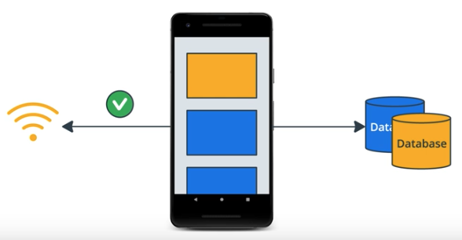

# Lesson 9: Behind the Scenes

## What's in a Cache

### Network Caching 

* Cache results per query
* HTTP Caching
* Store network results on disk

### Cache Invalidation

* Predicting cache out of date
* Easy for simple requests
* Harder for complex data

### Room

* Store structured data
* Use to build a cache
* Save network data in database

### SharedPreferences

* Key/Value store
* Writes to disk
* For small data
* No query support

**Room is a better option as your offline cache gains complexity.**

### Files

* Store anything you want
* Private to your app
* Can make multiple files
* Images or data files

## How to store data

Always show content from the database instead of the network.

When a network result comes in, instead of showing it right away, write it to the Database. 

The UI will get notified and refresh the content on screen.

Database = Single Source of Truth

### Update values

Delay updating offline cache until after the server lets you know the data is saved. 

Once you get the results from the server, you can write it to the offline cache.

## Building a Room

### Data Transfer Objects

* Parse network results
* Prepare data for network

### Domain Objects

* App data
* Used by UI
* Separate from network

### Separation of Concerns

* Switch network to database
* UI code stays the same
* Fewer changes, fewer bugs

## Using a Room

### Repository Pattern

The repository will provide a unified view of our data from several sources in an app. Data from the network and the database will be combined in the repository. 

Users of the repository don't have to care where the data comes from.

### Separation of Concerns

Classes that use the repository don't have to care how the cache is managed or even how it's implemented. 

## WorkManager for the Background

### Background Work

* Upload logs
* Process data
* Upload metrics
* Pre-fetch content

### WorkManager

* Lightweight API
* Schedule background work
* MyWork: Worker()
* Pre-fetch content

### Constraints

* Charging
* Device idle
* On WiFi
* etc

**WorkManager will take these constraints and figure out how and when to best run work.**

### Battery Friendly

* Optimized (CPU, Disk)
* Low network
* Runs rarely
* Or not at all

### Pre-fetching

* Load what user needs next
* In background
* Usually done nightly
* WorkManager schedules efficiently

