<div id="content" align="center"><h1>Content</h1></div>

[Part 1: Servlet/JSP](#part1)

[Part 2: Spring Basics](#part2)

[Part 3: Spring Web MVC](#part3)

[Part 4: Spring and JPA](#part4)

<div style="page-break-after: always;"></div>
<div id="part1" align="center"><h1>Part 1: Servlet/JSP</h1></div>
<div style="page-break-after: always;"></div>
&nbsp;
<div style="page-break-after: always;"></div>

# 1 Web App Architecture

## 1.1 Introduction

How do web clients and web servers talk to one another?

Our goal is to build a web application that clients around the globe can access.

## 1.2 Client/Server

### Web Server

Takes a client request and gives something back to the client.

### Client

Lets the user request something on the server, and shows the user the result of the request.

<p align="center">
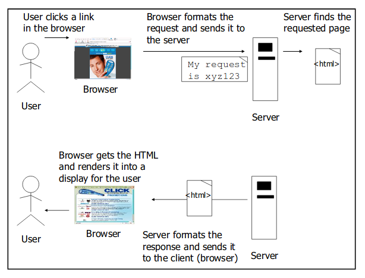
</p>

<div style="page-break-after: always;"></div>

## 1.3 Clients and servers know HTML anh HTTP

#### HTML

1. Server answers request
2. Server sends content to browser
3. Browser displays

Servers oftend send the browser a set of instructions written in HTML. All web browsers know what to do with html.

#### HTTP

1. Client sends HTTP request
2. Server answers with HTTP response

When a web server sends an HTML page to the client, it sends it using HTTP.

### What is the HTTP protocol?

#### Key elements of the request stream

* HTTP method: the action to be performed
* The page to access: a URL
* Form parameters: like arguments to a method

#### Key elements of the response stream 

* A status code: for whether the request was succesfull
* Content-type: text, picture, ...
* The content; the actual HTML, images , ...

### What is the request?

First thing you will find is an HTTP method name.

The method name tells the server the kind of request that's being made, and how the rest of the message will be formatted.

The HTTP protocols has several methods, but the ones you'll use most often are **GET** and **POST**

### GET and POST

#### GET

The simplest HTTP method, the point is to get something back from the server.

#### POST

The more powerfull request, you can request something and at the same time send form data to the server.

<p align="center">
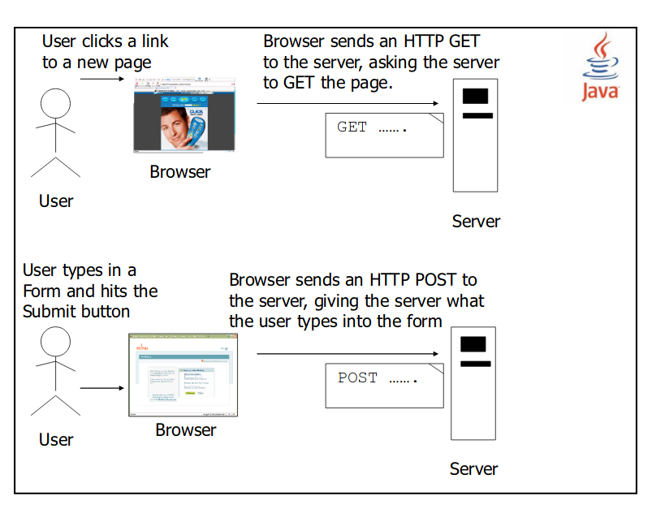
</p>

### Container

Servlets don't have a main() method. They are under the control of another Java application called a **container**.

When your web server application gets a request for a servlet, the server hands the request not to the servlet itself, but to the Container in which the servlet is deployed.

It is the Container that gives the servlet the HTTP request and response, and it is the Container that calls the servlet's method.

<p align="center">
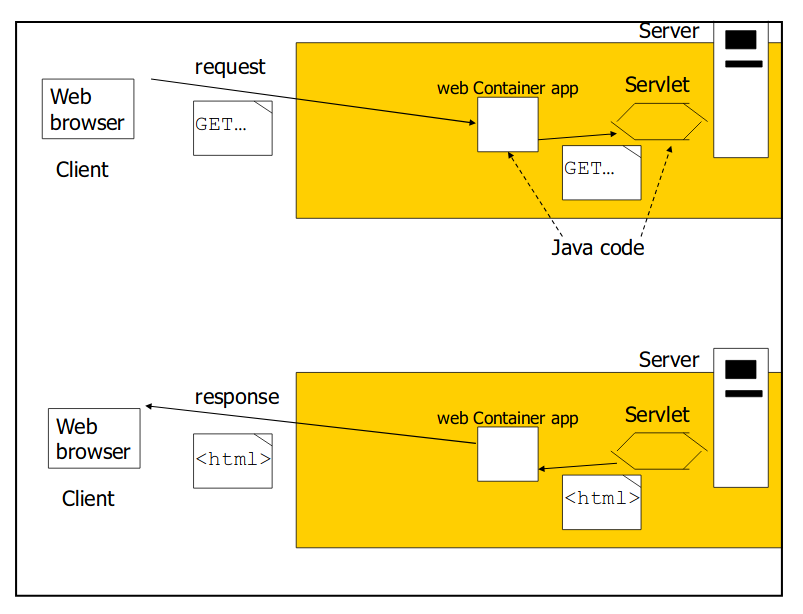
</p>

#### How the Container handles a request

<p align="center">
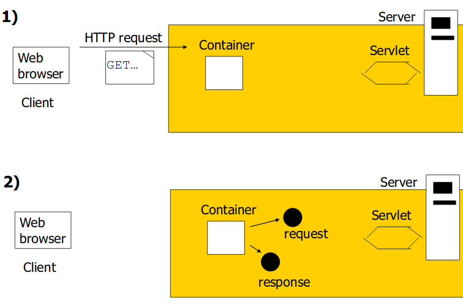
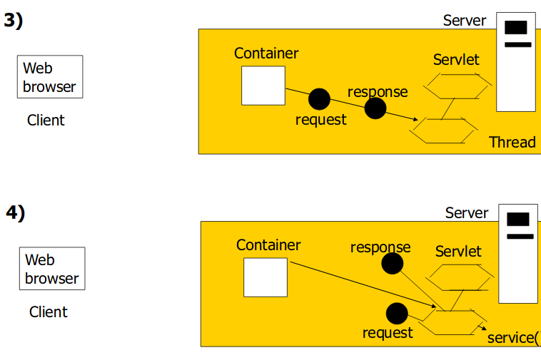
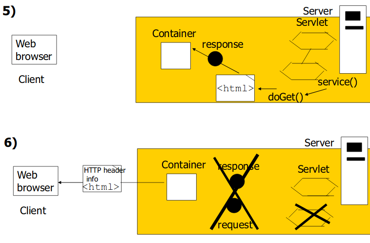
</p>

1. User click a link that has a URL to a servlet instead of a static page.
2. The container sees that the request is for a servlet, so the container creates two objects; HttpServletResponse and HttpServletRequest.
3. The container finds the correct servlet based on the URL in the request, creates or allocates a thread for that request, and passes the request and response objects to the servlet thread.
4. The container calls the servlet's service() method. Depending on the type of request, the service() method calls either the doGet() or doPost() method. For this example, we will assume the request was an HTTP GET.
5. The doGet() method generates the dynamic page and stuffs the page into the response object. Remember, the container still has a reference to the response object.
6. The thread completes, the container converts the response object into a HTTP response, sends it back to the client, then deletes the request and response objects.

<div style="page-break-after: always;"></div>

# 2 Servlets 

## 2.1 Introduction

The client requests that some action is performed, the server performs the action and responds to the client.

This request-response model of communication is the foundation for the highest-level views of networking in Java-Servlets and JavaServer Pages.

<p align="center">
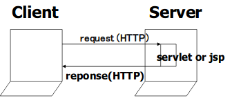
</p>

### What is a SERVLET?

A servlet is a **Java programming language class** used to extend the capabilities of servers that host applications accessed via a **request-response programming model**.

Java Servlet technology defines HTTP-specific servlet classes.

### Servlet Life Cycle

If an instance of a servlet does not exist, the container:

* Loads the servlet class
* Creates an instance of the servlet class
* Initializes the servlet instance by calling the init method
* Invokes the service method, passing a request and response object 

If the container needs to remove the servlet, it finalizes the servlet by calling the servlet's destroy method.

<p align="center">
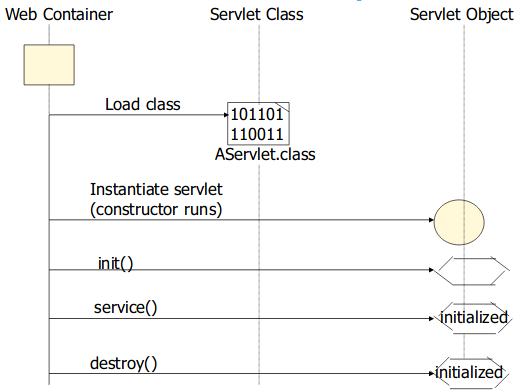
</p>

**Each request runs in a separate thread**

<p align="center">
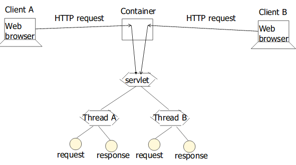
</p>

### GET and POST

The two most common HTTP request types

* GET: retrieves information from the server 
* POST: sends data to server, such as authentication information or data from a form

### HTTPServlet Class

Web-based servlets typically extend class HttpServlet

* method doGet() responds to GET requests
* method doPost() responds to POST requests

## 2.2 Handling http GET Requests

### WelcomeServlet demonstration

The servlet and HTML document demonstrate a servlet that handles HTTP get requests

#### WelcomeServlet.java

```java
@WebServlet("/welcome1")
public class WelcomeServlet extends HttpServlet
{
	//process "get" requests
	@Override
	protected void doGet(HttpServletRequest request, HttpServletResponse response) 
		throws ServletException, IOException
	{
		response.setContentType("text/html");
		try(PrintWriter out = response.getWriter()){
			//Write HTML document
		}
	}
}
```

#### welcomeForm.htmm

```html
<!DOCTYPE html>
<html>
	<head>
		<title>Handling an HTTP Get Request</title>
	</head>
	<body>
		<form action="welcome1" method="get">
			<p>
				<label>Click to invoke servlet</label>
				<input type="submit" value="Get HTML doc"/>
			</p>
		</form>
	</body>
</html>
```

The HTML document provides a form that invokes the servlet
The form's action (welcome1) specifies the URL path that invokes the servlet, and the form's method indicates that the browser sends a get request to the server. This results in a call to the servlet's doGet method.

### How the container found the servlet

**A servlet can have 2 names**

* Client-known URL name: e.g. the link to register/registerMe servlet
* Programmer-known file name: e.g. SignUpServlet.class

#### Mapping servlet names improves your app's flexibility and security

Gives you the flexibility to move things around without having to change the client code that refers to the old location of the servlet files.

Better security: the client doesn't know how things are structured on your server.

#### Handling http get requests containing data

In WelcomeServlet.java: 

```java
String firstname = request.getParameter("firstname");
```

In welcomeForm.html:

```html
<input type="text" name="firstname"/>
```

## 2.3 Handling http POST requests

A http post request is often used to post data from an HTML form to a server-side form handler that processes the data.

Browsers often cache web pages so they can quickly reload the pages. The browser minimizes the amount of data that must be downloaded for you to view a web page.

Browsers typically do not cache the server's response to a post request, because the next post might not return the same result.

### Differences between GET and POST

* GET requests can be bookmarked, POST requests cannot.
* GET is meant to be used for getting things; POST is meant to be used for sending data to be processed.

<div style="page-break-after: always;"></div>

### Demonstration

#### WelcomeServlet.java

```java
protected void doPost (HttpServletRequest request, HttpServletResponse response)
	throws ServletException, IOException

	//instead of doGet()
```

#### welcomeForm.html

```html
<form action="welcome1" method="post">
```

## 2.4 Redirecting Requests to Other Resources

The RedirectServlet.java recieves a page parameter as part of a get request, then uses that parameter to redirect the request to a different resource.

### Demonstration

#### RedirectForm.html

```html
<a href = "redirect?page=oracle">
```

<div style="page-break-after: always;"></div>

#### RedirectServlet.java

```java
@WebServlet("/redirect")
public class RedirectServlet extends HttpServlet
{
	//process "get" request from client
	@Override
	protected void doGet(HttpServletRequest request, HttpServletResponse response)
		throws ServletException, IOException
	{
		String location = request.getParameter("page");
		if (location != null)
		{
			if (location.equals("oracle"))
				response.sendRedirect("http://www.oracle ...");
			else
				if (location.equals("welcome"))
					response.sendRedirect("welcome1");
		}
	}
}
```

### Redirect vs Request Dispatch

#### Request Dispatch

The servlet calls: 

```java
RequestDispatcher view = request.getRequestDispatcher("result.jsp");
view.forward(request, response);
```

When a servlet does a request dispatch it's like asking a co-worker to take over working with a client.

The co-worker ends up responding to the client. The user never knows someone else took over, because the URL in the browser bar doesn't change.

#### Redirect

When a servlet does a redirect it's like asking the client to call someone else instead. 

In this case, the client is the browser, not the user. The browser makes the new call on the users behalf. The user sees the new URL in the browser.

## 2.5 Session Tracking

* Personalization 
* Privacy invasion
* HTTP-stateless protocol 
	* does not support persistent information
* Track clients individually 
	* Cookies
	* Session tracking
	* Hidden type input 
	* URL rewriting 

### Session tracking with HttpSession

<p align="center">
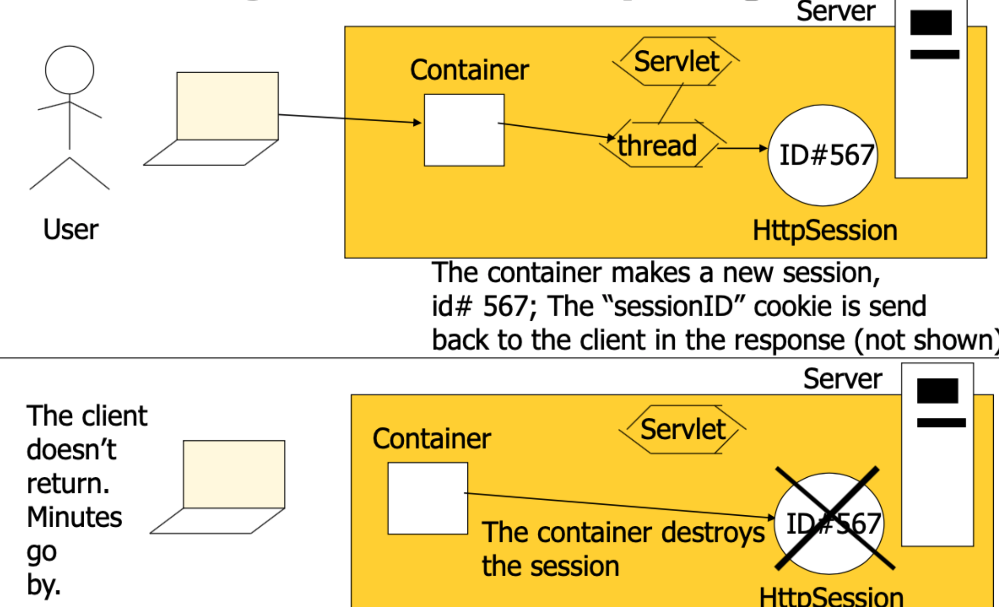
</p>

<div style="page-break-after: always;"></div>

#### Three ways a session can die

##### 1. It times out

Configuring session timeout in the Deployment Descriptor

```html
<servlet>
	...
</servlet>
<session-config>
	<session-timeout>15</session-timeout>
<session-config>
```

Setting session timeout for a specific session

```java
session.setMaxInactiveInterval(20*60);
```

##### 2. You can invalidate() on the session object

```java
session.invalidate();
```

##### 3. The application goes down 

crashes or is undeployed

### Important moments in a HttpSession object's life

<p align="center">
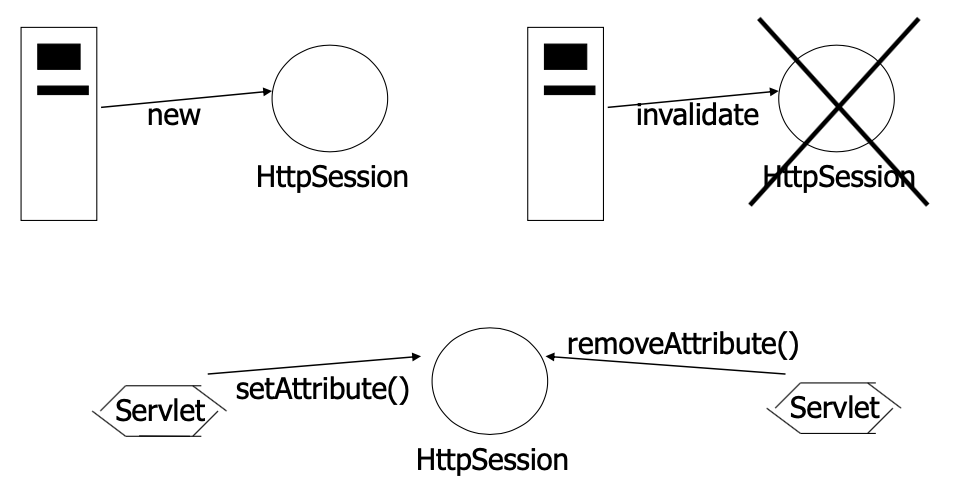
</p>

<div style="page-break-after: always;"></div>

#### Example: Servlet SessionServlet

* Uses HttpSession objects
* Handles both get and post requests

sessionSelectLanguage.html document for selecting a programming language and posting the data to the SessionServlet.

#### sessionSelectLanguage.html

```html
<body>
	<form action="sessions" method="post" >
		Select a programming language: <br><br> 
		<input type="radio" name="language" value="C++"/>C++ <br>
		<input type="radio" name="language" value="C#"/> C# <br> 
		<input type="radio" name="language" value="Cobol" /> Cobol <br> 
		<!--this radio button checked by default --> 
		<input type="radio" name="language" value="Java" checked="checked"/> Java <br> <br> 
		<input type="submit" value="Submit" />
	</form> 
</body>
```

#### SessionServlet.java

```java
package servlet;
import javax.servlet.*; import javax.servlet.http.*;
import java.io.*; import java.util.*;

@WebServlet("/sessions")
public classSessionServletextendsHttpServlet
{
	private final Map<String,String>books = new HashMap<>();
	// initialize Map books
	public voidinit()
	{
		books.put( "C++", "0130895725");
		books.put( "C#", "0130895717");
		books.put( “Cobol", "0130125075");
		books.put(“Java", "0134569555");
	}

	// receive language selection and create HttpSession object
	// containing recommended book for the client
	protected voiddoPost( HttpServletRequest request,HttpServletResponse response) throwsServletException, IOException
	{
		String language = request.getParameter("language")
		
		// Get the user's session object.
		// Uses method getSession of interface HttpServletRequest
		// Create a session (true) if one does not exist.
		HttpSession session = request.getSession( true );
		
		// add a value for user's choice to session
		session.setAttribute( language, books.get( language ) );

		response.setContentType( "text/html");
		
		try (PrintWriterout = response.getWriter()) 
		{
			// send HTML page to client
			out.println("<!DOCTYPE html>");
			out.println( "<html>" );
			
			// head section of document
			out.println("<head>" );
			out.println( "<title>Welcome to Sessions</title>" );
			out.println( "</head>" );
			
			// body section of document
			out.println( "<body>" );
			out.println( "<p>Welcome to Sessions! You selected "+language + ".</p>" );

			// display information about the session
			out.println( "<p>Your unique session ID is: "+ session.getId()+ "<br>" );

			out.println( "This " + ( session.isNew()? "is": "is not") +" a new session<br>");

			out.println("The session was created at: " + newDate( session.getCreationTime()) + "<br>" );
			out.println( "You last accessed the session at: "+ newDate( session.getLastAccessedTime()) + "<br>");	
			out.println( "The maximum inactive interval is: "+ session.getMaxInactiveInterval()+ " seconds</p>");
			out.println( "<p><a href = "+"\"sessionSelectLanguage.html\">"+"Click here to choose another language</a></p>");
			out.println("<p><a href = \"sessions\">"+"Click here to get book recommendations</a></p>" );
			out.println( "</body>");
			// end HTML documentout.println( "</html>");
		}
	}
  
  // read session attributes and create HTML document
  // containing recommended books
  protected void doGet( HttpServletRequest request,HttpServletResponse response )
  throwsServletException, IOException
  {
		// Get the user's session object.
		// Do not create a session (false) if one does not exist.
		HttpSession session = request.getSession( false );
	  
		// get names of session object's values
		Enumeration<String> valueNames;

		if( session != null)
			valueNames = session.getAttributeNames();
		else
			valueNames = null;

		try (PrintWriter out = response.getWriter()) 
		{
			response.setContentType( "text/html"); 
			
			// start HTML document
			out.println("<!DOCTYPE html>");
			out.println( "<html>" );

			// head section of documen
			tout.println("<head>");
			out.println("<title>Recommendations</title>");
			out.println( "</head>" );
			
			// body section of document
			out.println( "<body>");
			if( valueNames != null&& valueNames.hasMoreElements() ) 
			{
				out.println( "<h1>Recommendations</h1>" );
				out.println( "<p>");
				String name, value;
				
				// get value for each name in valueNames
				while( valueNames.hasMoreElements() ) 
				{
					name = valueNames.nextElement();
					value = (String) session.getAttribute( name );
					out.println( name + " How to Program. " +"ISBN#: "+ value +"<br >");
				}//end-while 
				out.println( "</p>");
			}//end-if
			else
			{
				out.println( "<h1>No Recommendations</h1>");
				out.println( "<p>You did not select a language.</p>");
			}
			out.println( "</body>" );
			
			// end HTML document
			out.println( "</html>");
		}
	}
}		
```

# 3 JSP - Scripting Components

## 3.1 Introduction

JSP is an extension of servlet technology

A JSP becomes a servlet. The container looks at your JSP, translates it into a servlet class source (.java) file, then compiles that into a full-fledged JAVA servlet class. After that, it’s just servlets all the way down.

## 3.2 JSP Overview

JSP simply puts Java inside HTML pages.

The request/response mechanism and lifecycle of a JSP is the same as that of a servlet.

<div style="page-break-after: always;"></div>

## 3.3 A First JavaServer Page example

We can put JAVA code in a JSP using a scriplet, which just means Java code within a <%...%> tag

We can’t put import statements in a JSP. We need a page directive.

```html
<%@ page import = "java.util.Date, domein.Rotator" %>
<%@ page contentType = "text/html" pageEncoding = "UTF-8" %>
<!DOCTYPE html>
<html>
	<head>
		<meta http-equiv = "refresh" content = "1"/>
		<title>A Simple JSP Example</title>
		<link rel="stylesheet" href="css/style.css"/>
	</head>
	<body>
		<h1>Simple JSP Example</h1>
		<br>
		<table>
			<tr>
				<td>
					<p>
						<!--JSP expression to insert date/time -->
						<% = newDate() %>
					</p>
				</td>
			</tr>
		</table>
	</body>
</html>
```

<div style="page-break-after: always;"></div>

## 3.4 MVC: Servlet = controller, JSP = view

### 3.4.1 Handling Http get Requests

```java
@WebServlet("/welcome1")
public class WelcomeServlet extends HttpServlet {

	// process "get" requests from clients
	
	protected void doGet( HttpServletRequest request,HttpServletResponse response)
	throws ServletException, IOException
	{
		RequestDispatcher view = request.getRequestDispatcher(“view/welcome.jsp");
		view.forward(request,response);
	}
}
```

### 3.4.2 Handling Http post Requests 

#### WelcomeServlet.java

```java
@WebServlet(“/welcome1”)
public class WelcomeServlet extends HttpServlet {

	// process “post" requests from clients
	
	protected void doPost ( HttpServletRequestrequest, HttpServletResponseresponse ) 
	throws ServletException, IOException
	{
		String firstname = request.getParameter("firstname");
		request.setAttribute("firstName", firstname);
		RequestDispatcher view = request.getRequestDispatcher(“view/welcome.jsp");
		view.forward(request,response);
	}
}
```

<div style="page-break-after: always;"></div>

#### Welcome.jsp

```html
<body>
	<% String name = (String) request.getAttribute("firstName"); %>
	<h1> 
		Welcome to Servlets!
		<%=name %>
	</h1>
</body>
```

## 3.5 Attributes in a JSP

### Scope

**Page**

* JSP object can be accessed only from within the same page where it was created
* For the lifetime of the current request

**Request**

* Accessed from any pages that serves that request
* More than one page can serve a single request

**Session**

* Accessible from pages that belong to the same session from where it was created
* Accessible to only those with access to a specific HttpSessionSession

**Application**

* Accessed from any pages across the application

<div style="page-break-after: always;"></div>

### Access Attributes

* Page

	* JSP
		* pageContext.setAttribute(“vb”,vb);
	* Servlet
		* does not apply
		
* Request

	* JSP
		* request.setAttribute(“vb”,vb);
		* <% pageContext.setAttribute(“vb”,vb,PageContext.REQUEST_SCOPE); %>
	* Servlet
		* request.setAttribute(“vb”,vb); 
		
* Session

	* JSP
		* session.setAttribute(“vb”,vb);
		* <% pageContext.setAttribute(“vb”,vb,PageContext.SESSION_SCOPE); %>
	* Servlet
		* request.getSession().setAttribute(“vb”,vb);
		
* Application

	* JSP
		* application.setAttribute(“vb”,vb);
		* <% pageContext.setAttribute(“vb”,vb,PageContext.APPLICATION_SCOPE); %>
	* Servlet
		* getServletContext().setAttribute(“vb”,vb);

<div style="page-break-after: always;"></div>

## 3.6 Overview Scripting Components

* Scriptlets (<% and %>)

* Comments (<%-- and --%>)

* Expressions (<% =and %>)

* Declaration (<% !and %>)

* Directive: (<% @and %>)

## 3.7 Java code in a JSP -> complaints 

Your JSP code can quickly become a mix of various HTML tags, JSP tags, and Java code that is difficult to follow, debug, and maintain.

1. Web page designers shouldn’t have to know JAVA.
2. Java code in a JSP is hard to change and maintain.

<div style="page-break-after: always;"></div>
<div id="part2" align="center"><h1>Part 2: Spring Basics</h1></div>
<div style="page-break-after: always;"></div>
&nbsp;
<div style="page-break-after: always;"></div>

# 1 Introduction to Spring

## 1.1 Spring Framework

The Spring Framework is an open source application framework and **Inversion of Control** container for the java platform.

### Why use the Spring Framework

Simplifying Java Development

Spring makes existing solutions significantly easier to use, and places them in a consistent architectural approach.

## 1.2 The core of the Spring Framework

**Inversion of Control** refers to the generally desirable architectural pattern of having an outside entity (the container) **wire** together objects, such that objects are given their **dependencies** by the container, instead of directly instantiating them themselves.

### 1.2.1 Dependency Injection

#### Dependency Injection

* Dependency: 
	* Class A need class B to get its job done
	* Class A is dependenton class B

* Injection: 
	* Class B will get injected into class A 
	* By the IoC container.

<div style="page-break-after: always;"></div>

#### Injection Styles

* Constructor injection
	* Via arguments passed to the constructor when an object is created.

* Setter injection
	* Via the setter method , after the object has been created.

#### Best choice: Setter Injection

* Swap dependencies on the fly without creating a new instance.
* The least effect on your code’s usability in non-IoC settings.

### 1.2.2 Example: wiring in Spring

#### Use Spring to Configure a Modularized Application

<p align="center">
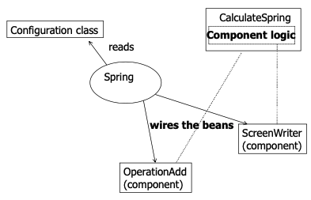
</p>

The **Spring container** reads the configuration class, instaniates the beans, and then wires them up according to the configuration information

* Spring framework:
	* Easily wire and rewire reusable Java beans
* Task: 
	* Instantiating concrete instances of Operation or ResultWriter
* Class CalculateSpring:
	* Delegates this task to the Spring container

<div style="page-break-after: always;"></div>

#### CalculateSpring

```java

public class CalculateSpring {

	private Operationops;
	private ResultWriterwriter;
	
	public void setOps(Operation ops) {
		this.ops = ops;
	}
	
	public  void setWriter(ResultWriter writer) {
		this.writer = writer;
	}
	
	public void execute(String [] args) {
		long op1 = Long.parseLong(args[0]);
		long op2 = Long.parseLong(args[1]);
		writer.showResult("The result of " + op1 +ops.getName() + op2 + " is "+ ops.operate(op1, op2) + "!");
	}   
}
```

#### StartUp

```java
public class StartUp {

	public static void main(String... args) {
		ApplicationContext context = 
			new AnnotationConfigApplicationContext(FirstExampleConfiguration.class);
	
		CalculateSpring opsbean = 
			context.getBean("opsbean", CalculateSpring.class);
		opsbean.execute(args);
	}
}
```

<div style="page-break-after: always;"></div>

#### Bean Factory

The IoC container in Spring is called the bean factory.

Bean Factory = Interface

Will load bean definitions stored in a configuration source (such as a configuration class)

ApplicationContext extends BeanFactory and adds additional facilities.

#### Configuration Class

```java
@Configuration
public class FirstExampleConfiguration {

	@Bean
	public ResultWriter resultWriter() {
		return new ScreenWriter();
	}
	
	@Bean
	public Operation operation() {
		return new OperationAdd();
	}
	
	@Bean
	public CalculateSpring opsbean() {
		CalculateSpring calculate = new CalculateSpring();
		calculate.setOps(operation());
		calculate.setWriter(resultWriter());
		return calculate;
	}
}
```

<div style="page-break-after: always;"></div>

# 2 Wiring Beans

## 2.1 Spring Configuration

<p align="center">
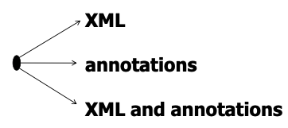
</p>

Each approach has its pros and cons.

## 2.2 Spring Configuration: Annotations

* @Service(“...”)
	* dependency
	
* @Autowired
	* Spring will inject the dependency
	* It can be applied on setter method, constructor or a field

* @Qualifier("...")
	* Works by matching the name defined with @Service annotation

Spring throws **NoSuchBeanDefinitionException** if the required dependency is not available. We can change this behavior: 

@Autowired(required=false)

By default, the @Autowired resolve dependencies by type.

<div style="page-break-after: always;"></div>

### 2.2.1 Setter-based Autowiring

```java
public class CalculateSpring {

	private Operation ops;
	
	@Autowired
	public void setOps(Operation ops) {
		this.ops = ops;
	}
}
```

### 2.2.2 Constructor-based Autowiring

```java
public class CalculateSpring {

	private Operation ops;
	
	@Autowired
	public CalculateSpring(Operation ops) {
		this.ops = ops;
	}
}
```

### 2.2.3 Field or Property-based Autowiring

```java
public class CalculateSpring {

	@Autowired
	private Operation ops;

}
```

<div style="page-break-after: always;"></div>

## 2.3 Example

```java
@Service("add")
public class OperationAdd implements Operation { ... }
```

```java
@Service("calculate")
public class CalculateSpring {

	private Operation ops;
	
	@Qualifier("add")
	@Autowired
	public void setOps(Operation ops) {
		this.ops = ops;
	}
	
	...
	
}
```

```java
@ComponentScan(basePackages = {"domain", "spring_wiring"})
@Configuration
public class FirstExampleConfiguration {}
```

```java
public class StartUp{

	public static void main(String... args) {
		ApplicationContextcontext = 
			new AnnotationConfigApplicationContext(FirstExampleConfiguration.class);
		
		CalculateSpringopsbean = 
			context.getBean("calculate", CalculateSpring.class);
		opsbean.execute(args);
	}
}
```

A configuration class can be used to read the annotated beans definitions. In this example, the class will no longer need any @Bean

But, to be able to look for bean definitions inside Java classes, component scanning has to be enabled &rarr; @ComponentScan

## 2.4 Automatically Wiring Bean Properties

Obvious wiring &rarr; when there’s no question about which bean reference should be wired.

The Spring container is able to autowire relationships between beans. 

Using autowiring, it is possible to reduce or eliminate the need to specify properties or constructor arguments, thus saving a significant amount of typing.

# 3 Aspect-Oriented Programming

## 3.1 OAP

programming paradigm which isolates secondary or supporting functions from the main program's business logic. 

It aims to increase modularity by allowing the separation of cross-cutting concerns, forming a basis for aspect-oriented software development.

## 3.2 Example

A typical application is broken down into modules. 

Each module’s main concern 

* is to provide services for its particular domain. 
* requires simular ancillary functionalities, such as security, logging, ...

<p align="center">
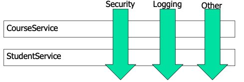
</p>

<div style="page-break-after: always;"></div>

## 3.3 Aspects

Cross-cutting concerns can be modularized into special objects = aspects.

Two benefits:

* The logic for each concern is in one place.
* Our service module contains only their primary concern and secondary concerns have been moved to aspects

## 3.4 AOP Concepts

### Join Point

Point in the execution of the application where an aspect can be plugged in. 

This point could be a method being called, an exception being thrown or a field being modified.

### Advice

The code that is executed at a particular joinpoint is the advice.

#### Kinds of advice

* Before
	* Executes before join point
* After
	* Executed regardless of the means by which a join point exits
* After-returning
	* Executed after a join point completes normally
* After-throwing
	* Executed if a method exits by throwing an exception
* Around
	* Advice wraps the advised method, providing some functionality before and after the advised method is invoked

<div style="page-break-after: always;"></div>

### Pointcut

Collection of joinpoints that you use to define when the advice should be executed.

### Target Object

Object being advised by one or more aspects. Also referred to as advised or proxied object.

### AOP proxy

Object created by the AOP framework, including advice.

### Weaving

Assembling aspects to create an advised object.

## 3.5 Spring's AOP support

Use the AspectJ framework in Spring applications.

### AspectJ

* complete and popular AOP framework
* widely-used de-facto standard for AOP
* it uses Java-like syntax

### Spring AOP vs AspectJ

<table>
	<tr>
		<th>
			Spring AOP
		</th>
		<th>
			AspectJ
		</th>
	</tr>
	<tr>
		<td>
			Method-execution pointcut
		</td>
		<td>
			Method-, constructor- and property-execution pointcut
		</td>
	</tr>
	<tr>
		<td>
			Weaving dynamically at runtime
		</td>
		<td>
			Compile-time weaving
		</td>
	</tr>
	<tr>
		<td>
			Dynamic proxy
		</td>
		<td>
		</td>
	</tr>
</table>

<div style="page-break-after: always;"></div>

## 3.6 Example

```java
@Aspect
public class Audience {

	@Around("execution(* *.perform(..))")
	public void watchPerformance(ProceedingJoinPoint joinpoint) {

		try{
			System.out.println("The audience is taking their seats.");
			System.out.println("The audience is turning off their cellphones");
			long start = System.currentTimeMillis();
			
			//Proceed to advised method
			joinpoint.proceed();
			
			long end = System.currentTimeMillis();
			System.out.println("CLAP CLAP CLAP CLAP CLAP");
			System.out.println("The performance took " + (end-start) + " milliseconds.");
		}
		catch(Throwable e){
			//After bad performance 
			System.out.println("Boo! We want our money back!");
		}
	}
}

```

<div style="page-break-after: always;"></div>
<div id="part3" align="center"><h1>Part 3: Spring Web MVC</h1></div>
<div style="page-break-after: always;"></div>
&nbsp;
<div style="page-break-after: always;"></div>

# 1 MVC Structure

## 1.1 Spring Web MVC

A part of the Spring Framework is Spring Web MVC, an extensible MVC framework for creating web applications.

<p align="center">
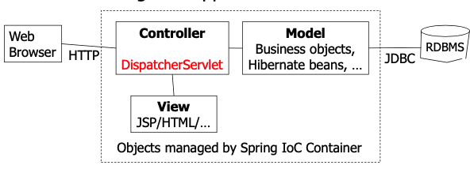
</p>

### DispatcherServlet

A single front controller servlet.

A single servlet delegates responsibility for a request to other components of an application to perform actual processing.

### Primary Flow of Request Handling in Spring MVC

<p align="center">
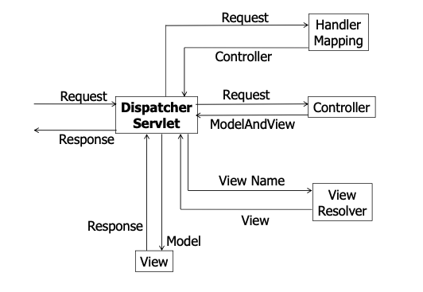
</p>

<div style="page-break-after: always;"></div>

## 1.2 First Example

<p align="center">
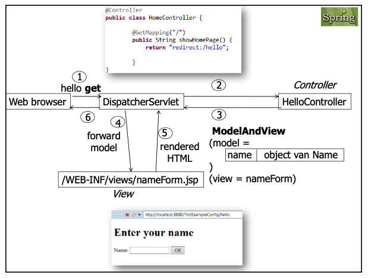
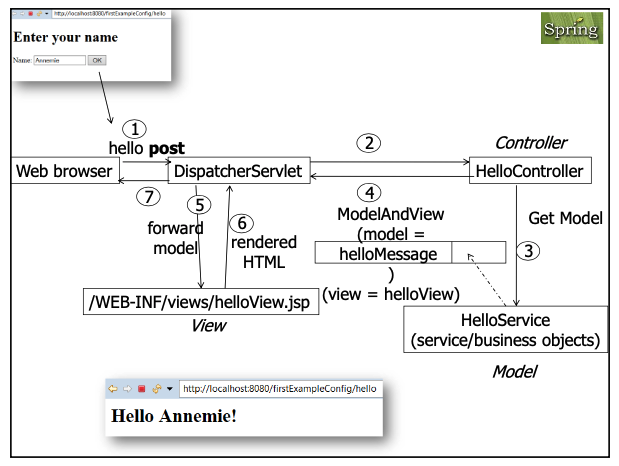
</p>

<div style="page-break-after: always;"></div>

### Config

#### SpringMvcInitializer.java

```java
public class SpringMvcInitializer extends AbstractAnnotationConfigDispatcherServletInitializer {

    @Override
    protected Class<?>[] getRootConfigClasses() {
		return new Class[]{WebConfig.class};
    }

    @Override
    protected Class<?>[] getServletConfigClasses() {
		return null;
    }

    @Override
    protected String[] getServletMappings() {
		return new String[]{"/"};
    }

}
```

#### WebConfig.java

```java
@Configuration
@EnableWebMvc
@ComponentScan("contoller")
public class WebConfig extends WebMvcConfigurerAdapter {

    @Bean
    public HelloService helloService() {
		return new HelloServiceImpl();
    }

    @Bean
    public ViewResolver viewResolver() {
		InternalResourceViewResolver resolver = new InternalResourceViewResolver();
		resolver.setPrefix("/WEB-INF/jsp/");
		resolver.setSuffix(".jsp");
		return resolver;
    }
}

```

### Model

#### HelloService.java

```
public interface HelloService {

    public String sayHello(String name);
}
```

#### HelloServiceImpl.java

```java
public class HelloServiceImpl implements HelloService {

    @Override
    public String sayHello(String name) {
	 	return String.format("Hello %s!", (name != null) ? name : "");
    }

}
```

### Controller

#### HelloController.java

```java
@Controller
public class HelloController {

    @Autowired
    private HelloService helloService;

    @RequestMapping(value = {"/hello"}, method = RequestMethod.GET)
    public String showHomePage(Model model) {
		model.addAttribute("name", new Name());
		return "nameForm";
    }

    @RequestMapping(value = {"/hello"}, method = RequestMethod.POST)
    public String onSubmit(@ModelAttribute Name name, Model model) {
		model.addAttribute("helloMessage", helloService.sayHello(name.getValue()));
		return "helloView";
    }

}
```

#### Name.java

```java
public class Name {

    //the name for this property will be used in the .jsp
    // modelattribute: name
    // path: value
    private String value;

    public String getValue() {
		return value;
    }

    public void setValue(String value) {
		this.value = value;
    }

}
```

### View

#### nameForm.jsp

```html
<%@page contentType="text/html" pageEncoding="UTF-8"%>
<%@taglib prefix = "form" uri="http://www.springframework.org/tags/form" %>
<!DOCTYPE html>
<html>
    <head>
        <meta http-equiv="Content-Type" content="text/html; charset=UTF-8">
        <title>Enter your name</title>
    </head>
    <body>
        <h1>Enter your name</h1>

        <form:form method="POST" action="hello" modelAttribute="name">
            Name: 

            <form:input path="value" size = "15"/>
            <input type="submit" value="OK"/>
        </form:form>

    </body>
</html>
```

#### helloView.jsp

```html
<%@page contentType="text/html" pageEncoding="UTF-8"%>
<!DOCTYPE html>
<html>
    <head>
        <meta http-equiv="Content-Type" content="text/html; charset=UTF-8">
        <title>Hello</title>
    </head>
    <body>
        <h2>${helloMessage}</h2>
    </body>
</html>
```

## 1.3 Mapping Requests with @RequestMapping

DispatcherServlet receives a web request 

&rarr; It attempts to dispatch requests to the various controller classes (@Controller)

&rarr; dispatching process depends on the various @RequestMapping

### 1.3.1RequestMapping Example

```java
@Controller
@RequestMapping(“/member/*”)
public class MemberController{

	@RequestMapping(“add”)
	public String addMember(Model model) {...}
	
	@GetMapping(value={“remove”, “delete”})
	public String removeMember(...) { ... }
	
	//This handler method is executed as a catch-all.

	@RequestMapping
	public void memberList() {... }
```

<div style="page-break-after: always;"></div>

### 1.3.2 Processing form input

```html
<form:form method="POST" action="registrationMember"modelAttribute="registration">
	<form:input path="userName" />
	<form:password path="password" />
</form>
```

```java
@Controller
@RequestMapping("/registrationMember")
public class RegistrationController {

	@GetMapping
	public String showRegistration(Model model) {
		Registration registration = new Registration();
		model.addAttribute("registration", registration);
		return "registrationform";
	} 
	
	@PostMapping
	public String processRegistration(@ModelAttribute Registration registration){ ... }
}
```

# 2 Spring Boot

Spring Boot makes it easy to create stand-alone, production-grade Spring based Applications that you can "just run"

## 2.1 Dependencies

```java
<dependencies>
	<dependency>
		<groupId>org.apache.tomcat.embed</groupId>
		<artifactId>tomcat-embed-jasper</artifactId>
	</dependency>
	<dependency>
		<groupId>javax.servlet</groupId>
		<artifactId>jstl</artifactId>
	</dependency>
</dependencies>
```

## 2.2 Example

```java
@SpringBootApplication
public class SpringBootFirstExampleApplication {

	public static void main(String[] args) {
		SpringApplication.run(SpringBootFirstExampleApplication.class, args);
	}
	
	@Bean
	public HelloService helloService() {
		return new HelloServiceImpl();
	}
}
```

## 2.3 Testing

```java
@ExtendWith(SpringExtension.class)
@WebAppConfiguration@SpringBootTest
//@ContextConfiguration(classes = WebConfig.class)
public class HelloControllerTest {

	@Autowired
	private WebApplicationContext wac;
	
	private MockMvc mockMvc;  
	...
}
```

<div style="page-break-after: always;"></div>

# 3 Spring Web Flow

## 3.1 Annotation-driven Formatting

### @NumberFormat

Two optional attributes:

* Style
* Pattern

```java
public class Account {

	@NumberFormat(pattern="#,##0.00")
	private BigDecimal balance = new BigDecimal("20003000.2599");
	
	// balance = 20,003,000.26
	
	@NumberFormat(style=Style.PERCENT)
	private double percent = 0.25;
	
	// percent = 25%
```

### @DateTimeFormat

Three optional attributes:

* Style
* Pattern
* Iso

The style attribute allows you to provide a two-character string that dictates how the date and time should be formatted.

```java
public class Account {

	@DateTimeFormat(style="MM")
	private Date activationDate = new Date();
	
	//activationDate = 5-jul-2019 22:11:08
	
	@DateTimeFormat(pattern="dd/MM/yyyy")
	private Date currentDate = new Date();
	
	// currentDate = 05/07/2019
```

## 3.2 Validation

### 3.2.1 @Valid

To trigger validation of a @Controller input, simply annotate the input argument as @Valid

```java
@RequestMapping(method = RequestMethod.POST)
public String processRegistration(@Valid Registration registration, BindingResult result) 
{ ... }
```

#### Annotations for validation

* String
	* @NotEmpty
	* @NotEmpty(message = "Password must not be blank.")
	* @Size(min = 1, max = 20)
	* @Size(min = 1, max = 10, message = "Password must between 1 to 10 Characters.")
	* @Email
	* @Pattern(regexp = "^[a-zA-Z]+")
	
* Numbers
	* @NotNull
	* @Min(1)
	* @Max(110)
	* @DecimalMin(“20.50")
	* @DecimalMin(value = “20.50", message = "must be greater than or equal to 20.50")
	* @DecimalMax("5000.50")
	* @Range(min = 10, max = 90)

### 3.2.2 Validator Class

```java
public class RegistrationValidation implements Validator{

	@Override
	public boolean supports(Class<?> klass) {
		return Registration.class.isAssignableFrom(klass);
	}
	
	@Override
	public void validate(Object target, Errors errors) {
		Registration registration = (Registration) target;
		String userName = registration.getUserName();
		if (userName.length() < 4 || userName.length() > 15) {
			errors.rejectValue("userName", "lengthOfUser.registration.userName", “username must be between 4 and 15 characters long.");
		}
	}
}
```

```java
@Controller
@RequestMapping("/registration")
publicclassRegistrationController {

	@Autowired
	private RegistrationValidation registrationValidation;
	
	@PostMapping
	public String processRegistration( @Valid Registration registration, BindingResultresult, Modelmodel) {
		registrationValidation.validate(registration, result);
		registration.setConfirmPassword(null);
		registration.setPassword(null);
		if(result.hasErrors()){
			return"registrationForm";
		}
	
		...
	}
}
```

<div style="page-break-after: always;"></div>

## 3.3 Write your own custom annotations for specifying constraints

```java
@Documented
@Constraint(validatedBy = EmailConstraintValidator.class)
@Target({METHOD, FIELD})
@Retention(RUNTIME)
public @interface ValidEmail {
	String message() default “you must include a valid email";
	Class<?>[] groups() default{};
	Class<? extends Payload>[] payload() default {};
}
```

* @Documented
	* Indicates that annotations with a type are to be documented by javadoc

* @Retention(RetentionPolicy.RUNTIME)
	* Annotations are to be recorded in the class file by the compiler and retained by the VM at run time, so they may be read reflectively
	
* @Target({ElementType.METHOD, ElementType.FIELD})
	* Indicates the kinds of program element to which an annotation type is applicable

* @Constraint(validatedBy =   EmailConstraintValidator.class)
	* In bean validation, a constraint is a Java annotation that is annotated with the annotation javax.validation.Constraint

```java
package validator;
import javax.validation.ConstraintValidator;
import javax.validation.ConstraintValidatorContext;
public class EmailConstraintValidator implements ConstraintValidator<ValidEmail,String>{

	@Override
	public void initialize(ValidEmail constraintAnnotation) {}
	
	@Override
	public boolean isValid(String value, ConstraintValidatorContext context) {
		return (value.contains("@"));  
	}
}
```

# 4 Error Messages

skip

# 5 Multiple Row

skip

# 6 Security

skip

<div style="page-break-after: always;"></div>
<div id="part4" align="center"><h1>Part 4: Spring and JPA</h1></div>
<div style="page-break-after: always;"></div>
&nbsp;
<div style="page-break-after: always;"></div>

# 1 JPA Rehearsal

## 1.1 ORM

The technique of bridging the gap between the object model and the relational model is known as object-relational mapping, often referred to as ORM.

## 1.2 JPA

The Java Persistence API is a lightweight, POJO-based framework for Java persistence.

JPA is the preferred technology for mapping and querying relational databases

### 1.2.1 JPA 2.0

Persistence in this context covers three areas:

* The API itself, defined in the javax.persistencepackage
* The Java Persistence Query Language(JPQL)
* Object/relational metadata

### 1.2.2 Persistence framework = Persistence Provider = Provider

EclipseLink 2.0 provides a powerful and flexible framework for storing Java objects in a relational database.

### 1.2.3 Persistence Context

```java
@PersistenceContext
private EntityManager em;
```

A persistence unit tells the container which entity classes are to be managed by the entity manager, and also the datasource used by those entities.

Each user has his own persistence context that lasts for the duration of his own transaction.

<div style="page-break-after: always;"></div>

### 1.2.4 Entity Manager

The entity manager is responsible for creating and removing persistent entity instances and finding entities by their primary keys.

When an entity manager obtains a reference to an entity, it said to be **managed**.

### 1.2.5 Entities

An entity is a lightweight persistence domain object. Typically an entity represents a table in a relational database, and each entity instance corresponds to a row in that table. 

Regular Java classes are easily transformed into entities by annotatingthem.

```java
@Entity
public class Country implements Serializable {...
```

#### Tables 

**@Table**

```java
@Entity
@Table
public class Country { ... 
```

<div style="page-break-after: always;"></div>

**@SecondaryTable**

```java
@Entity
@SecondaryTables({
	@SecondaryTable(name = “city”),
	@SecondaryTable(name = “country”)
})
public class Address {

@Id
private Long id;

private String street;

@Column (table = “city”)
private String state;

@Column (table = “country”)
private String country;

//constructors, getters, setters
```

#### Primary Keys

**Automatic ID Generation**

```java
@Entity
@Table(name = "docenten")
public class Docent implements Serializable {

	@Id@GeneratedValue(strategy =  GenerationType.AUTO)
	private int docentNr;
	...
}
```

**Natural Primary Key**
(Assigned by application, not by db)

```java
@Entity
@Table(name = "boeken")
public class Boek implements Serializable {

	@Id
	private String ISBNNr;
	...
}
```

**Composite Primary Key**

```java
@Embeddable
public class TaalLand implements Serializable {

	private static final long serialVersionUID = 1L;
	private String taal;
	private String land;
	
	// constructor, getters, setters 
	// ook equals() en hashCode() gebaseerd op taal & land
}
```

```java
@Entity
public class TaalGebruikPerLand implements Serializable {

	@EmbeddedId
	private TaalLand id;
	...
}
```

#### Attributes

An entity has all sorts of different attributes, making up its state, that have to be mapped to the table. This state can include almost every Java type that you could want to map.

<div style="page-break-after: always;"></div>

# 2 Queries - JPQL

## 2.1 JPQL

Query language that looks like SQL. Differences:

* Uses classnames instead of table names
* USes InstanceVariable names instead of column names

JPA translates each JPQL query to an SQL query

## 2.2 Select

```jpql
SELECT NEW

SELECT DISTINCT c.firstName 
FROM Customer c

SELECT COUNT(c) 
FROM Customer c

SELECT CASE b.editor
WHEN ‘Apress’ 
THEN b.price * 0.5 
ELSE b.price * 0.8 
END
FROM Book b
```

<div style="page-break-after: always;"></div>

## 2.3 Delete and Update

```jpql
DELETE entityName identiefierVariable
WHERE where-clauseVoorbeeld

DELETE Seller s WHERE s.status = ‘Silver’
```

```jpql
UPDATE entityName identiefierVariable
SET  single_value_path_expression1 = value1, ...
single_value_path_expressionN = valueN
WHERE where-clause

UPDATE Seller s 
SET s.status = ‘G’, s.commissionRate = 10
WHERE s.lastName like ‘Van%’
```

## 2.4 Parameters

### Positional Parameters

```java
TypedQuery<Docent> query = entityManager.createQuery(
	"SELECT d 
	FROM docent d
	WHERE d.wedde between ? and ?",
Docent.class);

query.setParameter(1, new BigDecimal(2000));
query.setParameter(2, new BigDecimal(3000));

List<Docent> docenten = query.getResultList();
```

<div style="page-break-after: always;"></div>

### Named Parameters

```java
TypedQuery<Docent> query = entityManager.createQuery(
	"SELECT d 
	FROM docent d
	WHERE d.wedde between :van and :tot",
Docent.class);

query.setParameter("van", new BigDecimal(2000));
query.setParameter("tot", new BigDecimal(3000));

List<Docent> docenten = query.getResultList();
```

## 2.5 @NamedQuery + @NamedQueries

### Definition of named queries

```java
@NamedQueries ({
	@NamedQuery(name = "docentenByWedde",
		query = "SELECT d FROM docent d WHERE d.wedde between :van and :tot"), 
	@NamedQuery(name = "docentenByVoornaam",
		query = " SELECT d FROM Docent d WHERE d.voornaam like :voornaamdeel")
})
```

### Calling named query

```java
TypedQuery<Docent> query = 
	entityManager.createNamedQuery("docentenByVoornaam", Docent.class);
	
query.setParameter("voornaamdeel", "h%");
List<Docent> docenten = query.getResultList();
```	


