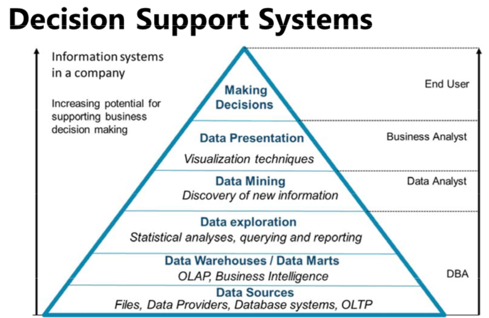
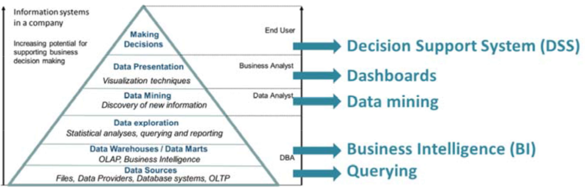
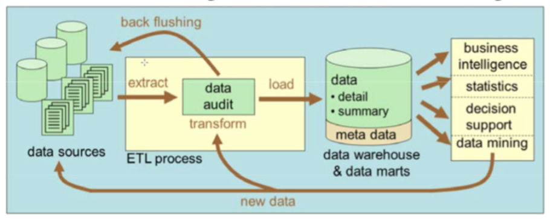
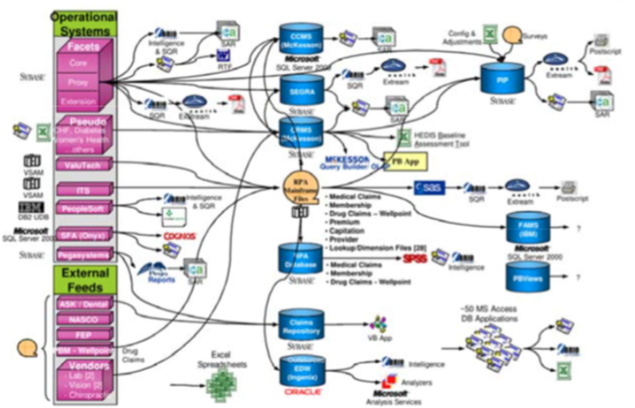

---

---

<h1 id="what-is-big-data">1. What is big data?</h1>
<h2 id="information-management">1.1 Information Management</h2>

Information Management includes

<ul>
<li>Data storing</li>
<li>Data processing</li>
<li>Data visualisation</li>
</ul>

<h3 id="hierarchial-structure-of-information-management-systems">Hierarchial structure of information management systems</h3>
<h4 id="oltp">OLTP</h4>
<ul>
<li>Online Transaction Processing</li>
<li>Works with transactions</li>
<li>Transaction = logical unit of work</li>
<li>Working with transactions ensures data consistency and guarantees there is no information loss</li>
<li>Intended to support operational activities of a company</li>
<li>Keeps most recent data up-to-date</li>
</ul>
<h4 id="olap">OLAP</h4>
<ul>
<li>Online Analytical Processing</li>
<li>Used for advanced analysis</li>
<li>Central to an OLAP system is a data warehouse or data marts</li>
<li>Data warehouses collect data from different sources and thus records the history of the data</li>
<li>Allows user to do historical analysis on the data</li>
<li>Midterm and longterm decision support</li>
</ul>
<h4 id="data-mining">Data Mining</h4>
<ul>
<li>Examining the data to try to find previously unknown knowledge</li>
<li>Found by searching for correlations within the available data collections</li>
<li>These correlations are not visible to users of data warehouse or database and cannot be found via SQL queries or OLAP operations</li>
</ul>
<h4 id="data-presentation">Data Presentation</h4>
<ul>
<li>Not all correlations found yield relevant knowledge</li>
<li>They must be critically analysed by business analysts</li>
<li>Major challenge to build efficient that are able to visualise adequately the available data and the analysis results</li>
</ul>
<h4 id="making-decisions">Making Decisions</h4>
<ul>
<li>Data can be entered into decision support systems</li>
<li>Allows the user to select option that best meets the preferences of the users</li>
<li>If there is more relevant data, the results of the analysis are more accurate</li>
</ul>
<h3 id="traditional-systems">Traditional Systems</h3>

The general purpose of an information management system is to support users when taking decisions.

<h4 id="common-tools">Common Tools:</h4>
<ul>
<li>Querying the database</li>
<li>BI-tools</li>
<li>Data mining applications</li>
<li>Dashboard and decision support systems</li>
</ul>
<h4 id="what-do-users-want">What do users want</h4>

Users want a single logic database for their analyses. It looks like all data is coming from one single database.

<h4 id="what-do-we-usually-have-in-theory">What do we usually have: In Theory</h4>

The theoretical process off:

<ul>
<li>Extracting data from different source systems</li>
<li>Transforming and cleaning it to a suitable format</li>
<li>Loading it into a Datawarehouse for easy BI</li>
</ul>

The ETL process guarantees that the correct data is selected from the sources and that it is checked for errors, and if necessary is corrected and converted to current data standards and that this transformed data is loaded in the data warehouse.

Back flushing the error correction is important to insure that the data sources contain correct data. Otherwise users will start using the data warehouse for OLTP purposes.

<h4 id="what-do-we-usually-have-in-practice">What do we usually have: In Practice</h4>

<h4 id="how-does-big-data-fit-in-these-pictures">How does Big Data fit in these pictures?</h4>

Traditional databases, ETL processes, Data warehouses, Data Mining, … are not suited for processing data with specific characteristics. Such data is called <strong>Big Data</strong>.

<h2 id="what-are-big-data">1.2 What are Big Data?</h2>

Data of very large size, typically to the extent that its manipulation and management present significant logistical challenges.

An all-encompassing term for any collection of data sets so large and complex that it becomes difficult to process using on-hand data management tools or traditional data processing applications.

<h2 id="the-origin-of-big-data">1.3 The origin of Big Data</h2>
<ul>
<li>New data characteristics</li>
<li>New data challenges</li>
</ul>

This data has it’s own characteristics and the efficient processing of this data brings new challenges along.

<h2 id="the-four-vs-of-big-data">1.4 The four V’s of Big Data</h2>
<h3 id="volume-big-data">Volume: BIG data</h3>

The amount of data, also reffered to the data at rest

Big data can be the result of a large data volume. This feature is most common. There is a great need to be able to work with ever-increasing data collections.

<h3 id="variety-varied-data">Variety: Varied data</h3>

The range of data types and sources that are used, data in its many forms

In the conventional information systems we assume the data can be structured in a fixed database schema the only rarely needs to be adjusted. If data does not fit into a fixed database schema ut must first be converted, which is time consuming. In practice data is often available in various shapes and sizes.

Big data can be characterised by a lack of uniformity in the structure of the data, making it very difficult to set up a fixed database schema for it.

<h3 id="velocity-fast-data">Velocity: Fast data</h3>

The speed at which data comes in and goes out, data in motion, streaming data

Quickly and efficiently processing is necessary in order not to loose any information. Limitaions on the acquisition speed and timelines of the data can be another reason for characterising data as big data.

<h3 id="veracity-bad-data">Veracity: Bad data</h3>

The uncertainty of the data, data in doubt

<ul>
<li>Imprecise data</li>
<li>Vague data</li>
<li>Uncertain data</li>
<li>Incomplete data</li>
<li>Inconsistent data</li>
</ul>

This indicates the quality or trustworthiness of the data. Large volumes with varied data that must be processed very quickly are very sensitive to poor data quality.

To be valuable an information system should offer adequate guarantees that the user at least knows how reliable the processing of the data was done -&gt; truthfulness.

As the quality of your data can not be checked with a conventional information the data is described as big data.

Poor quality data is often due to inaccuracy, vagueness, uncertainty, incompleteness, inconsistency and can be caused by incorrect user input, redundant data, corrupt data.

<h2 id="some-other-vs">1.5 Some other V’s</h2>
<h3 id="virality">Virality</h3>

How long do we need to keep the data, when does it become outdated?

<h3 id="viscosity">Viscosity</h3>

Do we have enough data to perform relevant to analysis?

<h3 id="visualisation">Visualisation</h3>

Can the results easily be presented?

<h3 id="value">Value</h3>

Can we create additional value based upon the data?

<h2 id="bottlenecks">1.6 Bottlenecks</h2>
<h3 id="most-common-pitfalls">Most common pitfalls</h3>
<ul>
<li>Believing that one has huge volumes of data, hence requiring big data setup, even trough modern RDBMs are perfectly capable of handling these.</li>
<li>Big data technologies are not easy to query, analyse, or derive insights from.# 1. What is big data?</li>
</ul>
<h2 id="information-management-1">1.1 Information Management</h2>

Information Management includes

<ul>
<li>Data storing</li>
<li>Data processing</li>
<li>Data visualisation</li>
</ul>

<h3 id="hierarchial-structure-of-information-management-systems-1">Hierarchial structure of information management systems</h3>
<h4 id="oltp-1">OLTP</h4>
<ul>
<li>Online Transaction Processing</li>
<li>Works with transactions</li>
<li>Transaction = logical unit of work</li>
<li>Working with transactions ensures data consistency and guarantees there is no information loss</li>
<li>Intended to support operational activities of a company</li>
<li>Keeps most recent data up-to-date</li>
</ul>
<h4 id="olap-1">OLAP</h4>
<ul>
<li>Online Analytical Processing</li>
<li>Used for advanced analysis</li>
<li>Central to an OLAP system is a data warehouse or data marts</li>
<li>Data warehouses collect data from different sources and thus records the history of the data</li>
<li>Allows user to do historical analysis on the data</li>
<li>Midterm and longterm decision support</li>
</ul>
<h4 id="data-mining-1">Data Mining</h4>
<ul>
<li>Examining the data to try to find previously unknown knowledge</li>
<li>Found by searching for correlations within the available data collections</li>
<li>These correlations are not visible to users of data warehouse or database and cannot be found via SQL queries or OLAP operations</li>
</ul>
<h4 id="data-presentation-1">Data Presentation</h4>
<ul>
<li>Not all correlations found yield relevant knowledge</li>
<li>They must be critically analysed by business analysts</li>
<li>Major challenge to build efficient that are able to visualise adequately the available data and the analysis results</li>
</ul>
<h4 id="making-decisions-1">Making Decisions</h4>
<ul>
<li>Data can be entered into decision support systems</li>
<li>Allows the user to select option that best meets the preferences of the users</li>
<li>If there is more relevant data, the results of the analysis are more accurate</li>
</ul>
<h3 id="traditional-systems-1">Traditional Systems</h3>

The general purpose of an information management system is to support users when taking decisions.

<h4 id="common-tools-1">Common Tools:</h4>
<ul>
<li>Querying the database</li>
<li>BI-tools</li>
<li>Data mining applications</li>
<li>Dashboard and decision support systems</li>
</ul>
<h4 id="what-do-users-want-1">What do users want</h4>

Users want a single logic database for their analyses. It looks like all data is coming from one single database.

<h4 id="what-do-we-usually-have-in-theory-1">What do we usually have: In Theory</h4>

The theoretical process off:

<ul>
<li>Extracting data from different source systems</li>
<li>Transforming and cleaning it to a suitable format</li>
<li>Loading it into a Datawarehouse for easy BI</li>
</ul>

The ETL process guarantees that the correct data is selected from the sources and that it is checked for errors, and if necessary is corrected and converted to current data standards and that this transformed data is loaded in the data warehouse.

Back flushing the error correction is important to insure that the data sources contain correct data. Otherwise users will start using the data warehouse for OLTP purposes.

<h4 id="what-do-we-usually-have-in-practice-1">What do we usually have: In Practice</h4>

<h4 id="how-does-big-data-fit-in-these-pictures-1">How does Big Data fit in these pictures?</h4>

Traditional databases, ETL processes, Data warehouses, Data Mining, … are not suited for processing data with specific characteristics. Such data is called <strong>Big Data</strong>.

<h2 id="what-are-big-data-1">1.2 What are Big Data?</h2>

Data of very large size, typically to the extent that its manipulation and management present significant logistical challenges.

An all-encompassing term for any collection of data sets so large and complex that it becomes difficult to process using on-hand data management tools or traditional data processing applications.

<h2 id="the-origin-of-big-data-1">1.3 The origin of Big Data</h2>
<ul>
<li>New data characteristics</li>
<li>New data challenges</li>
</ul>

This data has it’s own characteristics and the efficient processing of this data brings new challenges along.

<h2 id="the-four-vs-of-big-data-1">1.4 The four V’s of Big Data</h2>
<h3 id="volume-big-data-1">Volume: BIG data</h3>

The amount of data, also reffered to the data at rest

Big data can be the result of a large data volume. This feature is most common. There is a great need to be able to work with ever-increasing data collections.

<h3 id="variety-varied-data-1">Variety: Varied data</h3>

The range of data types and sources that are used, data in its many forms

In the conventional information systems we assume the data can be structured in a fixed database schema the only rarely needs to be adjusted. If data does not fit into a fixed database schema ut must first be converted, which is time consuming. In practice data is often available in various shapes and sizes.

Big data can be characterised by a lack of uniformity in the structure of the data, making it very difficult to set up a fixed database schema for it.

<h3 id="velocity-fast-data-1">Velocity: Fast data</h3>

The speed at which data comes in and goes out, data in motion, streaming data

Quickly and efficiently processing is necessary in order not to loose any information. Limitaions on the acquisition speed and timelines of the data can be another reason for characterising data as big data.

<h3 id="veracity-bad-data-1">Veracity: Bad data</h3>

The uncertainty of the data, data in doubt

<ul>
<li>Imprecise data</li>
<li>Vague data</li>
<li>Uncertain data</li>
<li>Incomplete data</li>
<li>Inconsistent data</li>
</ul>

This indicates the quality or trustworthiness of the data. Large volumes with varied data that must be processed very quickly are very sensitive to poor data quality.

To be valuable an information system should offer adequate guarantees that the user at least knows how reliable the processing of the data was done -&gt; truthfulness.

As the quality of your data can not be checked with a conventional information the data is described as big data.

Poor quality data is often due to inaccuracy, vagueness, uncertainty, incompleteness, inconsistency and can be caused by incorrect user input, redundant data, corrupt data.

<h2 id="some-other-vs-1">1.5 Some other V’s</h2>
<h3 id="virality-1">Virality</h3>

How long do we need to keep the data, when does it become outdated?

<h3 id="viscosity-1">Viscosity</h3>

Do we have enough data to perform relevant to analysis?

<h3 id="visualisation-1">Visualisation</h3>

Can the results easily be presented?

<h3 id="value-1">Value</h3>

Can we create additional value based upon the data?

<h2 id="bottlenecks-1">1.6 Bottlenecks</h2>
<h3 id="most-common-pitfalls-1">Most common pitfalls</h3>
<ul>
<li>Believing that one has huge volumes of data, hence requiring big data setup, even trough modern RDBMs are perfectly capable of handling these.</li>
<li>Big data technologies are not easy to query, analyse, or derive insights from.</li>
</ul>

Big data is first about managing and storing huge, high-speed, and/or unstructured datasets, but this does not automatically mean one can analyze them or easily leverage them to obtain insights.

The use of big data must be justified by the potential to create additional value in the activities of a company.

