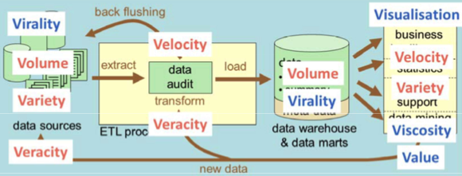
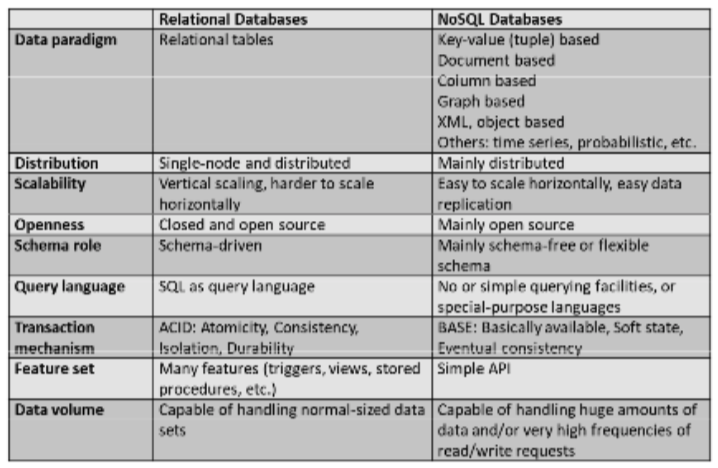
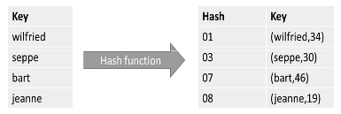
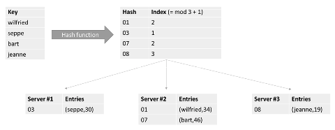
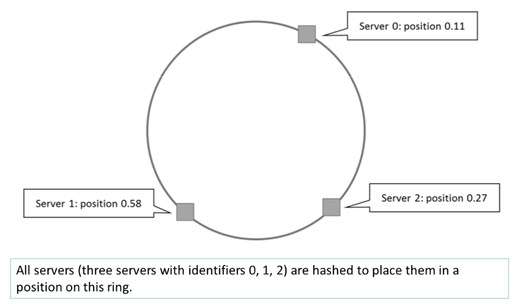
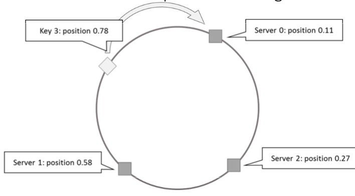
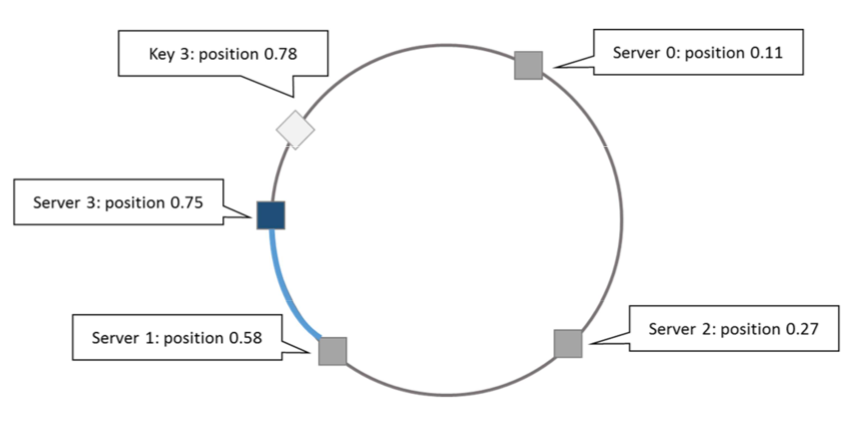
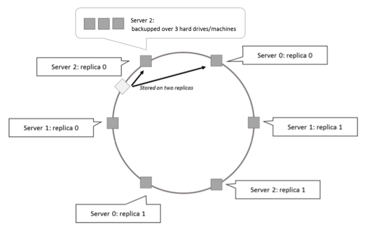

# 1 What is big data?

## 1.1 Information Management

Information Management includes

* Data storing
* Data processing
* Data visualisation

### Hierarchial structure of information management systems 

#### OLTP

* Online Transaction Processing
* Works with transactions
* Transaction = logical unit of work
* Working with transactions ensures data consistency and guarantees there is no information loss
* Intended to support operational activities of a company
* Keeps most recent data up-to-date

#### OLAP

* Online Analytical Processing
* Used for advanced analysis
* Central to an OLAP system is a data warehouse or data marts
* Data warehouses collect data from different sources and thus records the history of the data
* Allows user to do historical analysis on the data
* Midterm and longterm decision support

#### Data Mining

* Examining the data to try to find previously unknown knowledge
* Found by searching for correlations within the available data collections
* These correlations are not visible to users of data warehouse or database and cannot be found via SQL queries or OLAP operations 

#### Data Presentation

* Not all correlations found yield relevant knowledge
* They must be critically analysed by business analysts 
* Major challenge to build efficient that are able to visualise adequately the available data and the analysis results

#### Making Decisions

* Data can be entered into decision support systems
* Allows the user to select option that best meets the preferences of the users
* If there is more relevant data, the results of the analysis are more accurate 

### Traditional Systems

The general purpose of an information management system is to support users when taking decisions. 

#### Common Tools:

* Querying the database 
* BI-tools
* Data mining applications 
* Dashboard and decision support systems

#### What do users want 

Users want a single logic database for their analyses. It looks like all data is coming from one single database.

#### What do we usually have: In Theory

The theoretical process off:

* Extracting data from different source systems
* Transforming and cleaning it to a suitable format
* Loading it into a Datawarehouse for easy BI

The ETL process guarantees that the correct data is selected from the sources and that it is checked for errors, and if necessary is corrected and converted to current data standards and that this transformed data is loaded in the data warehouse.

Back flushing the error correction is important to insure that the data sources contain correct data. Otherwise users will start using the data warehouse for OLTP purposes.

#### What do we usually have: In Practice

#### How does Big Data fit in these pictures?

Traditional databases, ETL processes, Data warehouses, Data Mining, ... are not suited for processing data with specific characteristics. Such data is called **Big Data**.

## 1.2 What are Big Data?

Data of very large size, typically to the extent that its manipulation and management present significant logistical challenges.

An all-encompassing term for any collection of data sets so large and complex that it becomes difficult to process using on-hand data management tools or traditional data processing applications.

## 1.3 The origin of Big Data

* New data characteristics 
* New data challenges

This data has it's own characteristics and the efficient processing of this data brings new challenges along.

## 1.4 The four V's of Big Data

### Volume: BIG data

The amount of data, also reffered to the data at rest 

Big data can be the result of a large data volume. This feature is most common. There is a great need to be able to work with ever-increasing data collections.

### Variety: Varied data

The range of data types and sources that are used, data in its many forms

In the conventional information systems we assume the data can be structured in a fixed database schema the only rarely needs to be adjusted. If data does not fit into a fixed database schema ut must first be converted, which is time consuming. In practice data is often available in various shapes and sizes.

Big data can be characterised by a lack of uniformity in the structure of the data, making it very difficult to set up a fixed database schema for it.

### Velocity: Fast data

The speed at which data comes in and goes out, data in motion, streaming data

Quickly and efficiently processing is necessary in order not to loose any information. Limitaions on the acquisition speed and timelines of the data can be another reason for characterising data as big data.

### Veracity: Bad data

The uncertainty of the data, data in doubt

* Imprecise data
* Vague data
* Uncertain data
* Incomplete data
* Inconsistent data

This indicates the quality or trustworthiness of the data. Large volumes with varied data that must be processed very quickly are very sensitive to poor data quality.

To be valuable an information system should offer adequate guarantees that the user at least knows how reliable the processing of the data was done -> truthfulness.

As the quality of your data can not be checked with a conventional information the data is described as big data.

Poor quality data is often due to inaccuracy, vagueness, uncertainty, incompleteness, inconsistency and can be caused by incorrect user input, redundant data, corrupt data.

## 1.5 Some other V's

### Virality 

How long do we need to keep the data, when does it become outdated? 

### Viscosity

Do we have enough data to perform relevant to analysis?

### Visualisation

Can the results easily be presented?

### Value

Can we create additional value based upon the data?

## 1.6 Bottlenecks

### Most common pitfalls

* Believing that one has huge volumes of data, hence requiring big data setup, even trough modern RDBMs are perfectly capable of handling these.
* Big data technologies are not easy to query, analyse, or derive insights from.# 1. What is big data?

## 1.1 Information Management

Information Management includes

* Data storing
* Data processing
* Data visualisation

### Hierarchial structure of information management systems 

#### OLTP

* Online Transaction Processing
* Works with transactions
* Transaction = logical unit of work
* Working with transactions ensures data consistency and guarantees there is no information loss
* Intended to support operational activities of a company
* Keeps most recent data up-to-date

#### OLAP

* Online Analytical Processing
* Used for advanced analysis
* Central to an OLAP system is a data warehouse or data marts
* Data warehouses collect data from different sources and thus records the history of the data
* Allows user to do historical analysis on the data
* Midterm and longterm decision support

#### Data Mining

* Examining the data to try to find previously unknown knowledge
* Found by searching for correlations within the available data collections
* These correlations are not visible to users of data warehouse or database and cannot be found via SQL queries or OLAP operations 

#### Data Presentation

* Not all correlations found yield relevant knowledge
* They must be critically analysed by business analysts 
* Major challenge to build efficient that are able to visualise adequately the available data and the analysis results

#### Making Decisions

* Data can be entered into decision support systems
* Allows the user to select option that best meets the preferences of the users
* If there is more relevant data, the results of the analysis are more accurate 

### Traditional Systems

The general purpose of an information management system is to support users when taking decisions. 

#### Common Tools:

* Querying the database 
* BI-tools
* Data mining applications 
* Dashboard and decision support systems

#### What do users want 

Users want a single logic database for their analyses. It looks like all data is coming from one single database.

#### What do we usually have: In Theory

The theoretical process off:

* Extracting data from different source systems
* Transforming and cleaning it to a suitable format
* Loading it into a Datawarehouse for easy BI

The ETL process guarantees that the correct data is selected from the sources and that it is checked for errors, and if necessary is corrected and converted to current data standards and that this transformed data is loaded in the data warehouse.

Back flushing the error correction is important to insure that the data sources contain correct data. Otherwise users will start using the data warehouse for OLTP purposes.

#### What do we usually have: In Practice

#### How does Big Data fit in these pictures?

Traditional databases, ETL processes, Data warehouses, Data Mining, ... are not suited for processing data with specific characteristics. Such data is called **Big Data**.

## 1.2 What are Big Data?

Data of very large size, typically to the extent that its manipulation and management present significant logistical challenges.

An all-encompassing term for any collection of data sets so large and complex that it becomes difficult to process using on-hand data management tools or traditional data processing applications.

## 1.3 The origin of Big Data

* New data characteristics 
* New data challenges

This data has it's own characteristics and the efficient processing of this data brings new challenges along.

## 1.4 The four V's of Big Data

### Volume: BIG data

The amount of data, also reffered to the data at rest 

Big data can be the result of a large data volume. This feature is most common. There is a great need to be able to work with ever-increasing data collections.

### Variety: Varied data

The range of data types and sources that are used, data in its many forms

In the conventional information systems we assume the data can be structured in a fixed database schema the only rarely needs to be adjusted. If data does not fit into a fixed database schema ut must first be converted, which is time consuming. In practice data is often available in various shapes and sizes.

Big data can be characterised by a lack of uniformity in the structure of the data, making it very difficult to set up a fixed database schema for it.

### Velocity: Fast data

The speed at which data comes in and goes out, data in motion, streaming data

Quickly and efficiently processing is necessary in order not to loose any information. Limitaions on the acquisition speed and timelines of the data can be another reason for characterising data as big data.

### Veracity: Bad data

The uncertainty of the data, data in doubt

* Imprecise data
* Vague data
* Uncertain data
* Incomplete data
* Inconsistent data

This indicates the quality or trustworthiness of the data. Large volumes with varied data that must be processed very quickly are very sensitive to poor data quality.

To be valuable an information system should offer adequate guarantees that the user at least knows how reliable the processing of the data was done -> truthfulness.

As the quality of your data can not be checked with a conventional information the data is described as big data.

Poor quality data is often due to inaccuracy, vagueness, uncertainty, incompleteness, inconsistency and can be caused by incorrect user input, redundant data, corrupt data.

## 1.5 Some other V's

### Virality 

How long do we need to keep the data, when does it become outdated? 

### Viscosity

Do we have enough data to perform relevant to analysis?

### Visualisation

Can the results easily be presented?

### Value

Can we create additional value based upon the data?

## 1.6 Bottlenecks

### Most common pitfalls

* Believing that one has huge volumes of data, hence requiring big data setup, even trough modern RDBMs are perfectly capable of handling these.
* Big data technologies are not easy to query, analyse, or derive insights from.

### Big Data

Big data is first about managing and storing huge, high-speed, and/or unstructured datasets, but this does not automatically mean one can analyze them or easily leverage them to obtain insights.

The use of big data must be justified by the potential to create additional value in the activities of a company.

# 2 Introduction to NoSQL

## 2.1 Classical relational database follow the ACID rules

### Atomic

A transaction is a logical unit of work which must be either completed with all of its data modifications or nothing at all.

### Consistent

At the end of a transaction, all the data must be left in a consistent state 

### Isolated

Modifications of data performed by a transaction must be independent of another transaction. Otherwise the outcome of a transaction may be erroneous.

### Durable

When the transaction is completed, effects of the modification performed by the transaction must be permanent in the system.

## 2.2 Relational Database Management Systems

RDMSs put a lot of emphasis on keeping data consistent. They require a formal database system, and new or modified data is not accepted unless they comply with this schema in terms of data type, referential integrity etc...

This guarantees that the entire database is consistent at all times.

**The focus on consistency may hamper flexibility and scalability**

As the data volume or the number of parallel transactions increases, capacity can be increased by

* Vertical scaling: extending storage capacity and/or CPU power of the database server
* Horizontal scaling: multiple DBMS servers being arranged in a cluster

## 2.3 Vertical vs Horizontal scaling

### Vertical scaling

You can scale things up using bigger boxes, this costs a lot more and there are real limits on how far you can go.

Extending storage capacity and/or CPU power of the database server.

However there are hardware induced limitations to vertical scaling.

### Horizontal scaling

You can use lots and lots of little boxes, just commodity hardware, all thrown into massive grids. However relational databases were not designed to run efficiently on clusters.

This provides the necessary performance, which cannot be realised by a single server, but also guarantees availability, with the data being replicated over multiple nodes.

DBMSs are not good at extensive horizontal scaling.

* Coordination overhead because of focus on consisntency 
* Rigid database schemas.

## 2.4 The NoSQL Movement

Describes databases that store and manipulate data in other formats than regular relations.

NoSQL databases aim at near linear horizontal scalability, by distributing data over a cluster of database nodes for the sake of performance as well as availability.

**Eventual consistency**: the data will become consistent at some point in time after each transaction. 

## 2.5 Limitations of NoSQL

### SQL

40 years old -> very mature

Switching from one relational database to another is much easier than switching between 2 NoSQL databases

### Each NoSQL database has unique aspects

The developer must invest time and effort to learn the new query language and the consistency semantics 

## 2.6 Independence Mismatch

* In software: cohesive structures of objects in memory
* In databases: you have to stripe the object over multiple tables

NoSQL databases allow developers to develop without having to convert in-memory structures to relational structures.

# 3 Types of NoSQL Databases - Key-value stores

## 3.1 Key-value Stores

Key-Value based database stores data as (key, value) pairs. 

* Keys are unique. Sometimes keys are composed of multiple fields to yield a unique key.
* The value contains an uninterpreted value that may have any length and content

Keys are hashed by means of a so called hash function.

* A hash function takes an arbitrary value of arbitrary size and maps it into a key with a fixed size which is called the hash value.
* Each hash can be mapped to a space in computer memory

### Good hash functions should be: 

* Deterministic: Hashing the same input value must always provide the same hash value. 
* Uniform: A good hash function should map the inputs evenly over its output range, to prevent so-calles collisions between closely related pairs of inputs.
* Defined size: It is desirable that the output of a hash function has a fixed size, which makes it easier to store the data structure efficiently.

The reason hashes allow for efficient storage and lookup of entries is because each hash can be mapped to a space computer memory, allowing for rapid, exact lookup of a key.

### NoSQL

NoSQL Databases are bult with horizontal scalability support in mind. We can distribute the hah tables over different locations.

Assume we need to spread our hashes over three servers.

* Hash every key to a server indentifier 
* index(hash) = mod(hash, nrServers) + 1

Since the nature of a hash function is to spread inputs uniformly over its output range, it is easy to create an index over the hash range that can spread out the hash table over different locations.

**= Sharding: distributes different data across multiple servers, so each server acts as a single source for a subset of data.**

### Key Value Stores

* Request coordination 
* Consistent hashing
* Replication and redundancy
* Eventual consistency 
* Stabilization
* Integrity constraints and querying

## 3.2 Request Coordination

In many NoSQL implementations all nodes implement the same functionality and are all able to perform the role of request coordinator.

need for membership protocol 

* Dissemination
* Failure detection 

It's the duty of the client to make sure requests to store and retrieve key-value pairs are routed to the desired node which will store the data.

However starting from the basic key-value architecture it is possible to move such duties from the client to the nodes themselves. In such a setup, all nodes often implement the same functionality and can all perform the role of request coordinator: i.e. the responsible party to route requests to the appropriate destination node and relay back the result status of operation.

it is necessary that all nodes remain informed at all times of the other nodes on the network. This problem is addressed through a membership protocol.

**Membership Protocol**: Each node talks to the network to retrieve a membership list and keep its view of the whole network up to date. This protocol allows all nodes to know about the existence of other nodes, and is the fundamental underlying protocol on top of which other functionality can be built.

Each membership protocol contains two sub-components, called dissemination and failure detection. Implementation in practice mimics how rumours or gossips are spread.

## 3.3 Consistent Hashing

Consistent hashing schemes are often used, which avoid having to remap each key to a new node when nodes are added or removed.

At the core of a consistent hashing setup is a so called "ring-topology", which is basically a representation of the number range [0,1[

Hash each key to a position on a ring, and store the actual key-value pair on the first server that appears clockwise of the hashed point on the ring.

Because of the uniformity property of a good hash function, roughly 1/n of key-value pairs will end up being stored on each server. Most of the key-value pairs will remain unaffected if a machine is added or removed.

For instance, say we add a new server to the ring, only the keys positioned on the highlighted section of the ring in the figure above would have to be moved to the new server.

Typicily the fraction of keys that need to be moved when using this set-up is about **k / (n + 1)**

## 3.4 Replication and Redundancy

### Problems with consistent hashing

* If two servers end up being mapped close to one another, one of these nodes will end up with few keys to store 
* In case a server is added, all of the keys moved to to this new node originate from just one other server.

### Solution

Instead of mapping a server s to a single point on our ring, we map it to multiple positions, called replicas.

For each physical server s, we hence end up with r (number of replicas) points on the ring. Each of the replicas still represents the same physical instance.

We increase uniformity with which key-value pairs will end up being distributed to servers, and can also ensure that an even lower number of keys must be moved when a server is adde to a cluster.

### Redundancy

To handle data replication and redundancy, many vendors extend the consistent hashing mechanism so that key-value pairs are duplicated across multiple nodes, for instance by storing the key-value pair on 2 or more nodes clockwise from the key's position on the ring.

It's also possible to set up a full redundancy scheme where each node itself corresponds to multiple physical machines each storing a fully redundant copy of the data

