# Adaptor

Het Adaptor Pattern converteert de interface van een klasse naar een andere interface die de client verwacht. Adapters zorgen ervoor dat klassen samenwerken. Zonder de adapters lukt dit niet vanwege incompatibele interfaces.

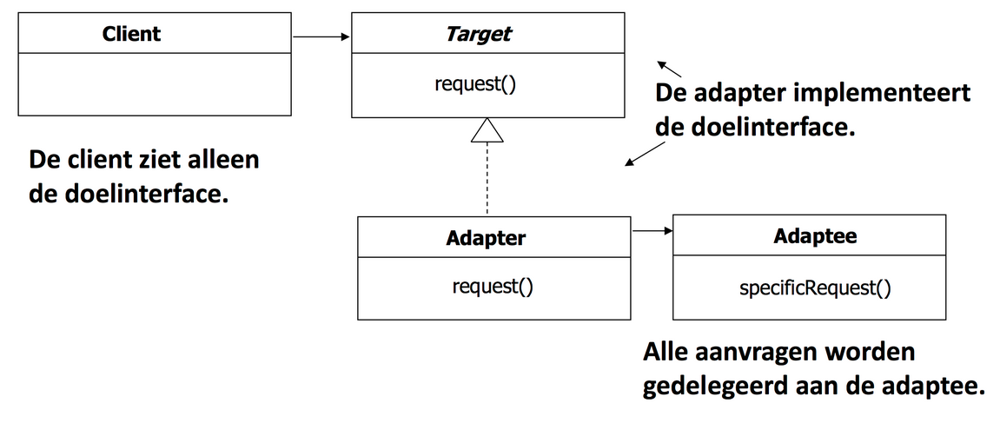
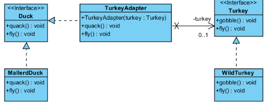

```java
public interface Duck {
    void quack();
    void fly();
}

public class MallardDuck implements Duck {
    public void quack() {
        System.out.println("Quack");
    }

    public void fly() {
        System.out.println("I'm flying");
    }
}

public interface Turkey {
    void gobble();
    void fly();
}

public class WildTurkey implements Turkey {
    public void gobble() {
        System.out.println("Gobble gobble");
    }

    public void fly() {
        System.out.println("I'm flying a short distance");
    }
}

public class TurkeyAdapter implements Duck {
    private Turkey turkey;

    public TurkeyAdapter(Turkey turkey) {
        this.turkey = turkey;
    }

    public void quack() {
        turkey.gobble();
    }

    public void fly() {
        for (int i = 0; i < 5; i++) {
            turkey.fly();
        }
    }
}

public class Adapter {
    public static void main(String[] args) {
        MallardDuck duck = new MallardDuck();
        testDuck(duck);

        WildTurkey turkey = new WildTurkey();
        Duck turkeyAdapter = new TurkeyAdapter(turkey);
        testDuck(turkeyAdapter);
    }

    static void testDuck(Duck duck) {
        duck.quack();
        duck.fly();
    }
}
```

# Builder

Gebruik het builder Pattern om de constructie van een product af te schermen en zorg dat je het in stappen kan construeren.

* De **Builder** klasse specifieert een abstracte interface voor de creatie van de onderdelen van het Product object. De Builder bevat alle methodes die nodig zijn voor het bouwen van de onderdelen.
* De **ConcreteBuilder** bouwt de onderdelen van het complexe object en gooit deze samen door implementatie van de Builder Interface. Het houdt een representatievan het object bij en biedt een interface voor het opvangen van het product.
* De **Director** klasse bouwt het complexe object gebruik makend van de interface van de Builder. De Director ken de stappen voor het bouwen en vraagt de Builder om de structuur te maken.
* Het **Product** stelt het complexe object voor dat gebouwd wordt.

Voordelen: 

* Schermt de manier waarop een complex object gebouwd wordt af.
* Geeft de mogelijkheid om objecten in meerdere stappen en wisselende processen te maken, in tegenstelling tot éénstapsfactory.
* Verbergt interne representatie van het product voor de Client.
* Productimplementaties kunnen steeds wisselen, omdat een client alleen een abstracte interface ziet.


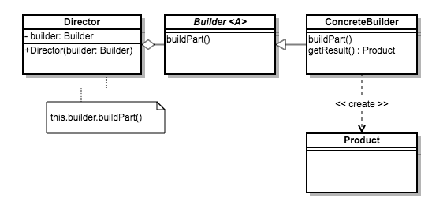
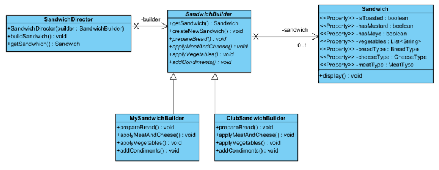

```java
// De builder: de abstracte klasse
public abstract class SandwichBuilder {
    private Sandwich sandwich;
    public Sandwich getSandwich {
        return sandwich;
    }    

    public void createNewSandwich() {
        sandwich = new Sandwich();
    }

    public abstract void prepareBread();
    public abstract void applyMeatAndCheese();
    public abstract void applyVegetables();
    public abstract void addCondiments();
}

// De builder klassen: concrete klassen
public class MySandwhichBuilder extends SandwichBuilder {
    public void prepareBread() {
        Sandwich sandwich = getSandwich();
        sandwich.setbreadType(BreadType.Wheat);
    }
    public void applyMeatAndCheese() {
        // ...
    }
    public void applyVegetables() {
        // ...
    }
    public void addCondiments() {
        // ...
    }
}

public class ClubSandwichBuilder extends SandwichBuilder {
    public void prepareBread() {
        Sandwich sandwich = getSandwich();
        sandwich.setbreadType(BreadType.White);
    }
    public void applyMeatAndCheese() {
        // ...
    }
    public void applyVegetables() {
        // ...
    }
    public void addCondiments() {
        // ...
    }
}

// De Director
public class SandwichDirector {
    private SandwichBuilder builder;

    public SandwichDirector(SandwichBuilder builder) {
        this.builder = builder;
    }

    public void buildSandwich() {
        builder.createNewSandwich();
        builder.prepareBread();
        builder.applyMeatAndCheese();
        builder.applyVegetables();
        builder.addCondiments();
    }

    public Sandwich getSandwich() {
        return builder.getSandwich();
    }
}

public static void main(String[] args) {
    SandwichDirector director = new SandwichDirector(new MySandwhichBuilder());

    director.buildSandwich();
    Sandwich sandwich = director.getSandwich();
    sandwich.display();
}
```

# Command

het Command Pattern schermt een aanroep af door middel van een object, waarbij je verschillende aanroepen in verschillende objecten kan opbergen, in een queue zetten, of op schijf kunt bewaren. Ook undo-operaties kunnen worden ondersteund.

* Een actie wordt voorgesteld als een **object**.
* De commandszijn volledig **self-contained**.
* Nieuwe commandos kunnen eenvoudig worden toegevegd.

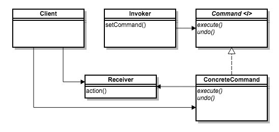
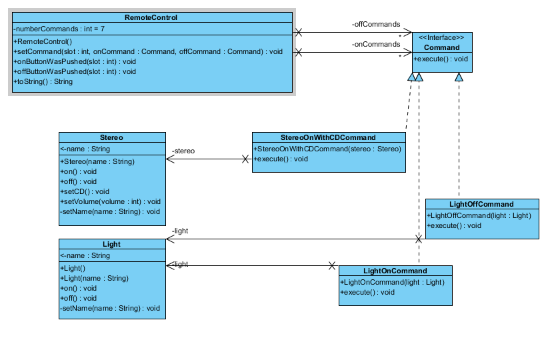

* De **Client** maakt Command objecten aan die dan in de slots van de RemoteControl worden geladen.
* de **RemoteControl** Heeft een set commands, een per knop. Wanneer een knop ingedrukt is dan wordt de juiste methode aangferoepen.

```java
public interface Command { // Command
    void execute();
    void undo();
}

// Zorgt er voor dat we geen if-statements moeten zetten met de vraag of we wel execute() kunnen aanroepen
public class NoCommand implements Command { // ConcreteCommand
    public void execute() {}
    public void undo() {}
}

// Voorbeelden
public class LightOnCommand implements Command { // ConcreteCommand
    private Light light;

    public LightOnCommand(Light light) {
        this.light = light;
    }

    public void execute() {
        light.on();
    }

    public void undo() {
        light.off();
    }
}

public class LightOffCommand implements Command { // ConcreteCommand
    private Light light;

    public LightOffCommand(Light light) {
        this.light = light;
    }

    public void execute() {
        light.off();
    }

    public void undo() {
        light.on();
    }
}

public class StereoOnWithCDCommand implements Command { // ConcreteCommand
    private Stereo stereo;

    public StereoOnWithCDCommand(Stereo stereo) {
        this.stereo = stereo;
    }

    public void execute() {
        stereo.on();
        stereo.setCD();
        stereo.setVolume(11);
    }
}

// Hoe runnen:
public class RemoteControl { // Invoker, invoked commands
    private Command[] onCommands;
    private Command[] offCommands;
    private Command undoCommand;
    private final int numberCommands = 7;

    public RemoteControl() {
        onCommands = new Command[numberCommands];
        offCommands = new Command[numberCommands];
        Command noCommand = new NoCommand();

        for (int i = 0; i < numberCommands; i++) {
            onCommands[i] = noCommand;
            offCommands[i] = noCommand;
        }

        undoCommand = noCommand;
    }

    public void setCommand(int slot, Command onCommand, Command offCommand) {
        onCommands[slot] = onCommand;
        offCommands[slot] = offCommand;
    }

    public void onButtonWasPushed(int slot) {
        onCommands[slot].execute();
        undoCommand = onCommands[slot];
    }

    public void undoButtonWasPushed() {
        undoCommand.undo();
        undoCommand = new NoCommand();
    }

}

public class RemoteControlApp { // Client
    public static void main(String[] args) {
        RemoteControl remoteControl = new RemoteControl();

        Light livingRoomLight = new Light("Living Room Lighting");
        Light kitchenLight = new Light("Kitchen lighting");
        Stereo stereo = new Stereo("Stereo");
        // ...

        LightOnCommand livingRoomLightOn = new LightOnCommand(livingRoomLight);
        LightOffCommand livingRoomLightOff = new LightOffCommand(livingRoomLight);
        LightOnCommand kitchenLightOn = new LightOnCommand(kitchenLight);
        LightOffCommand kitchenLightOff = new LightOffCommand(kitchenLight);
        StereoOnWithCDCommand stereoOnWithCD = new StereoOnWithCDCommand(stereo);

        // Execution
        remoteControl.setCommand(1, livingRoomLightOn, livingRoomLightOff);
        remoteControl.setCommand(2, kitchenLightOn, kitchenLightOff);

        remoteControl.onButtonWasPushed(1);
        remoteControl.onButtonWasPushed(2);
        remoteControl.undoButtonWasPushed();
        remoteControl.undoButtonWasPushed();
    }
}
```

## Macro-Command

Een command, die een verzameling van commands bevat. deze commands kan je dan een voor een executen.

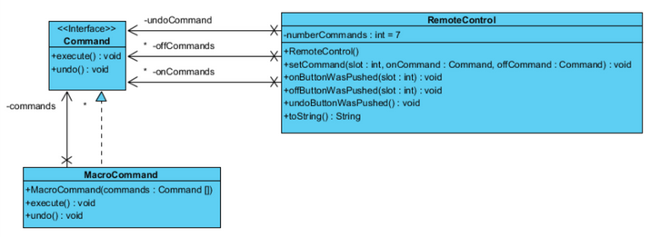

```java
public class MacroCommand implements Command { // ConcreteCommand
    private Command[] commands;
    public MacroCommand(Command[] commands) {
        this.commands = commands;
    }

    public void execute() {
        Arrays.stream(commands).forEach(Command::execute);
    }

    public void undo() {

    }
}

public class RemoteLoader { // Client
    public static void main(String[] args) {
        RemoteControl remotecontrol = new RemoteControl();

        Light light = new Light("Living Room");
        Tv tv = new Tv("Living Room");
        Stereo stereo = new Stereo("Living Room");
        Hottub hottub = new Hottub();

        LightOnCommand lightOn = new LightOnCommand(light);
        StereoOnCommand stereoOn = new StereoOnCommand(stereo);
        TvOnCommand tvOn = new TvOnCommand(tv);
        HottubOnCommand hottubOn = new HottubOnCommand(hottub);

        LightOffCommand lightOff = new LightOffCommand(light);
        StereoOffCommand stereoOff = new StereoOffCommand(stereo);
        TvOffCommand tvOff = new TvOffCommand(tv);
        HottubOffCommand hottubOff = new HottubOffCommand(hottub);

        Command[] partyOn = { lightOn, stereoOn, tvOn, hottubOn };
        Command[] partyOff = { lightOff, stereoOff, tvOff, hottubOff };

        MacroCommand partyOnMacro = new MacroCommand(partyOn);
        MacroCommand partyOffMacro = new MacroCommand(partyOff);

        remoteControl.setCommand(0, partyOnMacro, partyOffMacro);

        System.out.println(remoteControl);

        System.out.println("--- Pushing Macro On---");
        remoteControl.onButtonWasPushed(0);

        System.out.println("--- Pushing Macro Off---");
        remoteControl.offButtonWasPushed(0);
    }
}
``` 

# Composite

Het Composite Pattern stelt je in staat om objecten in boomstructuren samen te stellen om partwhole hiërarchiën weer te geven. Composite laat clients de afzonderlijke objecten of samengestelde objecten op uniforme wijze behandelen.

* De **Client** gebruikt de Component interface om de objecten in de compositie te manipuleren.
* De **Component** definiëert een interface voor alle objecten in de compositie (leafs en composites).
* Een **Leaf** heeft geen children en definiëert het gedrag voor elementen in de compositie.
* De **Composite** definiëert het gedrag van de componenten met kinderen, de Composite implementeert ook Leaf-gerelateerde operaties.

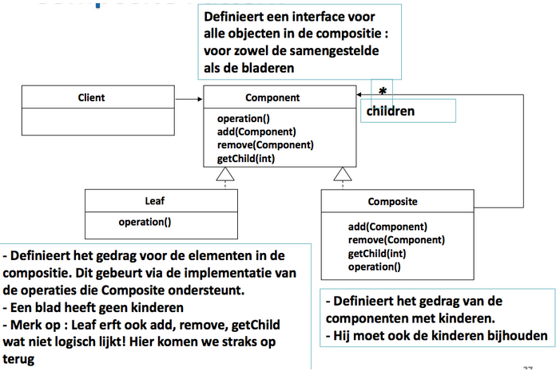
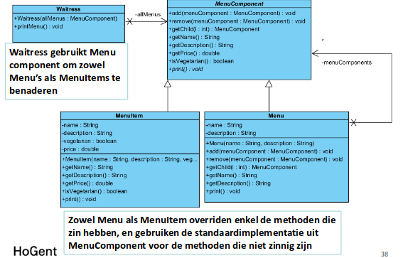

```java
public abstract class MenuComponent {
    public void add(MenuComponent menuComponent) {
        throw new UnsupportedOperationException();
    }

    public void remove(MenuComponent menuComponent) {
        throw new UnsupportedOperationException();
    }

    public MenuComponent getChild(int i) {
        throw new UnsupportedOperationException();
    }

    public String getName() {
        throw new UnsupportedOperationException();
    }

    public String getDescription() {
        throw new UnsupportedOperationException();
    }

    public double getPrice() {
        throw new UnsupportedOperationException();
    }

    public boolean isVegetarian() {
        throw new UnsupportedOperationException();
    }

    public abstract void print();
}

public class MenuItem extends MenuComponent {
    private String name;
    private String description;
    private boolean vegetarian;
    private double price;

    public MenuItem(String name, String description, boolean vegetarian, double price) {
        this.name = name;
        this.description = description;
        this.vegetarian = vegetarian;
        this.price = price;
    }

    public String getName() { return name; }
    public String getDescription() { return description; }
    public double getPrice() { return price; }
    public boolean isVegetarian() { return vegetarian; }

    public void print() {
        System.out.print("  " + getName());
        if (isVegetarian()) {
            System.out.print("(v)");
        }
        System.out.println("," + getPrice()):
        System.out.println("  --" + getDescription()):
    }
}

public class Menu extends MenuComponent {
    private List<MenuComponent> menuComponents;
    private String name;
    private String description;

    public Menu(String name, String description) {
        this.name = name;
        this.description = description;
    }

    public void add(MenuComponent menuComponent) (
        menuComponents.add(menuComponent);
    )

    public void remove(MenuComponent menuComponent) (
        menuComponents.remove(menuComponent);
    )

    public MenuComponent getChild(int i) {
        return (MenuComponent) menuComponents.get(i);
    }

    public String getName() {
        return name;
    }

    public String getDescription() {
        return description;
    }

    public void print() {
        System.out.print("\n" + getName());
        System.out.print("," + getDescription());
        System.out.print("--------------------");

        menuComponents.forEach(MenuComponent::print);
    }
}

public class Waitress {
    private MenuComponent allMenus;

    public Waitress(MenuComponent allMenus) {
        this.allMenus = allMenus;
    }

    public void printMenu() {
        allMenus.print();
    }
}
```

## Null Iterator

In **MenuItem**: Null iterator retourneert altijd false bij aanroep van hasNext().

```java
@Override
public Iterator createIterator() {
	return new NullIterator();
}
```

De **NullIterator** klasse:

```java
public class NullIterator implements Iterator<MenuComponent> {
    public MenuComponent next() {
        return null;
    }

    public boolean hasNext() {
        return false;
    }

    public void remove() {
	throw new UnsupportedOperationException("Not supported");
    }
}
```

## Composite Iterator

In **Menu**: een knoop geeft een iterator terug over zijn kinderen.

```java
@Override
public Iterator createIterator() {
	if (iterator == null) {
		itarator = new CompositeIterator(menuComponents.iterator());
	}
	return iterator;
}
```

De **CompositeIterator** klasse: 

```java
public class CompositeIterator implements Iterator<MenuComponent> {
    private Stack<Iterator<MenuComponent>> stack = new Stack<>();

    public CompositeIterator(Iterator<MenuComponent> iterator)
    {
        stack.push(iterator);
    }

    public MenuComponent next()
    {
        if (hasNext()) {
            Iterator<MenuComponent> iterator = stack.peek();
            MenuComponent component = iterator.next();

            // It is not a leaf, it has children
            if (component instanceof Menu) {
                stack.push(component.createIterator());
            }
        }

        return null;
    }

    public boolean hasNext()
    {
        if (stack.empty()) return false;

        Iterator<MenuComponent> iterator = stack.peek();

        if ( ! iterator.hasNext()) {
            stack.pop();
            return hasNext();
        }

        return true;
    }
}
```

# Abstract Factory

Het Abstract Factory Pattern levert een interface voor de vervaardiging van reeksen gerelateerde of onafhankelijke objecten zonder hun concrete klassen te specifieren.

* De **Abstract Factory** definieert de interface dat alle Concrete Factories moeten implementeren, die bestaat uit een set van methodes voor de creatie van producten.
* De **Concrete Factory** maakt eigen versie van elk Product. De Client gebruikt een van deze Factories zodat die nooit een Product object moet instantieren.
* De **Client** is geschreven met de Abstracte Factory en wordt tijdens runtime composed met een Concrete Factory.

We schrijven de code zodanig dat de **Client** de **Factory** gebruikt voor het maken van de producten. Door een verscheidenheid aan fabrieken krijgen we een verscheidenheid aan implementaties voor de producten. Maar de Clientcode blijft hetzelfde.

We voorzien een manier voor het maken van een familie producten, Code is losgekoppeld van de Factory waardoor een variatie van Factories kunnen geimplementeerd worden.

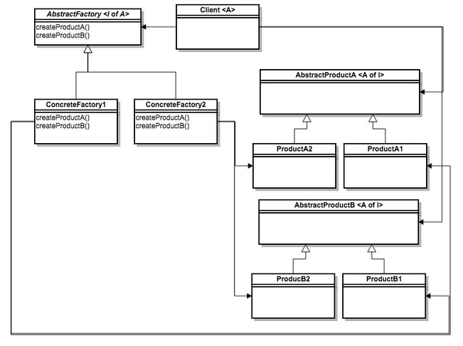

```java
public interface PizzaIngredientFactory {

	public Dough createDough();
	public Sauce createSauce();
	public Cheese createCheese();
	public Veggies[] createVeggies();
	public Pepperoni createPepperoni();
	public Clams createClam();

}

public class NYPizzaIngredientFactory implements PizzaIngredientFactory {
	
	public Dough createDough() {
		return new ThinCrustDough();
	}

	public Sauce createSauce() {
		return new MarinaraSauce();
	}

	public Cheese createCheese() {
		return new ReggianoCheese();
	}

	public Veggies[] createVeggies() {
		Veggies veggies[] = { new Garlic(), new Onion(), new RedPepper() };
		return veggies;
	}

	public Pepperoni create Pepperoni() {
		return new SlicedPepperoni();
	}

	public Clams createClam() {
		return new FreshClams();
	}
}

public abstract class Pizza {

	String name;
	Dough dough;
	sauce sauce;
	Veggies veggies[];
	Cheese cheese;
	Pepperoni pepperoni;
	Clams clam;

	abstract void prepare();

	void bake() {
		System.out.println("Bake for 25 minutes at 350°");
	}

	void cut() {
		System.out.println("Cutting the pizza into diagonal slices");
	}

	void box() {
		System.out.println("Place pizza in official PizzaStore box");
	}

	void setName(String name) {
		this.name = name;
	}

	String getName() {
		return name;
	}
}

public class CheesePizza extends Pizza {
	PizzaIngredientFactory ingredientFactory;

	public CheesePizza(PizzaIngredientFactory ingredientFactory) {
		this.ingredientFactory = ingredientFactory;
	}

	void prepare() {
		System.out.println("Preparing " + name);
		dough = ingredientFactory.createDough();
		sauce = ingredientFactory.createSauce();
		cheese = ingredientFactory.createCheese();
	}
}

public class NYPizzaStore extends PizzaStore {

	protected Pizza createPizza(String item) {
		Pizza pizza = null;
		PizzaIngredientFactory ingredientFactory = new PizzaIngredientFactory();

		if (item.equals("cheese")) {
			pizza = new CheesePizza(ingredientFactory);
			pizza.setName("New York Style Cheese Pizza");
		} else if (item.equals("veggie")) {
			pizza = new VeggiePizza(ingredientFactory);
			pizza.setName("New York Style Veggie Pizza");
		} else if (item.equals("clam")) {
			pizza = new ClamPizza(ingredientFactory);
			pizza.setName("New York Style Clam Pizza");
		} else if (item.equals("pepperoni")) {
			pizza = new PepperoniPizza(ingredientFactory);
			pizza.setName("New York Style Pepperoni Pizza);
		}
		return pizza;
	}
}
```

# Factory Method

Het Factory Method Pattern definieert een interface voor het creëren van een object, maar laat de subklassen beslissen welke klasse er geïnstantieert wordt. De Factory Method draagt de instanties door aan de subklassen.

* De **Creator** 
	* Bevat de implementaties voor alle methodes voor manipulatie van het product.
	* Bevat abstracte Factory Methode die alle subklassen moeten implementeren.
* De **Concrete Creator** 
	* Implementeert de Factory Methode.
	* Is verantwoordelijk voor de creatie van Concrete Producten.
	* Is de enige klasse die kennis over de creatie heeft.
* Alle **Producten** moeten dezelfde interface implementeren zodat de klassen die de producten gebruiken hier naar kunnen refereren.

De **Abstracte Creator-Klasse** definieert een abstracte fabrieksmethode die door de subklassen geïmplementeerd wordt om producten te vervaardigen. 

* De verantwoordelijkheid voor het maken van de producten is verplaatst naar een methode die zich gedraagt als een Factory.
* De methode isoleert de Client van het weten welk soort concreet product gemaakt is.

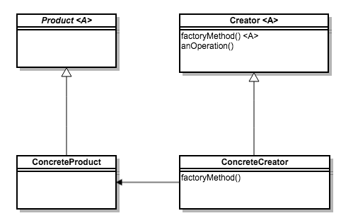
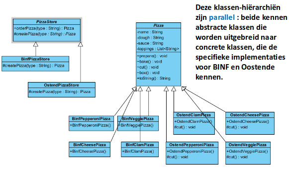

```java
public abstract class PizzaStore {

	public Pizza orderPizza(String type) {
		Pizza pizza;

		pizza = createPizza(type);

		pizza.prepare();
		pizza.bake();
		pizza.cut();
		pizza.box();

		return pizza;
	}

	abstract Pizza createPizza(String type);
}

public class NYPizzaStore extends PizzaStore {
	
	Pizza createPizza(String item) {
		if (item.equals("cheese")) {
			return new NYStyleCheesePizza();
		} else if (item.equals("veggie")) {
			return new NYStyleVeggiePizza();
		} else if (item.equals("clam")) {
			return new NYStyleClamPizza();
		} else if (item.equals("pepperoni")) {
			return new NYStylePepperoniPizza();
		} else return null;
	}
}
```

# Simple Factory

We nemen de code voor de creatie op en verplaatsen deze naar een ander object dat alleen maar het maken als taak zal hebben. Wanneer een methode een klasse retoruneert uit verschillende klassen met gelijkaardige superklasse.

* De **Client** gaat door de Factory voor instanties van het product.
* De **Factory** maakt instanties van het product, dit is het enige deel van de applicatie die refereert daar de concrete klassen van het product.
* De **product** klasse is abstract en heeft implementaties die overschreven kunnen worden.
* de **Concrete Producten** implementeren de Product klasse en kunnen gemaakt worden door de Factory.

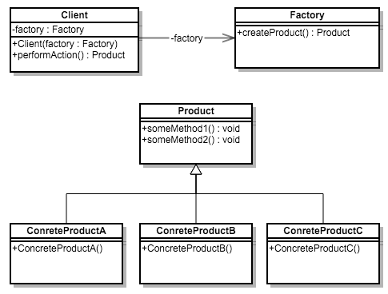

```java
public class SimplePizzaFactory {

	public Pizza createPizza(String type){
		Pizza pizza = null;

		if (type.equals("cheese")) {
			pizza = new CheesePizza();
		} else if (type.equals("pepperoni")) {
			pizza = new PepperoniPizza();
		} else if (type.equals("clam")) {
			pizza = new ClamPizza();
		} else if (type.equals("veggie")) {
			pizza = new VeggiePizza();
		}
		return pizza;
	}
}
```


# Iterator

Het Iterator Pattern voorziet ons van een manier voor sequentiële toegang tot de elementen van een aggregaatobject zonder de onderliggende representatie weer te geven.

* Iterator Pattern is gebaseerd op een Iterator interface.
* Een implementatie van Iterator weet hoe hij moet itereren door zijn specifieke lijst.
* De Client wordt losgekoppeld van de implementatie van de concrete klassen.

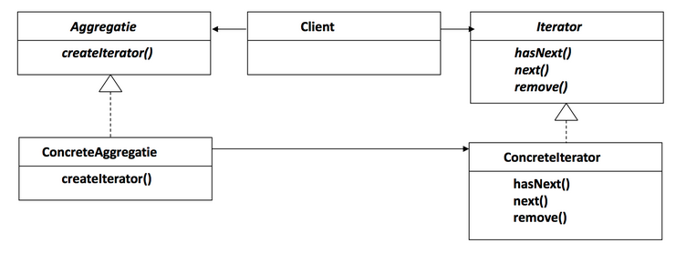
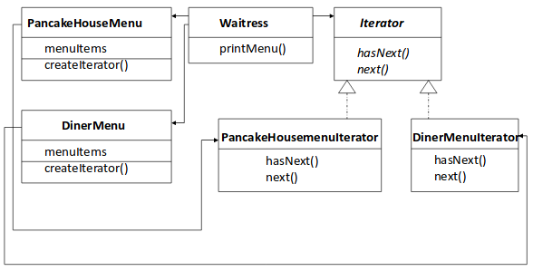

```java
public interface Iterator {
	boolean hasNext();
	Object next();
}

public class DinnerMenuIterator implements Iterator {
	MenuItem[] items;
	int position = 0;

	public DinnerMenuIterator(MenuItem[] items) {
		this.items = items;
	}

	public MenuItem next() {
		MenuItem menuItem = items[position];
		position = position + 1;
		return menuItem;
	}

	public boolean hasNext() {
		if (position >= items.length || items[position] == null) {
			return false;
		} else {
			return true;
		}
	}
}

public class DinnerMenu {
	static final int MAX_ITEMS = 6;
	int nuberOfItems = 0;
	MenuItem[] menuItems;

	public Iterator createIterator() {
		return new DinnerMenuIterator(menuItems);
	}
}

public class Waitress {
	PancakeHouseMenu pancakeHouseMenu;
	DinerMenu dinerMenu;

	public Waitress(PancakeHouseMenu pancakeHouseMenu, DinerMenu dinerMenu) {
		this.pancakeHouseMenu = pancakeHouseMenu;
		this.dinerMenu = dinerMenu;
	}

	public void printMenu() {
		Iterator pancakeIterator = pancakeHouseMenu.createIterator();
		Iterator dinerIterator = dinerMenu.createIterator();

		System.out.println("MENU\n----\nBREAKFAST);
		printMenu(pancakeIterator);
		System.out.println("\nLUNCH");
		printMenu(dinerIterator);

	}

	public void printMenu(Iterator iterator) {
		while (iterator.hasNext()) {
			MenuItem menuItem = iterator.next();
			System.out.print(menuItem.getName() + ", ");
			System.out.print(menuItem.getPrice() + " -- ");
			System.out.println(menuItem.getDescription());
		}
	}
}
```

## Na opschonen met java.util.iterator en Menu Interface.

* De **PancakeHouseIterator** klasse wordt verwijderd en de create methode wordt aangepast.
* In de **DinerMenuIterator** klasse wordt een remove methode toegevoegd.

Hierdoor kent de Client enkel Menu en Iterator, de Client is losgekoppeld van de implementaties van Menus dus kan er een Iterator gebruikt worden om te itereren over elke menulijst.

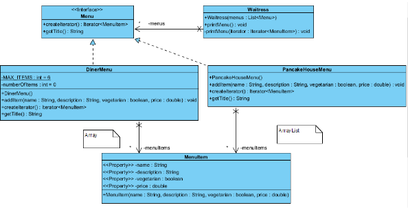

```java
public class PancakeHouseMenu {
	public Iterator<MenuItem> createIterator() {
		return menuItems.iterator();
	}
}

public class DinerMenuIterator implements Iterator {
	
	public void remove () {
		
		if (position <= 0) {
			throw new IllegalSateException("Kan niet verwijderen");
		}
		if (list[position-1] != null) {
			for (int i = position-1; i < (list.length-1) {
				list[i] = list[i+1];
			}
			list[list.length-1] = null;
		}
	}
}

public interface Menu {
	public Iterator<MenuItem> createIterator();
}
```
# Proxy

Het Proxy Pattern zorgt voor een surrogaat of plaatsvervanger voor een ander object om de toegang hiertoe te controleren.

Structureel gelijk aan **Decorator** maar de doelstellingen veranderen:

* Decorator voegt gedrag toe aan een object.
* Proxy regelt de toegang.

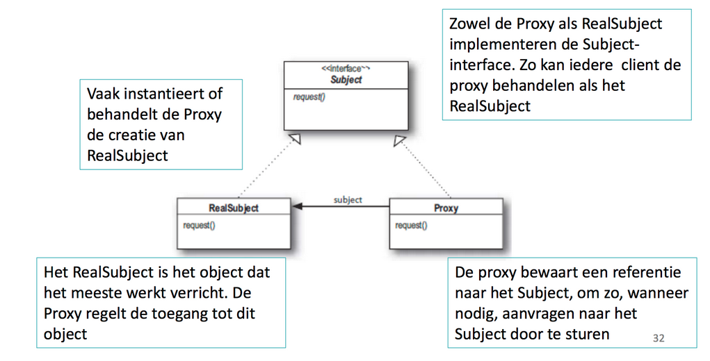

De **Remote Service** aanmaken

1. Remote interface aanmaken
2. Remote implementatie maken
3. stub en skeleton worden dynamisch
4. RMI registry starten
5. Het remote object bekend maken bij de namen service
6. Run

### Remote interface aanmaken 

* Remote interface aanmaken en laten implementeren van Remote
* Methoden die die we willen aanroepen over internet definiëren
* Elke methode gooit RemoteException
* Alle argumenten en retourwaarden moeten primitief of serialiseerbaar zijn

```java
public interface GumballMachineRemote extends Remote {
	int getCount() throws RemoteException;
	String getLocation() throws RemoteException;
	String getState() throws RemoteException;
}

public abstract class GumballMachineState implements serializable {
	transient protected GumballMachine gumballMachine; //transient = moet niet geserialiseerd worden
	protected GumballMachineState(GumballMachine gumballMachine) {
		this.gumballMachine = gumballMachine;
	}
	protected String insertQuarter() {
		return "You can't insert a quarter";
	}
}
```

### Remote implementatie maken

* Deze klasse doet het echte werk
* Hiervan wil de Client methodes oproepen
* Aangeven dat het over een remote object gaat door UnicastRemoteObject te implementeren
* UnicastRemoteObject uitbreiden

```java
public class GumballMachine extends UnicastRemoteObject implements GumballMachineRemote {
	private GumballMachineState currentState;
	private int count = 0;
	private final String location;

	public GumballMachine(String location, int numberGumballs) throws RemoteException {
		this.location = location;
		this.count = numberGumballs;
		toState((numberGumballs > 0)? new NoQuarterState(this) : new OutOfGumballsState(this));
	}

	public String insertQuarter() {
		return currentState.insertQuarter();
	}
}
```

### RMI Registry starten en Remote Object bekend maken bij de namen service

* RMI registry service starten
* Stel remote service beschikbaar aan de remote clients

```java
private void registerRemoteGumballMachine() {
	try {
		Registry registry = LocateRegistry.createRegistry(1099);
		GumballMachineRemote machine = new GumballMachine(location, count);
		registry.rebind("gumballmachine", machine);
	} catch (RemoteException ex) {
		ex.printStackTrace();
	}
}
```

### Client laten werken met Remote

```java
public class GumballMonitor {
	private GumballMachineRemote machine;

	public GumballMonitor(GumballMachineRemote machine) {
		this.machine = machine;
	}

	public void report() {
		try {
			System.out.println("Gumball machine: " + machine.getLocation());
			System.out.println("Current inventory: " + machine.getCount());
			System.out.println("Current state: " + machine.getState());
		}catch (RemotreException ex) {
			ex.printStackTrace();
		}

	}
}
```

De RMI Registry

```java
private void doTest() {
	try {
		Registry myRegistry = LocateRegistry.getRegistry("127.0.0.1, 1099");
		GumballMachineRemote machine = (GumballMachineRemote) myRegistry.lookup("gumballmachine");
		GumballMonitor monitor = new GumballMonitor(machine);
		monitor.report();
	} catch (Exception e) {
		e.printStackTrace();
	}
}
```
## De Virtuele Proxy

**Remote Proxy**: Lokale vertegenwoordiger van een object in een andere JVM.
**Virtuele Proxy**: Fungeert als surrogaat voor object voor en na creatie, daarna delegeert de proxyt direct naar RealSubject.

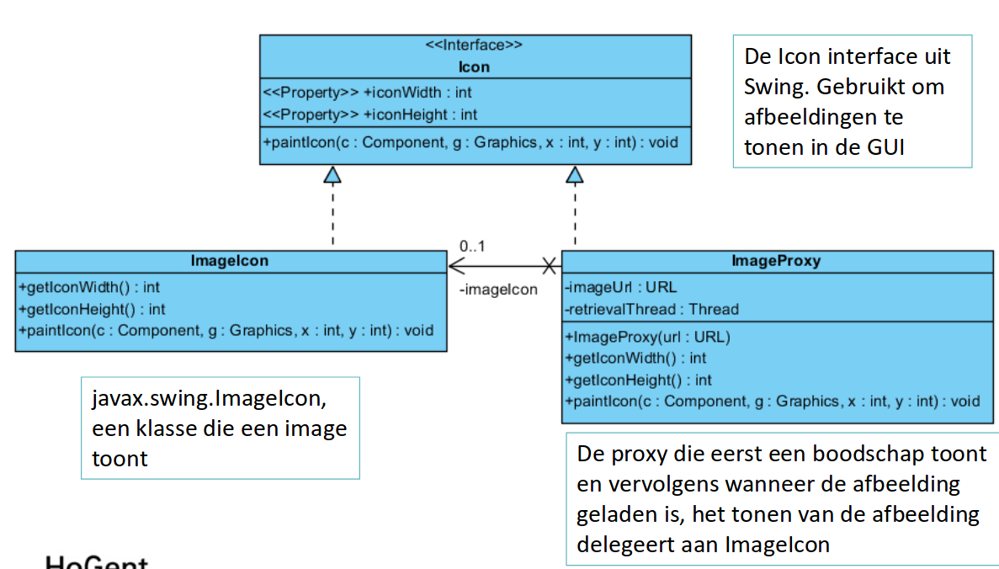

Werking ImageProxy:

1. ImageProxy maakt eerst ImageIcon en begint met het laden van dan een netwerk-URL
2. Terwijl de bytes van de afbeelding worden opgehaald toont ImageProxy laadboodschap
3. Wanneer de afbeelding volledig geladen is delegeert ImageProxy alle methodeaanroepen naar ImageIcon, inclusief paintIcon, getWidth, getHeight
4. Vraagt de gebruiker om een nieuwe afbeelding, dan maken we een nieuwe proxy en starten we het proces opnieuw

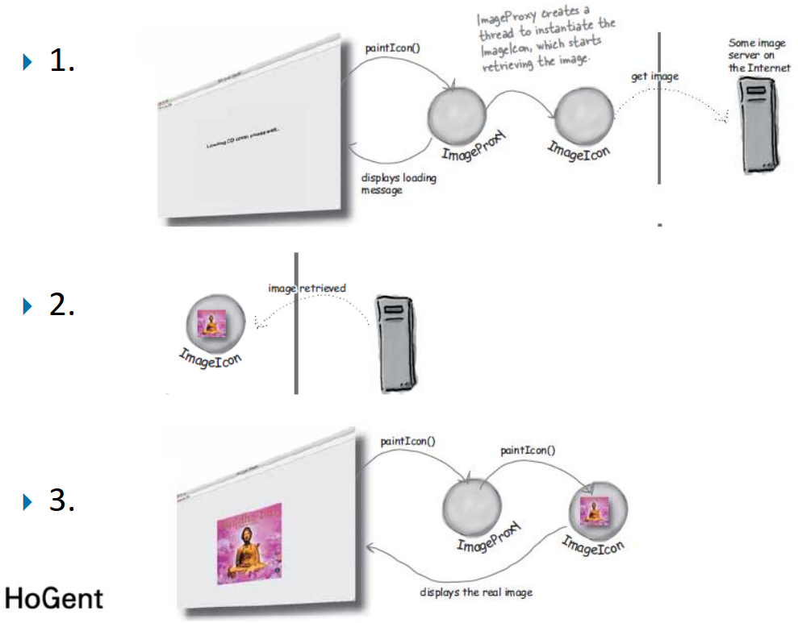

```java
// Een tijdelijke afbeelding laden tot de echte afbeelding geladen is
public class ImageProxy implements Icon {
    private ImageIcon imageIcon;
    private URL imageUrl;
    private Thread retrievalThread;
    public ImageProxy(URL url) {
        this.imageUrl = url;
    }

    @Override
    public int getIconWidth() {
        if (imageIcon != null) {
            return imageIcon.getIconWidth(); // Doordelegeren
        }
        return 800; // Default
    }

    @Override
    public int getIconHeight() {
        if (imageIcon != null) {
            return imageicon.getIconHeight();
        }

        return 600;
    }

    public void paintIcon(final Component c, Graphics g, int x, int y) {
        if (imageIcon != null) {
            imageIcon.paintIcon(c, g, x, y); // Toon de echte afbeelding
        } else {
            g.drawString("cd cover wordt geladen, wachten aub...", x + 300, y + 190); // tijdelijke string tonen

            if (retrievalThread == null) {
                retrievalThread = new Thread(new Runnable() {
                    @Override
                    public void run() {
                        try {
                            imageicon = new ImageIcon(imageUrl, "cd-cover"); // Nu pas ophalen
                            c.repaint(); // Zal opnieuw uitvoeren zodat het eerste blokje wordt uitgevoerd
                        } catch(Exception e) { e.printStackTrace(); }
                    }
                });
                retrievalThread.start();
            }
        }
    }
}

public class SomethingApp {
    public static void main(String[] args) {
        Icon icon = new ImageProxy("http://d.pr/i/1kx77+");

        // Echte gui zeker?
        imageComponent = new ImageComponent(icon);   
        frame.getContentPane().add(imageComponent);
    }
}
```

## Protection Proxy


# Singleton

Het Singleton Pattern garandeert dat een klasse slechts één instantie heeft, en biedt een globaal toegangspunt ernaartoe.

* De **getInstance** methode is static, waardoor deze van overal toegankelijk is.
* De **uniqueInstance** variabele bevat de enige insantie.

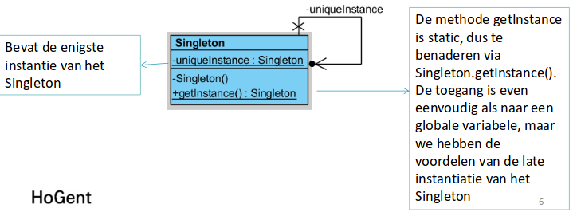

```java
public class Singleton {
    private static Singleton instance;

    private Singleton() {
    }

    public static Singleton getInstance() {
        if (instance == null) {
            instance = new Singleton();
        }

        return instance;
    }
}
```

## Singleton en threading

Bijvoorbeeld als 2 threads tegelijk een instantie aanmaken waardoor we dan verschillende instanties hebben.

Oplossing met **Synchronized**:

```java
public class Singleton {
    private static Singleton instance;

    private Singleton() {
    }

    // synchronized keyword
    public static synchronized Singleton getInstance() {
        if (instance == null) {
            instance = new Singleton();
        }

        return instance;
    }
}
```

Oplossing met **Eager Loading**:

```java
public class Singleton {

    // Maak meteen een instanties
    private static final Singleton instance = new Singleton();

    private Singleton() {
    }

    public static Singleton getInstance() {
        return instance;
    }
}
```

# Template Method

Het Template Method Pattern definieert het skelet van een algoritme in een methode, waarbij sommige stappen aan subklassen worden overgelaten. De Template Method laat subklassen bepaalde stappen in een algoritme herdefiniëren zonder de structuur van het algoritme te veranderen.

De Template Methode maakt gebruik van **primitieve methoden** om een algoritme te implementeren. Deze is echter ontkoppeld van de feitelijke implementatie van deze methoden.

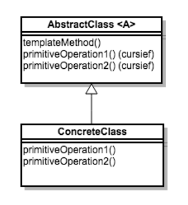
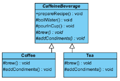

## Hook

De hook is zodat een subklasse een override kan uitvoeren.

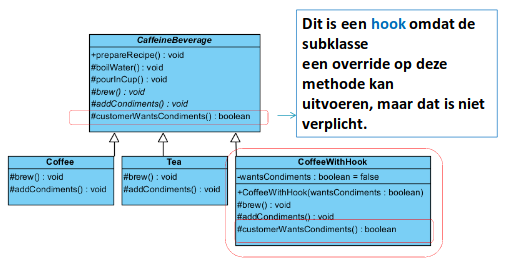

```java
public abstract class CaffeineBeverage {

    // MAG NIET OVERRIDEN WORDEN, vandaar de "final"
    public final void prepareRecipe() {
        boilWater();
        brew();
        pourInCup();

        if (customerWantsCondiments()) addCondiments();
    }

    protected void boilWater() {
        System.out.println("Boiling water");
    }

    protected void pourInCup() {
        System.out.println("Boiling water");
    }

    protected abstract void brew();
    protected abstract void addCondiments();

    // Dit is een hook
    protected boolean customerWantsCondiments() {
        return true;
    }
}

public class Coffee extends CaffeineBeverage {
    @Override
    protected void brew() {
        System.out.println("Dripping coffee through filter");    
    }

    @Override
    protected void addCondiments() {
        System.out.println("Adding sugar and milk");
    }
}

public class Tea extends CaffeineBeverage {
    @Override
    protected void brew() {
        System.out.println("Steeping the tea");    
    }

    @Override
    protected void addCondiments() {
        System.out.println("Adding lemon");
    }
}

public class CoffeeWithHook extends CaffeineBeverage {
    private boolean wantsCondiments;
    public CoffeeWithHook(boolean wantsCondiments) {
        this.wantsCondiments = wantsCondiments;
    }
    @Override
    protected void brew() {
        System.out.println("Dripping coffee through filter");    
    }

    @Override
    protected void addCondiments() {
        System.out.println("Adding sugar and milk");
    }

    protected boolean customerWantsCondiments() {
        return wantsCondiments;
    }
}

public class Template {
    public static void main(String[] args) {
        System.out.println("Making coffee");
        CaffeineBeverage beverage = new Coffee();
        beverage.prepareRecipe();

        System.out.println("Making tea");
        beverage = new Tea();
        beverage.prepareRecipe();

        System.out.println("Making coffee with a hook");
        boolean answer = getUserInputForCoffee();
        beverage = new CoffeeWithHook(answer);
        beverage.prepareRecipe();
    }

    public static boolean getUserInputForCoffee() {
        String answer = null;
        System.out.println("Would you like milk and sugar with your coffee (y/n)?");
        Scanner in = new Scanner(System.in);

        return in.next().equalsIgnoreCase("y");
    }
}
```

// Een tijdelijke afbeelding laden tot de echte afbeelding geladen is
public class ImageProxy implements Icon {
    private ImageIcon imageIcon;
    private URL imageUrl;
    private Thread retrievalThread;
    public ImageProxy(URL url) {
        this.imageUrl = url;
    }

    @Override
    public int getIconWidth() {
        if (imageIcon != null) {
            return imageIcon.getIconWidth(); // Doordelegeren
        }
        return 800; // Default
    }

    @Override
    public int getIconHeight() {
        if (imageIcon != null) {
            return imageicon.getIconHeight();
        }

        return 600;
    }

    public void paintIcon(final Component c, Graphics g, int x, int y) {
        if (imageIcon != null) {
            imageIcon.paintIcon(c, g, x, y); // Toon de echte afbeelding
        } else {
            g.drawString("cd cover wordt geladen, wachten aub...", x + 300, y + 190); // tijdelijke string tonen

            if (retrievalThread == null) {
                retrievalThread = new Thread(new Runnable() {
                    @Override
                    public void run() {
                        try {
                            imageicon = new ImageIcon(imageUrl, "cd-cover"); // Nu pas ophalen
                            c.repaint(); // Zal opnieuw uitvoeren zodat het eerste blokje wordt uitgevoerd
                        } catch(Exception e) { e.printStackTrace(); }
                    }
                });
                retrievalThread.start();
            }
        }
    }
}

public class SomethingApp {
    public static void main(String[] args) {
        Icon icon = new ImageProxy("http://d.pr/i/1kx77+");

        // Echte gui zeker?
        imageComponent = new ImageComponent(icon);   
        frame.getContentPane().add(imageComponent);
    }
}
