# 1. Gebeurtenissen en hun kansen

## 1.1 Inleiding

Kansrekening houdt zich bezig met studie van gebeurtenissen of toevalsverschijnselen. Dit zijn verschijnselen waarvan de individuele uitkomsten onzeker zijn, maar waar bij een groot aantal herhalingen een regelmatige verdeling van relatieve frequenties ontstaat.

De kans komt overeen met de relatieve frequentie op lange termijn

Onderdelen: 

1. Opstellen lijst mogelijke uitkomsten
2. Bepalen van de kans van elke uitkomst

## 1.2 Universum of uitkomstenruimte

Het universum of uitkomstenruimte is de verzameling van alle mogelijke uitkomsten van dit experiment en wordt genoteerd met Ω. Elke uitkomst moet overeenkomen met juist één element.

Het moet dus mogelijk zijn om eenduidig aan te geven welk element van Ω zich heeft voorgedaan.

## 1.3 Gebeurtenissen

Een gebeurtenis is een deelverzameling van de uitkomstenruimte. Een enkelvoudige of elementaire gebeurtenis is een singleton, een samengestelde heeft cardinaliteit groter dan 1.

Gebeurtenissen die geen gemeenschappelijke uitkomsten hebben noemt men disjunct. Deze kunnen dus nooit samen voorkomen.

Unie of doorsnee van gebeurtenissen zijn eveneens gebeurtenissen.

## 1.4 Kansen en kansruimte

Kans of waarschijnlijkheid drukt uit hoe waarschijnlijk het is dat deze gebeurtenis voorkomt. We noteren deze kans als P(A)

Het toekennen van kansen aan gebeurtenissen dient aan volgende regels te voldoen:

1. Kansen zijn steeds positief
2. Uitkomstenruimte heeft kans 1
3. Wanneer A en B disjuncte gebeurtenissen zijn dan is P(A ∪ B) = P(A) + P(B)

Wanneer de functie P aan volgende eigenschappen voldoet is dit een kansruimte.

Eigenschappen:

1. Voor elke gebeurtenis A geldt dat P(Ā) = 1 - P(A)
2. De onmogelijke gebeurtenis heeft kans 0: P(∅) = 0
3. Als A ⊆ B, dan is P(A) ≤ P(B); i.h.b geldt P(A) = P(B) - P(B \ A)
4. De uitgebreide somregel is: P(A ∪ B) = P(A) + P(B) - P(A ∩ B)

### 1.4.1 Eindig universum

Als de uitkomstenverzameling eindig is dan moet de som van de kansen van alle elementaire gebeurtenissen gelijk zijn aan 1.

Wanneer de elementaire gebeurtenissen allemaal even waarschijnlijk zijn dan bekomt men de formule van Laplace:

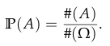

## 1.5 Voorwaardelijke kansen en (on)afhankelijkheid van gebeurtenissen

Uitdrukkingen zijn vaak van de vorm

> Als B voorkomt, dan is de waarscheinlijkheid dat A voorkomt gelijk aan p.

Kans op A gegeven B: 

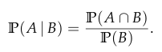

Wanneer de waarschijnlijkheid niet veranderd kunnen we zeggen dat A en B onafhankelijk zijn. Gebeurtenissen zijn onafhankelijk als:

P(A ∩ B) = P(A)P(B)

Als A en B onafhankelijk zjn dan geldt 

P(A) = P(A|B)

#### Kettingregel

Wanneer A₁ tem An gebeurtenissen zijn waarvoor

P(A₁ ∩ A₂ ∩ ... ∩ An-1) > 0

Dan geldt

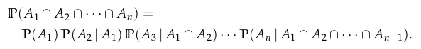

### 1.5.2 Regel van Bayes

Gegeven een gebeurtenis A met n elkaar uitsluitende oorzaken Bi geldt voor elke j dat:

# 2. Kans- of toevalsvariabelen

## 2.1 Inleiding

Het kan gebeuren dat we bij toevalsverschijnselen niet geintereseerd zijn in de kansen van verschillende uitkomsten, maar aan de verschillende gebeurtenissen getalwaarden te hechten.

Een kansvariabele X is een afbeelding van Ω naar R. Deze afbeelding associeert met elke mogelijke uitkomst van een kansexperiment een reëel getal. Men maakt ook een onderscheid tussen discrete en continue kansvariabelen.

## 2.2 Discrete kansvariabelen

Een kansvariabele X is discreet wanneer X slechts een eindig of aftelbaar oneindig aantal waarden aanneemt.

De kansfunctie van de discrete toevalsveranderlijke X:

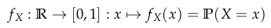

Een kansfunctie f voor een discrete toevalsveranderlijke voldoet aan de volgende eigenschappen:

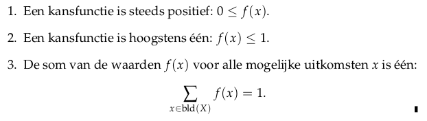

Men definieert ook de comulatieve kansfunctie, de Kansverdelingsfunctie. Deze wordt gedefinieerd als:

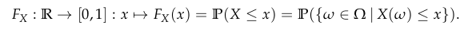

## 2.3 Continue kansvariabelen

Er zijn oneindig veel mogelijkheden en elk heeft evenveel kans. Het is eerder zinvol om na te gaan wat de kans is van een bepaald interval. De fundamentele grootheid is dan dus ook de kansverdelingsfunctie

De kansverdelingsfunctie Fx van toevalsveranderlijke X is een functie van R naar het interval [0,1] gegeven door:

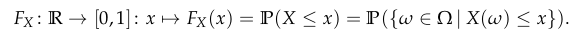

Een toevalsveranderlijke X is continu als er een functie fx van R naar R⁺ bestaat zodanig dat 

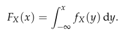

De functie fx wordt de kansdichtheid genoemd

#### De functie fx voldoet aan de volgende eigenschappen

1. De functie fx is nergens negatief: fx(x) >= 0

2. Als men fx integreert over R dan bekomt men als uitkomst 1

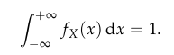

3. De kans dat X behoort tot een interval [a,b] wordt uitgedrukt mbh de volgende integraal

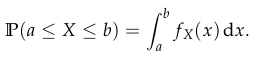

#### Zowel voor discrete als continue kansvariabelen geldt: 

1. F is gedefinieerd in heel R: dom(F) = R

2. F is niet dalend

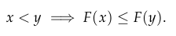

3. De X-as is een horizontale asymptoot op min oneindig:

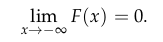

4. De rechte met vergelijking y=1 is een horizontale asymptoot op plus oneindig

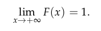

## 2.4 Verwachtingswaarde en variantie

### 2.4.1 Discrete kansvariabele

Veronderstel dat een toevalsveranderlijke X geassocieerd werd met de uitkomstenruimte Ω van een bepaald experiment, met elke w ∈ Ω werd een reeel getal X(w) geassocieerd. Bij herhalingen van het experiment komen we een lijst van reele getallen X(w) uit. we willen hiervan het **gemiddelde** berekenen: 

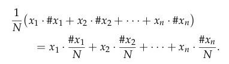

De **Verwachtingswaarde** van een discrete toevalsveranderlijke X wordt genoteerd als µx of E(X), en is een gewogen gemiddelde van de waarden xi die X kan aannemen met de respectievelijke kansen als gewichten. In formulevorm: 

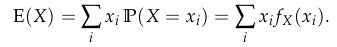

De verwachtingswaarde geeft aan rond welke waarde de kansvariabele ligt. Het is een centraliteitsmaat.

De **Variantie** is de gewogen gemiddelde kwadratische afwijking tov zijn verwachtingswaarde:

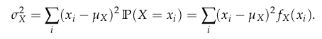

De **Standaardafwijking** is de spreidingsmaat waarvan de eenheid hetzelfde is als die van de verwachtingswaarde:

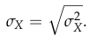

### 2.4.2 Continue kansvariabele

Op analoge manier als bij de discrete kansvariabelen heeft men de volgende definities.

De **Verwachtingswaarde** en **Variantie** worden gedefinieerd als:

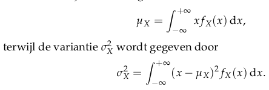

### 2.4.3 Eigenschappen van verwachtingswaarde en variantie

**Law of the unconscious statistican**: Als X een discrete kansvariabele is en g een functie van R naar R dan geldt:

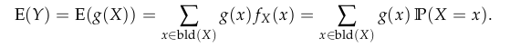

De **verwachtingswaarde** en **variantie** voldoen aan de volgende eigenschappen:

1. Als X constant is, dan is E(X)=k

2. Als a ∈ R een constante is dan geldt: E(X+a) = E(X) + a waaruit volgt dat: E(X-µx) = 0

3. Als a ∈ R een constante is dan geldt: E(aX) = a E(X)

4. Er geldt steeds dat:

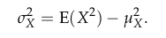

5. De variantie wijzigt niet als we de toevalsveranderlijke verschuiven:

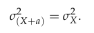

6. Vermenigvuldigen met een constante wijzigt de variantie op een kwadratische manier

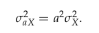

