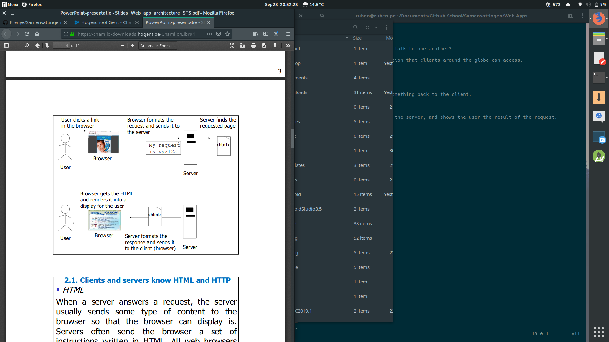
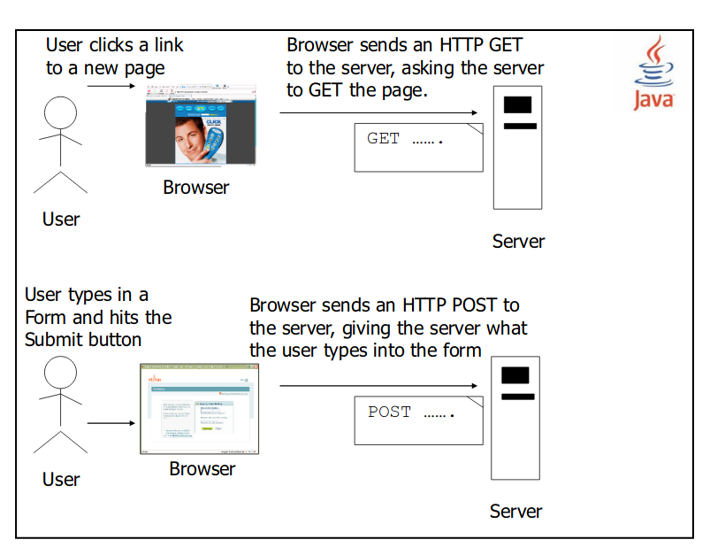
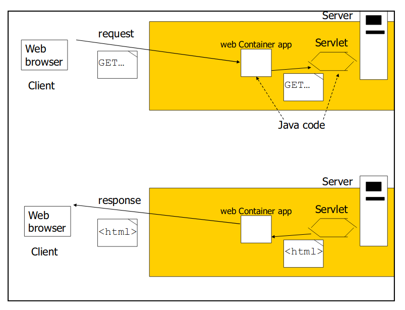
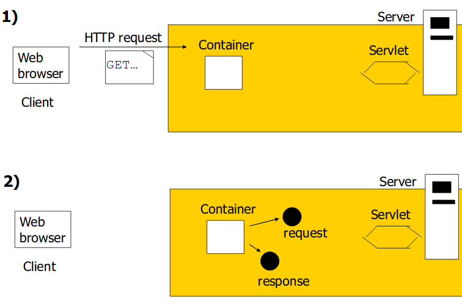
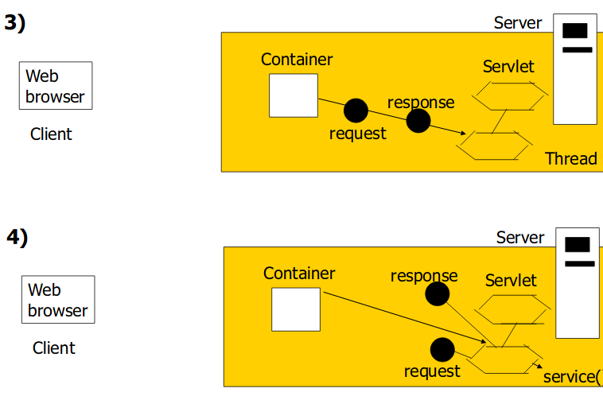
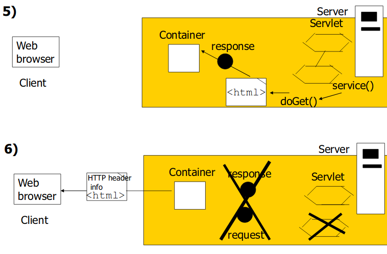
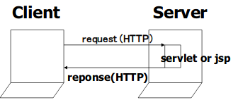
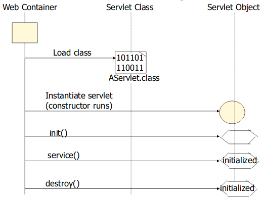
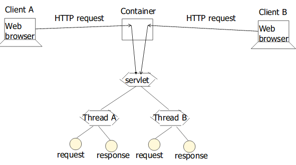

# Web App Architecture

## Introduction

How do web clients and web servers talk to one another?

Our goal is to build a web application that clients around the globe can access.

## Client/Server

### Web Server

Takes a client request and gives something back to the client.

### Client

Lets the user request something on the server, and shows the user the result of the request.



## Clients and servers know HTML anh HTTP

#### HTML

1. Server answers request
2. Server sends content to browser
3. Browser displays

Servers oftend send the browser a set of instructions written in HTML. All web browsers know what to do with html.

#### HTTP

1. Client sends HTTP request
2. Server answers with HTTP response

When a web server sends an HTML page to the client, it sends it using HTTP.

### What is the HTTP protocol?

#### Key elements of the request stream

* HTTP method: the action to be performed
* The page to access: a URL
* Form parameters: like arguments to a method

#### Key elements of the response stream 

* A status code: for whether the request was succesfull
* Content-type: text, picture, ...
* The content; the actual HTML, images , ...

### What is the request?

First thing you will find is an HTTP method name.

The method name tells the server the kind of request that's being made, and how the rest of the message will be formatted.

The HTTP protocols has several methods, but the ones you'll use most often are **GET** and **POST**

### GET and POST

#### GET

The simplest HTTP method, the point is to get something back from the server.

#### POST

The more powerfull request, you can request something and at the same time send form data to the server.



### Container

Servlets don't have a main() method. They are under the control of another Java application called a **container**.

When your web server application gets a request for a servlet, the server hands the request not to the servlet itsel, but to the Container in which the servlet is deployed.

It is the Container that gives the servlet the HTTP request and response, and it is the Container that calls the servlet's method.



#### How the Container handles a request





1. User click a link that has a URL to a servlet instead of a static page.
2. The container sees that the request is for a servlet, so the container creates two objects; HttpServletResponse and HttpServletRequest.
3. The container finds the correct servlet based on the URL in the request, creates or allocates a thread for that request, and passes the request and response objects to the servlet thread.
4. The container calls the servlet's service() method. Depending on the type of request, the service() method calls either the doGet() or doPost() method. For this example, we will assume the request was an HTTP GET.
5. The doGet() method generates the dynamic page and stuffs the page into the response object. Remember, the container still has a reference to the response object.
6. The thread completes, the container converts the response object into a HTTP response, sends it back to the client, then deletes the request and response objects.

# Servlets 

## Introduction

The client requests that som action is performed, the server performs the action and responds to the client.

This request-response model of communication is the foundation for the highest-level views of networking in Java-Servlets and JavaServer Pages.



### What is a SERVLET?

A servlet is a **Java programming language class** used to extend the capabilities of servers that host applications accessed via a **request-response programming model**.

Java Servlet technology defines HTTP-specific servlet classes.

### Servlet Life Cycle

If an instance of a servlet does not exist, the container:

* Loads the servlet class
* Creates an instance of the servlet class
* Initializes the servlet instance by calling the init method
* Invokes the service method, passing a request and response object 

If the container needs to remove the servlet, it finalizes the servlet by calling the servlet's destroy method.



**Each request runs in a separate thread**



### GET and POST

The two most common HTTP request types

* GET: retrieves information from the server 
* POST: sends data to server, such as authentication information or data from a form

### HTTPServlet Class

Web-based servlets typically extend class HttpServlet

* method doGet() responds to GET requests
* method doPost() responds to POST requests

## Handling http GET Requests

### WelcomeServlet demonstration

The servlet and HTML document demonstrate a servlet that handles HTTP get requests

#### WelcomeServlet.java

```java
@WebServlet("/welcome1")
public class WelcomeServlet extends HttpServlet
{
	//process "get" requests
	@Override
	protected void doGet(HttpServletRequest request, HttpServletResponse response) 
		throws ServletException, IOException
	{
		response.setContentType("text/html");
		try(PrintWriter out = response.getWriter()){
			//Write HTML document
		}
	}
}
```

#### welcomeForm.htmm

```html
<!DOCTYPE html>
<html>
	<head>
		<title>Handling an HTTP Get Request</title>
	</head>
	<body>
		<form action="welcome1" method="get">
			<p>
				<label>Click to invoke servlet</label>
				<input type="submit" value="Get HTML doc"/>
			</p>
		</form>
	</body>
</html>
```

The HTML document provides a form that invokes the servlet

The form's action (welcome1) specifies the URL path that invokes the servlet, and the form's method indicates that the browser sends a get request to the server. This results in a call to the servlet's doGet method.

#### How the container found the servlet

**A servlet can have 2 names**

* Client-known URL name: e.g. the link to register/registerMe servlet
* Programmer-known file name: e.g. SignUpServlet.class

#### Mapping servlet names improves your app's flexibility and security

Gives you the flexibility to move things around without having to change the client code that refers to the old location of the servlet files.

Better security: the client doesn't know how things are structured on your server.

#### Handling http get requests containing data

