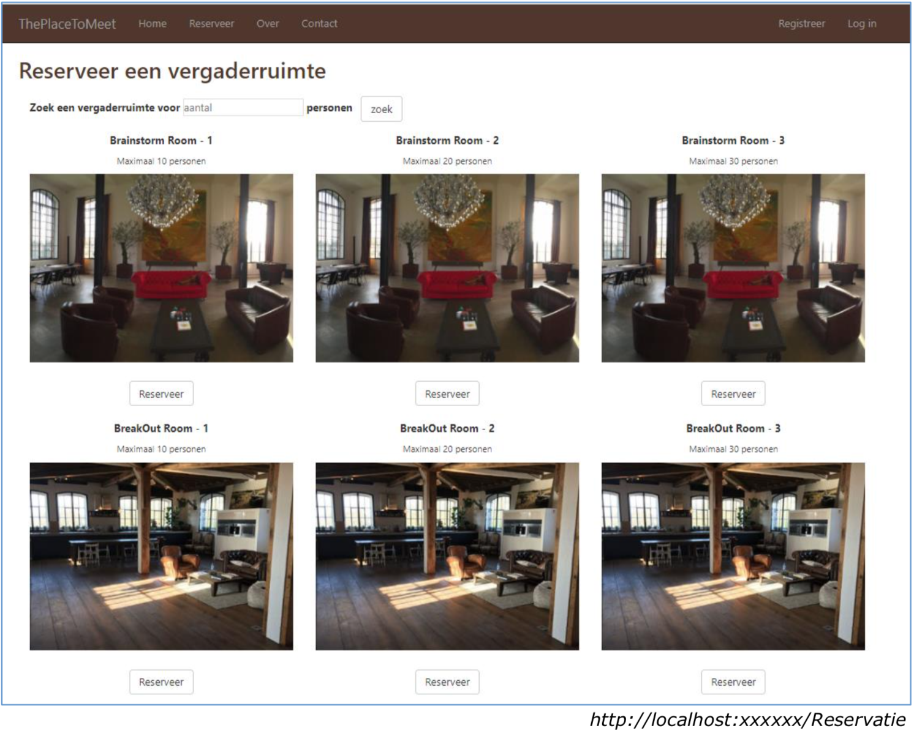
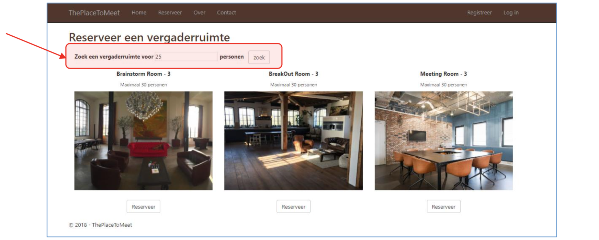

# Voorbeeldexamen Web3 + oplossing

Als voorbeeldexamen hieronder het examen van januari 2018. De volledige instructies zoals je ze op het examen vindt zijn hieronder letterlijk overgenomen, uiteraard hoef je nu geen folder van naam te wijzigen of op het einde te comprimeren.

## Algemeen

Deze oefening is open boek en wordt op PC gemaakt. Zie bord, voor locatie opgave. Pak deze uit.

**Verander eerst de naam van de folder “ThePlaceToMeetStarter” in je NaamVoornaam alvorens je de applicatie opent.** De applicatie kan je openen in Visual Studio door dubbel te klikken op **ThePlaceToMeet.sln.**

Na de oefening **comprimeer** je de volledige directorystructuur van de opgave **zonder de slides en plaats je dit bestand op je desktop in de folder met je VoornaamNaam. Deze folder mag maar 1 bestand bevatten! Hiervoor ben je zelf verantwoordelijk, enkel het gecomprimeerd bestand zal geëvalueerd worden!**

<span style="color:red">Zorg ervoor dat je oplossing geen compilatie fouten bevat, anders 0/100<span style="color:red">

## Beschrijving van de applicatie

Bij **ThePlaceToMeet** kan je een vergaderruimte huren. Je hebt de keuze uit verschillende types (breakout rooms, brainstorm of meeting rooms) en groottes.

Een gebruiker surft naar [http://localhost:xxxx/Reservatie]() en krijgt initieel een overzicht van alle vergaderruimtes, gesorteerd in oplopende volgorde van vergaderruimte-type en vervolgens het maximaal aantal personen.



Er kan gezocht worden naar vergaderruimtes die voldoende groot zijn voor een opgegeven aantal personen.



Indien er geen vergaderruimtes gevonden worden voor het opgegeven aantal personen, wordt een melding gegeven.


Een **aangemelde gebruiker** (~een klant), kan een nieuwe reservatie aanmaken door te klikken op een knop “Reserveer”.


Indien de gebruiker niet is aangemeld of niet voldoet aan de “Klant” policy wordt deze omgeleid naar de login pagina.

Als de gebruiker is aangemeld dan komt hij op de pagina [http://localhost:xxxx/Reservatie/Reserveer/](). Merk op dat in de starter applicatie alle reservaties gebeuren voor de klant met email peter@hogent.be (en nog niet voor de aangemelde gebruiker)


Voor het Dag-veldje wordt een date picker gebruikt (~Chrome browser)
Bij het **submitten** van het formulier worden volgende **voorwaarden aan client- en serverside gecheckt**:

* alle velden met uitzondering van “Catering” zijn verplicht in te vullen.
* “Beginuur” is minimum 8 en maximaal 20.
* “Aantal uur” is minimum 2 en maximaal 14.
* “Aantal personen” is >= 1.

Als het formulier niet correct werd ingevuld dan wordt de gebruiker geïnformeerd via gepaste berichten:


Indien het formulier correct werd ingevuld zal een nieuwe reservatie worden aangemaakt voor de vergaderruimte en de klant, **als aan volgende domeinregels is voldaan**:

* de dag van de reservatie ligt niet in het verleden (> datum van vandaag)
* een vergaderruimte dient minstens voor 2u te worden gereserveerd
* een reservatie start ten vroegste om 8u en eindigt ten laatste om 22u
* het aantal personen is >= 1
* het aantal personen is kleiner of gelijk aan het maximaal aantal toegelaten personen voor de gekozen vergaderruimte
* de reservatie van een vergaderruimte heeft geen overlapping met andere reservaties op die dag voor die vergaderruimte
* catering dient minstens 1 week op voorhand te worden gereserveerd
* er dient tevens te worden nagegaan of de klant hiervoor een korting krijgt op de huurprijs van de zaal (niet op de catering). Het percentage korting is afhankelijk
van het aantal reservaties van die klant in het betreffende jaar. Momenteel bevat de database 2 kortingen: een korting van 5% vanaf 3 reservaties en een korting
5
 van 10% vanaf 10 reservaties. Stel dat de klant een 7de reservatie aanmaakt, dan wordt de korting van 5% (vanaf 3 reservaties) toegepast. Stel aantal reservaties is 10 of meer dan wordt de korting van 10% (vanaf 10 reservaties) toegepast.
 
Bij een succesvolle reservatie wordt de **bevesting** pagina getoond. Bij een niet- succesvolle boeking wordt het formulier opnieuw aangeboden.

Onderstaand scherm toont je het resultaat van een succesvolle reservatie. Merk op dat in dit voorbeeld de klant een korting krijgt, daar het zijn 3de reservatie is in 2018.


## Het domein


## Het databank diagram

Merk op: dit diagram bevat geen AspNetxxx tabellen. Voor de relaties zijn er geen cascading delete.


## de opgave

Werk de gegeven ASP.NET Core MVC applicatie verder uit. De applicatie maakt gebruik van het Entity Framework Core en MOQ. Deze frameworks (EF, Moq, ...) zijn reeds toegevoegd aan het project. Je volgt best de stappen in de volgorde waarin ze hier beschreven staan.

### 1. EF, mapping
Implementeer de methode **Configure in ReservatieConfiguration**. Maak gebruik van fluent api en zorg dat de mapping resulteert in bovenstaand databank diagram. Maak een expliciete mapping voor alle associaties. Om je mapping te controleren kan je je programma runnen. De home page wordt getoond en de databank is op dat moment reeds aangemaakt... Je kan de tabellen bekijken in Sql Server Object Explorer, connecteer met .\sqlexpresshogent. De database naam is PlacesToMeet. Indien je de fout “Network related problem” krijgt, vraag dan aan de docent om je verder te helpen.

### 2. Repositories.
Maak een implementatie voor **VergaderruimteRepository**. Zorg dat VergaderruimteRepository de interface IVergaderruimteRepository implementeert.

### 3. Dependency injectie.
Er wordt gebruik gemaakt van constructor injectie om de repositories te injecteren in de ReservatieController. Configureer de injectie in de StartUp klasse.

### 4. Domein
Implementeer volgende methodes. Maak waar mogelijk gebruik van Linq. Controleer je werk aan de hand van de unit testen.
#### Klasse Klant
- **GetAantalReservaties**: retourneert het aantal reservaties van de klant voor het
opgegeven jaar

#### Klasse Vergaderruimte
- **GetReservatiesVoorDag**: deze methode retourneert de reservaties voor die dag.
- **GetKorting**: deze methode retourneert de korting die van toepassing is gegeven het aantal reservaties. Stel aantal reservaties = 7 (inclusief de nieuwe reservatie) en er is een korting voorzien vanaf 5 reservaties en een andere korting vanaf 10 reservaties, dan wordt de korting vanaf 5 reservaties geretourneerd. Stel aantal
reservaties is 10 of meer dan wordt de korting vanaf 10 reservaties toegekend.
- **Reserveer**: deze methode voegt een reservatie toe als aan alle domeinregels werd voldaan en past ook de juiste korting toe. Je kan desgewenst gebruik maken van de
methodes die reeds aanwezig zijn in deze klasse.

#### Klasse Reservatie
- **TotalePrijs**: retourneert de TotalePrijs rekening houdend met de prijs vergaderruimte en de prijs van de catering. De korting is enkel van toepassing op de huur van de ruimte, niet op de catering.

### 5. ReservatieController – Index 

#### a. Controller.
Implementeer de action method "Index" in ReservatieController.  
*De bijhorende unit testen (region == Index ==) verduidelijkt wat de Index action method verwacht wordt te doen.*

####  b. Views.
De Index View is reeds aanwezig. Vervolledig het overzicht. Geef ook een melding als er geen vergaderruimtes gevonden werden die groot genoeg zijn voor het opgegeven aantal personen.
De gegenereerde html voor 1 room, bvb de Brainstorm Room -1, is als volgt:

``` html
  <div class="col-md-4">
    <p class="text-center">
      <strong>Brainstorm Room - 1</strong> 
    </p>
    <p class="text-center small">Maximaal 10 personen</p>
     
    <div class="text-center btn-reserveer">
      <a class="btn btn-default" href="/Reservatie/Reserveer/1">Reserveer</a> 
    </div>
  </div>
```

**Als je op dit punt bent gekomen kan je de applicatie runnen. De Index pagina is nu bereikbaar en toont de vergaderruimtes.**

### 6. ReservatieController – Reserveer - HttpGet 
#### a. Viewmodels.

Er wordt gebruik gemaakt van een ReservatieViewModel. Dit is reeds aangemaakt.
In ReservatieViewModel moet je annotaties voor display en client/server side validatie toevoegen. In het begin van dit document staan de details beschreven en kan je ook zien hoe het formulier er moet uitzien.
#### b. Controller.
Is reeds geïmplementeerd.
#### c. View
Voeg de select list toe voor de catering.

**Als je op dit punt bent gekomen kan je een reservatie aanmaken**

### 7. ReservatieController – Reserveer - HttpPost 
#### a. Viewmodels.
Zie punt 6a
#### b. Controller.
Implementeer. Maak gebruik van de unittesten om je werk te controleren.
#### c. View.
Is reeds aangemaakt.

**Als je op dit punt bent gekomen kan je een nieuwe reservatie toevoegen**

### 8. Authorisatie

De authorisatie policy “Klant” is gedeclareerd met een claim van het type rol met als waarde “klant”. Het aanmaken van een nieuwe reservatie in ReservatieController is enkel toegankelijk voor gebruikers die aan deze policy voldoen. Stel authorisatie in.

Pas ook de action filter KlantFilter aan zodat de aangemelde gebruiker wordt geretourneerd. Momenteel wordt steeds [peter@hogent.be]() geretourneerd.

**Als je op dit punt bent gekomen dient de gebruiker zich eerst aan te melden alvorens een nieuwe reservatie kan worden aangemaakt**

### 9. Unit testen
Implementeer de volgende testen. Gebruik mocking, en train de mock waar nodig. In ReservatieControllerTest:

	- ReserveerGet_GeeftReservatieViewModelDoorAanView()
	- ReserveerPost_OngeldigeModelState_RetourneertDefaultView()

In VergaderruimteTest:

	- Reserveer_DatumLigtNietInDeToekomst_WerptArgumentException()


##   Puntenverdeling
  
<span style='color:red'>Een solution waarvan de code compilatie fouten bevat wordt niet verder geëvalueerd en hiervoor krijg je dus 0/100.</span>

Als de applicatie compileert :

* Mapper: 10 punten
* Repository en configuratie: 10 punten
* Domein: 20 punten
* Controller: 20 punten
* Authorisatie: 6 punten
* Views: 14 punten
* Client – Validatie: 10 punten
* Unit testen: 10 punten


## De oplossing

### 1. EF, mapping

Implementeer de methode **Configure in ReservatieConfiguration**. Maak gebruik van fluent api en zorg dat de mapping resulteert in bovenstaand databank diagram. Maak een expliciete mapping voor alle associaties. Om je mapping te controleren kan je je programma runnen. De home page wordt getoond en de databank is op dat moment reeds aangemaakt... Je kan de tabellen bekijken in Sql Server Object Explorer, connecteer met .\sqlexpresshogent. De database naam is PlacesToMeet. Indien je de fout “Network related problem” krijgt, vraag dan aan de docent om je verder te helpen.

``` csharp
namespace ThePlaceToMeet.Data.Mappers
{
    public class ReservatieConfiguration : IEntityTypeConfiguration<Reservatie>
    {
        public void Configure(EntityTypeBuilder<Reservatie> builder)
        {
            builder.ToTable("Reservatie");
            builder.HasOne(r => r.Catering).WithMany().IsRequired(false)
	    	.OnDelete(DeleteBehavior.Restrict);
            builder.HasOne(r => r.Korting).WithMany().IsRequired(false)
	    	.OnDelete(DeleteBehavior.Restrict);
        }
    }
}
```


### 2. Repositories.

Maak een implementatie voor **VergaderruimteRepository**. Zorg dat VergaderruimteRepository de interface IVergaderruimteRepository implementeert.

``` csharp
namespace ThePlaceToMeet.Data.Repositories
{
    public class VergaderruimteRepository : IVergaderruimteRepository
    {
        private readonly ApplicationDbContext _context;
        private readonly DbSet<Vergaderruimte> _vergaderruimtes;

        public VergaderruimteRepository (ApplicationDbContext context)
        {
            _context = context;
            _vergaderruimtes = _context.Vergaderruimtes;
        }
        public IEnumerable<Vergaderruimte> GetAll()
        {
            return _vergaderruimtes.OrderBy(t => t.Naam).AsNoTracking().ToList();
        }

        public Vergaderruimte GetById(int id)
        {
            return _vergaderruimtes.Include(v => v.Reservaties).FirstOrDefault(v => v.Id == id);
        }

        public IEnumerable<Vergaderruimte> GetByMaxAantalPersonen(int maxAantalPersonen)
        {
            return _vergaderruimtes.Where(v => v.MaximumAantalPersonen >= maxAantalPersonen).ToList();
        }

        public void SaveChanges()
        {
            _context.SaveChanges();
        }
    }
}
```


### 3. Dependency injectie.

Er wordt gebruik gemaakt van constructor injectie om de repositories te injecteren in de ReservatieController. Configureer de injectie in de StartUp klasse.

``` csharp
public void ConfigureServices(IServiceCollection services)
{
    services.Configure<CookiePolicyOptions>(options =>
    {
        // This lambda determines whether user consent for non-essential cookies is needed for a given request.
        options.CheckConsentNeeded = context => true;
        options.MinimumSameSitePolicy = SameSiteMode.None;
    });

    services.AddDbContext<ApplicationDbContext>(options =>
        options.UseSqlServer(
            Configuration.GetConnectionString("DefaultConnection")));
    services.AddIdentity<ApplicationUser, IdentityRole>()
        .AddEntityFrameworkStores<ApplicationDbContext>()
        .AddDefaultTokenProviders();
    services.AddAuthorization(options => {
        options.AddPolicy("Klant", policy => policy.RequireClaim(ClaimTypes.Role, "klant"));
    });

    // Add application services.
    services.AddTransient<IEmailSender, EmailSender>();
    services.AddScoped<IKlantRepository, KlantRepository>();
    services.AddScoped<IVergaderruimteRepository, VergaderruimteRepository>();
    services.AddScoped< IKortingRepository, KortingRepository > ();
    services.AddScoped< ICateringRepository, CateringRepository > ();
    services.AddScoped<ApplicationDataInitializer>();
    services.AddScoped<KlantFilter>();
    services.AddMvc().SetCompatibilityVersion(CompatibilityVersion.Version_2_1);
}
```


### 4. Domein

Implementeer volgende methodes. Maak waar mogelijk gebruik van Linq. Controleer je werk aan de hand van de unit testen.

#### Klasse Klant

- **GetAantalReservaties**: retourneert het aantal reservaties van de klant voor het
opgegeven jaar

``` csharp
public int GetAantalReservaties(int jaar)
{
    return Reservaties.Count(r => r.Dag.Year == jaar);
}
```

#### Klasse Vergaderruimte

- **GetReservatiesVoorDag**: deze methode retourneert de reservaties voor die dag.

``` csharp
private IEnumerable<Reservatie> GetReservatiesVoorDag(DateTime dag)
{
    return Reservaties.Where(r => r.Dag == dag).ToList();
}
```

- **GetKorting**: deze methode retourneert de korting die van toepassing is gegeven het aantal reservaties. Stel aantal reservaties = 7 (inclusief de nieuwe reservatie) en er is een korting voorzien vanaf 5 reservaties en een andere korting vanaf 10 reservaties, dan wordt de korting vanaf 5 reservaties geretourneerd. Stel aantal
reservaties is 10 of meer dan wordt de korting vanaf 10 reservaties toegekend.

``` csharp
private Korting GetKorting(IEnumerable<Korting> kortingen, int aantalReservaties)
{
    return kortingen.OrderByDescending(t => t.MinimumAantalReservatiesInJaar)
    	.FirstOrDefault(k => k.MinimumAantalReservatiesInJaar <= aantalReservaties);
}
```

- **Reserveer**: deze methode voegt een reservatie toe als aan alle domeinregels werd voldaan en past ook de juiste korting toe. Je kan desgewenst gebruik maken van de
methodes die reeds aanwezig zijn in deze klasse.

``` csharp
public Reservatie Reserveer(Klant klant, IEnumerable<Korting> kortingen, DateTime dag, int beginUur, 
	int aantalUren, int aantalPersonen, Catering catering, bool standaardCatering)
{
    int tot = beginUur + aantalUren;
    if (dag.Date <= DateTime.Today)
    {
        throw new ArgumentException("Een vergaderruimte dient minstens 1 dag op voorhand te worden gereserveerd");
    }
    if (aantalUren < 2)
    {
        throw new ArgumentException("Minstens 2uur");
    }
    if(beginUur < 8 || beginUur + aantalUren > 22)
    {
        throw new ArgumentException("tussen 8 en 22uur");
    }
    if(aantalPersonen < 1)
    {
        throw new ArgumentException("Minstens 1 persoon");
    }
    if(aantalPersonen > MaximumAantalPersonen)
    {
        throw new ArgumentException("Te veel personen");
    }
    if(Reservaties.Where(rv => rv.Dag == dag).Any(res => beginUur < res.Tot && tot > res.BeginUur))
    {
        throw new ArgumentException("Vergaderruimte is niet beschikbaar");
    }
    if(catering != null && dag < DateTime.Today.AddDays(7))
    {
        throw new ArgumentException("Catering minstens week op voorhand");
    }
    
    Reservatie r = new Reservatie() { AantalPersonen = aantalPersonen, BeginUur = beginUur, 
    	Catering = catering, Dag = dag, DuurInUren = aantalUren, PrijsPerUur = this.PrijsPerUur };
	
    if (standaardCatering) r.PrijsPerPersoonStandaardCatering = this.PrijsPerPersoonStandaardCatering;
    if (catering != null) r.PrijsPerPersoonCatering = catering.PrijsPerPersoon;
    Reservaties.Add(r);
    klant.VoegReservatieToe(r);
    r.Korting = GetKorting(kortingen, klant.GetAantalReservaties(dag.Date.Year));
    return r;
}
```

#### Klasse Reservatie

- **TotalePrijs**: retourneert de TotalePrijs rekening houdend met de prijs vergaderruimte en de prijs van de catering. De korting is enkel van toepassing op de huur van de ruimte, niet op de catering.

``` csharp
public decimal TotalePrijs
{
    get
    {
        return ((PrijsPerUur * DuurInUren) * 
		(1-(Korting != null ? (decimal) Korting.Percentage / 100 : 0))) 
		+ ((PrijsPerPersoonStandaardCatering + PrijsPerPersoonCatering)*AantalPersonen);
    }
}
```


### 5. ReservatieController – Index 

#### a. Controller.

Implementeer de action method "Index" in ReservatieController.  
*De bijhorende unit testen (region == Index ==) verduidelijkt wat de Index action method verwacht wordt te doen.*

``` csharp
public IActionResult Index(int? aantalPersonen)
{
    IEnumerable<Vergaderruimte> ruimtes;
    if (aantalPersonen.HasValue)
    {
        ruimtes = _vergaderruimteRepository.GetByMaxAantalPersonen(aantalPersonen.Value);
    }
    else
    {
        ruimtes = _vergaderruimteRepository.GetAll();
    }
    ViewData["aantalPersonen"] = aantalPersonen;
    return View(ruimtes.OrderBy(r => r.VergaderruimteType).ThenBy(r => r.MaximumAantalPersonen));
}
```

####  b. Views.

De Index View is reeds aanwezig. Vervolledig het overzicht. Geef ook een melding als er geen vergaderruimtes gevonden werden die groot genoeg zijn voor het opgegeven aantal personen.
De gegenereerde html voor 1 room, bvb de Brainstorm Room -1, is als volgt:

``` html
@model IEnumerable<Vergaderruimte>
@{
    ViewData["Title"] = "Index";
}

<h2>Reserveer een vergaderruimte</h2>
<div id="zoek">
    <div class="col-md-12">
        <form>
            <div class="form-group">
                <label for="aantalPersonen" class="control-label">Zoek een vergaderruimte voor </label>
                <input type="number" name="aantalPersonen" id="aantalPersonen" placeholder="aantal" 
		       value=@ViewData["aantalPersonen"] style="border:1px solid #dedede" /> 
		    <b>personen</b>&nbsp;&nbsp;
                <input type="submit" value="zoek" class="btn btn-default" />
            </div>
        </form>
        @if (Model.Count() == 0)
        {
            <p>Er zijn geen vergaderruimtes gevonden</p>
        }
        else
        {
            foreach (var item in Model)
            {
                <div class="col-md-4">
                    <p class="text-center">
                        <strong>@(item.Naam)</strong>
                    </p>
                    <p class="text-center small">Maximaal @(item.MaximumAantalPersonen) personen</p>
                    
                    <div class="text-center btn-reserveer">
                        <a class="btn btn-default" href="/Reservatie/Reserveer/@(item.Id)">Reserveer</a>
                    </div>
                </div>
            }
        }
    </div>
</div>
```

**Als je op dit punt bent gekomen kan je de applicatie runnen. De Index pagina is nu bereikbaar en toont de vergaderruimtes.**


### 6. ReservatieController – Reserveer - HttpGet 

#### a. Viewmodels.

Er wordt gebruik gemaakt van een ReservatieViewModel. Dit is reeds aangemaakt.
In ReservatieViewModel moet je annotaties voor display en client/server side validatie toevoegen. In het begin van dit document staan de details beschreven en kan je ook zien hoe het formulier er moet uitzien.

``` csharp
namespace ThePlaceToMeet.Controllers
{
    public class ReservatieViewModel
    {
        public string Naam { get; set; }

        [Required]
        [DataType(DataType.Date)]
        public DateTime Dag { get; set; }

        [Required]
        [Range(8, 20)]
        [Display(Name = "Begin uur")]
        public int BeginUur { get; set; }

        [Required]
        [Display(Name = "Hoeveel uur wil je de vergaderzaal reserveren?")]
        public int Duur { get; set; }

        [Required]
        [Display(Name = "Met hoeveel personen wil je vergaderen?")]
        public int AantalPersonen { get; set; }

        [Display(Name = "Standaard catering (koffie, thee, water) ")]
        public bool StandaardCatering { get; set; }

        [Display(Name = "Indien je ook catering wenst, selecteer wat nodig is")]
        public int CateringId { get; set; }

        public ReservatieViewModel()
        {
            Dag = DateTime.Today.Date.AddDays(7);
            BeginUur = 8;
            Duur = 2;
            AantalPersonen = 1;
        }

        public ReservatieViewModel(Vergaderruimte ruimte) : this()
        {
            Naam = ruimte.Naam;
        }
    }
}
```

#### b. Controller.

Is reeds geïmplementeerd.

#### c. View

Voeg de select list toe voor de catering.

``` html
@model ThePlaceToMeet.Controllers.ReservatieViewModel

@{
    ViewData["Title"] = "Reserveer";
}

<h2>Reserveer @Model.Naam</h2>

<hr />
<div class="row">
    <div class="col-md-6">
        <form method="post">
            <div asp-validation-summary="ModelOnly" class="text-danger"></div>
            <div class="form-group">
                <label asp-for="Dag" class="control-label"></label>
                <input asp-for="Dag" class="form-control" />
                <span asp-validation-for="Dag" class="text-danger"></span>
            </div>
            <div class="form-group">
                <label asp-for="BeginUur" class="control-label"></label>
                <input asp-for="BeginUur" class="form-control" />
                <span asp-validation-for="BeginUur" class="text-danger"></span>
            </div>
            <div class="form-group">
                <label asp-for="Duur" class="control-label"></label>
                <input asp-for="Duur" class="form-control" />
                <span asp-validation-for="Duur" class="text-danger"></span>
            </div>
            <div class="form-group">
                <label asp-for="AantalPersonen" class="control-label"></label>
                <input asp-for="AantalPersonen" class="form-control" />
                <span asp-validation-for="AantalPersonen" class="text-danger"></span>
            </div>
            <div class="form-group">
                <div class="checkbox">
                    <label>
                        <input asp-for="StandaardCatering" /> 
			    @Html.DisplayNameFor(model => model.StandaardCatering)
                    </label>
                </div>
            </div>
            <div class="form-group">
                <label asp-for="CateringId" class="control-label"></label>
                <select asp-for="CateringId" asp-items=@(ViewData["catering"] as SelectList) 
			class="form-control">
                    <option value="0">--selecteer catering--</option>
                </select>
                <span asp-validation-for="CateringId" class="text-danger"></span>
            </div>
            <div class="form-group">
                <button type="submit" class="btn btn-default">Reserveer</button>
                <a asp-action="Index">Terug naar overzicht</a>
            </div>
        </form>
    </div>
</div>

@section Scripts {
    @{await Html.RenderPartialAsync("_ValidationScriptsPartial");}
}
```

**Als je op dit punt bent gekomen kan je een reservatie aanmaken**


### 7. ReservatieController – Reserveer - HttpPost 

#### a. Viewmodels.

Zie punt 6a

#### b. Controller.

Implementeer. Maak gebruik van de unittesten om je werk te controleren.

``` csharp
public IActionResult Reserveer(int id, ReservatieViewModel viewmodel, Klant klant)
{
    if (ModelState.IsValid)
    {
        try
        {
            Catering catering = viewmodel.CateringId != 0 ? _cateringRepository
	    	.GetBy(viewmodel.CateringId) : null;
            Vergaderruimte v = _vergaderruimteRepository.GetById(id);
            Reservatie r = v.Reserveer(klant, _kortingRepository.GetAll(), 
	    	viewmodel.Dag, viewmodel.BeginUur, viewmodel.Duur, viewmodel.AantalPersonen, 
		catering, viewmodel.StandaardCatering);
            _vergaderruimteRepository.SaveChanges();
            return View("Bevestiging", r);
        }
        catch (Exception ex)
        {
            ModelState.AddModelError("", ex.Message);
        }
    }
    ViewData["catering"] = new SelectList(_cateringRepository.GetAll().OrderBy(c => c.Titel), 
    	nameof(Catering.Id), nameof(Catering.Titel));
    return View(viewmodel);
}
```

#### c. View.

Is reeds aangemaakt.

**Als je op dit punt bent gekomen kan je een nieuwe reservatie toevoegen**


### 8. Authorisatie

De authorisatie policy “Klant” is gedeclareerd met een claim van het type rol met als waarde “klant”. Het aanmaken van een nieuwe reservatie in ReservatieController is enkel toegankelijk voor gebruikers die aan deze policy voldoen. Stel authorisatie in.

``` csharp
[Authorize(Policy = "Klant")]
```

Pas ook de action filter KlantFilter aan zodat de aangemelde gebruiker wordt geretourneerd. Momenteel wordt steeds [peter@hogent.be]() geretourneerd.

``` csharp
namespace ThePlaceToMeet.Filters
{
    [AttributeUsageAttribute(AttributeTargets.All, AllowMultiple = false)]
    public class KlantFilter:  ActionFilterAttribute
    {
        private readonly IKlantRepository _klantRepository;

        public KlantFilter(IKlantRepository klantRepository)
        {
            _klantRepository = klantRepository;
        }

        public override void OnActionExecuting(ActionExecutingContext context)
        {
            context.ActionArguments["klant"] = context.HttpContext.User.Identity.IsAuthenticated ? 
	    	_klantRepository.GetByEmail(context.HttpContext.User.Identity.Name) : null;
            base.OnActionExecuting(context);
        }
    }
}
```

**Als je op dit punt bent gekomen dient de gebruiker zich eerst aan te melden alvorens een nieuwe reservatie kan worden aangemaakt**


### 9. Unit testen

#### ReservatieControllerTest:

- ReserveerGet_GeeftReservatieViewModelDoorAanView()

``` csharp
[Fact]
public void ReserveerGet_GeeftReservatieViewModelDoorAanView()
{
    _vergaderruimteRepository.Setup(v => v.GetById(1)).Returns(_context.Vergaderruimte);
    var actionResult = _controller.Reserveer(1) as ViewResult;
    Assert.IsType<ReservatieViewModel>(actionResult?.Model);
}
```

- ReserveerPost_OngeldigeModelState_RetourneertDefaultView()

``` csharp
[Fact]
public void ReserveerPost_OngeldigeModelState_RetourneertDefaultView()
{
    _controller.ModelState.AddModelError("any key", "any error");
    _cateringRepository.Setup(b => b.GetBy(3)).Returns(_context.CateringSushi);
    _vergaderruimteRepository.Setup(v => v.GetById(1)).Returns(_context.Vergaderruimte);
    ViewResult result = _controller.Reserveer(1, model, _context.Peter) as ViewResult;
    Assert.Null(result?.ViewName);
    Assert.Equal(model, result?.Model);
}
```

#### VergaderruimteTest:

- Reserveer_DatumLigtNietInDeToekomst_WerptArgumentException()

``` csharp
[Fact]
public void Reserveer_DatumLigtNietInDeToekomst_WerptArgumentException()
{
    Assert.Throws<ArgumentException>(() => _vergaderruimte
    	.Reserveer(_klantZonderReservaties, _context.Kortingen, 
		DateTime.Today, 8, 10, 10, null, true));
}
```
